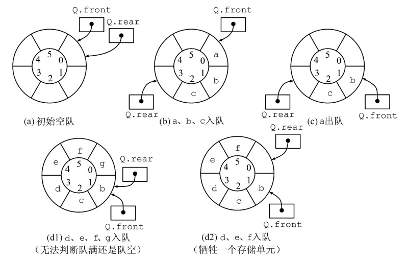
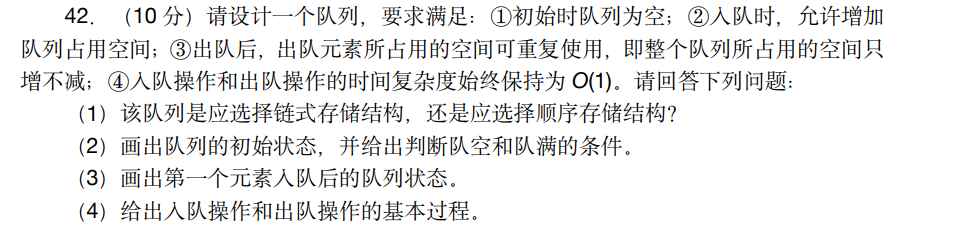

# 12. 栈与队列

## 12.1 栈

### 12.1.1 栈

* `stack`栈、堆栈、堆叠：先进先出（First In Last Out）
* `Top`栈顶：只允许在一端进行插入或删除操作的线性表，后来的元素作为栈顶
* `Bottom`栈底：第一个进入的元素

### 12.1.2 栈的顺序存储

栈是一个结构体，不是结构体指针

~~~cpp
typedef struct{
	Elemtype data[50];
	int top;
}SqStack;
SqStack S;
~~~

### 12.1.3 元素的出栈与入栈

* 注意对top的是先移动还是后移动
* `S.top=MaxSize-1`时是栈满

~~~cpp
S.top=-1//栈为空
S.data[++S.top]=4//元素的入栈
x=S.data[S.top--]//元素的出栈
~~~

### 12.1.4 栈的链式存储

链栈的实现与链表的实现一致，详见链表章节（几乎不考）

* 元素的入栈=链表头插法
* 元素的出栈=删除第一个元素
* `L->next == NULL`栈为空

### 12.1.5 栈的初始化、出入栈，读取栈顶元素的代码实例

~~~cpp
#include <stdio.h>  
#include <stdlib.h>  
  
#define MaxSize 50  //限定数组大小
typedef int ElemType;  
  
typedef struct {  
    ElemType data[MaxSize];//数组  
    int top;  
} SqStack;  
//初始化栈  
void InitStack(SqStack &S)  
{  
    S.top = -1;//代表栈为空  
}  
//判断栈是否为空  
bool StackEmpty(SqStack &S)  
{  
    if (S.top == -1)  
    {  
        return true;  
    }  
    else  
    {  
        return false;  
    }  
}  
//入栈  
bool Push(SqStack &S, int x)  
{  
    if (S.top == MaxSize - 1)//数组的大小不能改变，，避免越界  
    {  
        return false;  
    }  
    S.data[++S.top] = x;  
    return true;  
}  
//出栈  
bool Pop(SqStack &S, int &x)  
{  
    if (S.top == -1)  
    {  
        return false;  
    }  
    x = S.data[S.top--];//后减减，x=S.data[S.top];S.top=S.top-1;  
    return true;  
}  
//读取栈顶元素  
bool GetTop(SqStack &S, int &x)  
{  
    if (S.top == -1)//说明栈为空  
    {  
        return false;  
    }  
    x = S.data[S.top];  
    return true;  
}  
  
int main()  
{  
    SqStack S;//先进后出 FILO LIFO    bool flag;//用来判断操作是否成功  
    ElemType m;//用来存放拿出的元素  
    InitStack(S);//初始化  
    //判断栈是否为空  
    flag = StackEmpty(S);  
    if(flag)  
    {  
        printf("栈是空的\n");  
    }  
    //入栈，获取栈顶元素  
    Push(S,3);//入栈元素 3    Push(S,4);//入栈元素 4    Push(S,5);//入栈元素 5    flag=GetTop(S,m);//获取栈顶元素  
    if(flag)  
    {  
        printf("获取栈顶元素为 %dwn",m);  
    }  
    //出栈  
    flag=Pop(S,m);//弹出栈顶元素  
    if(flag)  
    {  
        printf("弹出元素为 %dwn",m);  
    }  
    return 0;  
}
~~~

## 12.2 队列

### 12.2.1 队列

* `Queue`队列，简称队，只允许在一端进行插入，而在表的另一端进行删除。First In First Out
* **入队**（进队）向队列中插入元素
* **出队**（离队）删除元素
* `Front`队头允许删除的一端，称之为队首
* `Rear`队尾允许插入的一端

### 12.2.2 队列的链式表示

* 队列的链式表示称为链队列
* 一个同时带有队头指针和队尾指针的单链表。
* 头指针指向队头结点，尾指针指向队尾结点，即单链表的最后一个结点

~~~cpp
typedef int ElemType,
typedef struct LinkNode{
	ElemType data;
	struct LinkNode *next;
}LinkNode;//链表结点的结构体
typedef struct{
	LinkNode *front,*rear;//链表头 链表尾
}LinkQueue;//先进先出
LinkQueue Q:
~~~

相当于原有的链表编写添加了链头链尾

### 12.2.3队列的链式表达

~~~cpp
#include <stdio.h>  
#include <stdlib.h>  
typedef int ElemType;  
typedef struct LinkNode{  
ElemType data;  
struct LinkNode *next;  
}LinkNode;  
typedef struct{  
    LinkNode *front,*rear;//链表头 链表尾  
}LinkQueue;//先进先出  

//初始化队列
void InitQueue(LinkQueue &Q)  
{  
    Q.front=Q.rear=(LinkNode*)malloc(sizeof(LinkNode));//头和尾指向同一个结点  
    Q.front->next=NULL;//头结点的 next 指针为 NULL}  
}
//判断队列是否为空
bool IsEmpty(LinkQueue Q)  
{  
    if(Q.front==Q.rear)  
    {  
        return true;  
    }  
    else  
    {  
        return false;  
    }   
	// return Q.front==Q.rear;//一条代码也可以完成
}  
//入队，尾部插入法  
void EnQueue(LinkQueue &Q,ElemType x)  
{  
    LinkNode *s=(LinkNode *)malloc(sizeof(LinkNode));  
    s->data=x;s->next=NULL;  
    Q.rear->next=s;//rear 始终指向尾部  
    Q.rear=s;  
}  
//出队 头部删除法  
bool DeQueue(LinkQueue &Q,ElemType &x)  
{  
    if(Q.front==Q.rear)  
    {  
        return false;//队列为空  
    }  
    LinkNode *p=Q.front->next;//头结点什么都没存，所以头结点的下一个节点才有数据  
    x=p->data;  
    Q.front->next=p->next;//断链  
    if(Q.rear==p)//删除的是最后一个元素  
        Q.rear=Q.front;//队列置为空  
    free(p);  
    return true;  
}  
  
int main(){  
    LinkQueue Q;  
    bool ret;  
    ElemType element;//存储出队元素  
    InitQueue(Q);//初始化队列  
    EnQueue(Q,3);  
    EnQueue(Q,4);  
    EnQueue(Q,5);  
    EnQueue(Q,6);  
    EnQueue(Q,7);  
    ret=DeQueue(Q,element);  
    if(ret){  
        printf("Dequeue successful, element value is %d\n",element);  
    }  
    {  
        printf("Dequeue failed \n");  
    }  
    return 0;  
}
~~~

## 12.3 循环队列

### 12.3.1 循环队列

* **注意**循环队列存储的是`MaxSize-1`个元素，防止分不清为空或为满
* `Q.front == Q.rear`相同表示循环队列为空
* `(Q.front + 1) % MaxSize == Q.rear`表示循环队列队满
* `Q.rear`指向的是最后一个元素之后的位置
* 出队就是移除`Q.front`指向的元素，入队就是添加`Q.rear`指向的前一个元素

~~~cpp
#define MaxSize 5
typedef int ElemType;
typedef struct{
	ElemType data[MaxSize];//数组,存储MaxSize-1个元素
	int front,rear;//队列头 队列尾
}SqQueue;
SqQueue Q;
~~~

### 12.3.2 循环队列的入队

~~~cpp
#define MaxSize 5
bool EnQueue(SqQueue &Q,ElemType x)
{
	if((Q.rear+1)%MaxSize==Q.front)//判浙是否队满
	{
		return false;
	}
	Q.data[Q.rear]=x;//放入元素
	Q.rear=(Q.rear+1)%MaxSize;//改变队尾标记
	return true;
}
~~~

### 12.3.3 循环队列的出队

~~~cpp
bool DeQueue(SqQueue &Q,ElemType &x)
{
	if(Q.rear==Q.front)
	{
		return false;
	}                         
	x=Q.data[Q.front];//先进先出
	Q.front=(Q.front+1)%MaxSize;
	return true,
}
~~~

### 12.3.4 循环队列的代码实现

~~~cpp
#include <stdio.h>  
#define MaxSize 5  
  
typedef int ElemType;  
  
typedef struct {  
    ElemType data[MaxSize];  
    int front, rear;  
} SqQueue;  
  
void InitQueue(SqQueue &Q)  
{  
    Q.front = Q.rear = 0;  
}  
  
bool isEmpty(SqQueue Q)  
{  
    if (Q.front == Q.rear)  
    {  
        return true;  
    }  
    else  
    {  
        return false;  
    }  
}  
bool EnQueue(SqQueue &Q, ElemType x)  
{  
    if ((Q.rear+1)%MaxSize == Q.front)  
    {  
        return false;  
    }  
    Q.data[Q.rear] = x;  
    Q.rear = (Q.rear+1)%MaxSize;  
    return true;  
}  
  
bool DeQueue(SqQueue &Q, ElemType &x)  
{  
    if (Q.front == Q.rear)  
    {  
        return false;  
    }  
    x = Q.data[Q.front];  
    Q.front = (Q.front+1)%MaxSize;  
    return true;  
}  
  
int main()  
{  
    SqQueue Q;  
    bool ret;//存储返回值  
    ElemType element;//存储出队元素  
    InitQueue(Q);  
    ret = isEmpty(Q);  
    if (ret)  
    {  
        printf("Queue is empty\n");  
    }  
    else  
    {  
        printf("Queue is not empty\n");  
    }  
    EnQueue(Q, 1);  
    EnQueue(Q, 2);  
    EnQueue(Q, 3);  
    ret = EnQueue(Q, 4);  
    if (ret)  
    {  
        printf("EnQueue success\n");  
    }else  
    {  
        printf("EnQueue failed\n");  
    }  
    ret = EnQueue(Q, 5);  
    if (ret)  
    {  
        printf("EnQueue success\n");  
    }else  
    {  
        printf("EnQueue failed\n");  
    }  
    ret = DeQueue(Q, element);  
    if (ret)  
    {  
        printf("DeQueue success, element = %d\n", element);  
    }else  
    {  
        printf("DeQueue failed\n");  
    }  
  
    return 0;  
}
~~~

## 12.4 考研真题实战

### 12.4.1 真题实例

### 12.4.2 题目分析解题

* 使用链式存储结构
* 初始状态创建带有一个空闲结点的两段式单向循环链表（两段式指的是一段用来存放数据的data段和存放指针的next段），头指针front和尾指针rear均指向空闲结点。
* 判空条件是`front==rear`
* 判满条件是`front==rear->next`
* 注意题目所说只增加不减少，在链表填充满时申请新的空间，在链表还有空位时直接替换新的值到“空位”上，即出队无需像链表的删除一样释放空间，直接使用新值覆盖即可
### 12.4.3 题目代码实现

~~~cpp
#include <stdio.h>  
#include <stdlib.h>  
  
typedef int ElementType;  
typedef struct LNode  
{  
    ElementType data;  
    struct LNode *next;  
}LNode, *LinkList;  
  
bool EnQueue(LinkList &front, LinkList &rear, ElementType val)  
{  
    LinkList pnew;  
    if (rear->next == front)  
    {  
        //队列满，申请一个结点的空间，放人队列  
        pnew= (LinkList)malloc(sizeof(LNode));  
        rear->data = val;//把人队元素放人 rear 指向结点  
        rear->next= pnew;//放了一个结点，其相当于做了分割  
        pnew->next= front;  
        rear= pnew;  
    }  
    else  
    {  
        //如果队列不满，直接放值，让 rear 后移一个结点  
        rear->data = val;  
        rear= rear->next;  
    }  
}  
  
void DeQueue(LinkList &front, LinkList &rear)  
{  
    if(front==rear)  
    {  
        printf("Queue is empty\n");  
    }else  
    {  
        printf("Element is %d\n", front->data);  
        front = front->next;  
    }  
  
}  
//循环队列操作的总流程  
void CircleQueue(LinkList &front, LinkList &rear)  
{  
    //队列头和队列尾都指向一个结点，这是队列既是空的，也是满的  
    front=(LinkList)malloc(sizeof(LNode));  
    rear=front;  
    rear->next=front;//构造循环队列  
    //入队  
    EnQueue(front, rear,3);  
    EnQueue(front, rear,4);  
    //出队  
    DeQueue(front, rear);  
    DeQueue(front, rear);  
    DeQueue(front, rear);  
}  
  
int main()  
{  
    LinkList front, rear;  
    CircleQueue (front, rear);  
    return 0;  
}
~~~