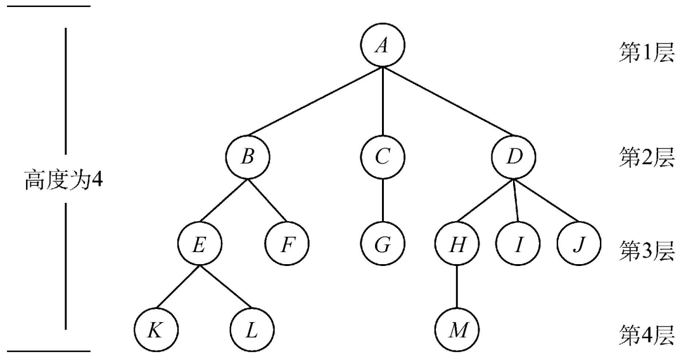
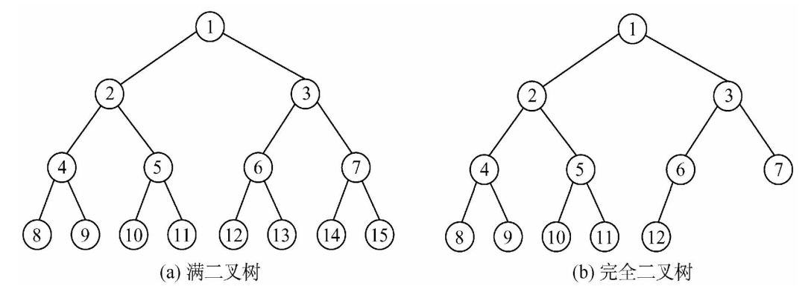
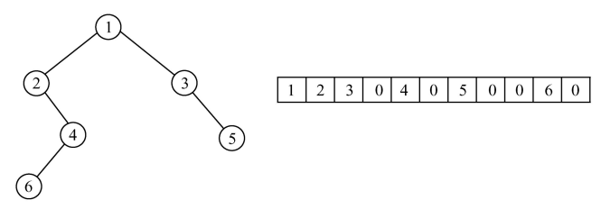
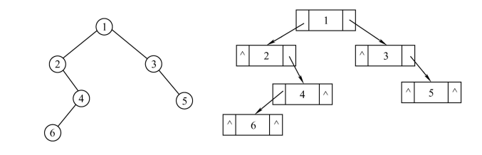
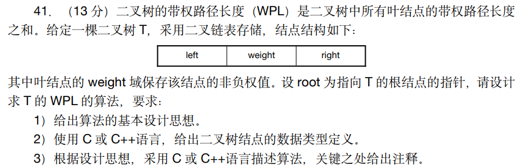
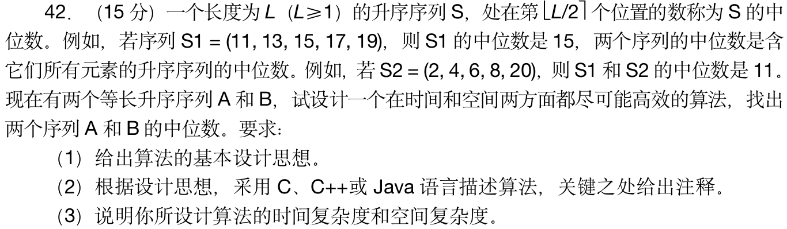

# 13. 树

## 13.1 树

*  `Tree`树是n(n>0)个节点的有限集。
* 当n=0时，称为空树。
* 在任意一棵非空树中应满足:
	1. 有且仅有一个特定的称为根的结点。
	2. 当n>1时，其余节点可分为m(m>0)个互不相交的有限集T1,T2... Tm，其中每个集合本身又是一棵树，并且称为根的子树。
* 树作为一种逻辑结构，同时也是一种分层结构
	1. 树的根结点没有前驱，除根结点外的所有结点有且只有一个前驱。
	2. 树中所有结点可以有零个或多个后继

## 13.2 二叉树

* 二叉树是一种树形结构
* 每个结点至多只有两棵子树（即二叉树中不存在度大于2的结点，度指的是结点的分叉的数量）
* 二又树的子树有左右之分，其次序不能任意颠倒。
* 与树相似，二又树也以递归的形式定义。二树是n(n≥0)个结点的有限集合
	1. 或者为空二又树，即n=0。
	2. 或者由一个根结点和两个五不相交的被称为根的左子树和右子树组成。左子树和右子树又分别是一棵二叉树。

* 满二叉树：每一层的个数就是$2^{n-1}$个结点
* 完全二叉树：从左往右依次填充满了再填充下一层的二叉树

### 13.2.1 二叉树的顺序存储

### 13.2.2二叉树的链式存储

~~~cpp
typedef char BiElemType,
typedef struct BiTNodef
	BiElemType data;       //数据段
	struct BiTNode *lchild://左指针
	struct BiTNode *rchild://右指针
}BiTNode,*BiTree,
~~~

### 13.2.3二叉树层次建树实例

使用辅助队列

1. 在元素放入二叉树前，先~~放入~~辅助队列（这里辅助队列的data段直接存放树的结点的地址值，因为这里不需要对元素进行操作）
2. `pcur`指针指向第一个放入的元素
3. 放入第二个元素，判断`pcur`指针指向的元素即第一个元素，左右结点是否为空，优先放入左节点
4. 当第一个元素放满，`pcur`指针指向第二个元素
5. 队列放入第四个元素，判断`pcur`指针指向的元素即第二个元素，左右结点是否为空，优先放入左节点
6. 辅助队列`pcur`指针不断向后移动

使用calloc申请的空间

* `(StructName *)calloc(NumOfElement,SizeOfElement)`
* 申请的空间大小是2个参数的大小直接相乘
* 会对对空间进行初始化，**赋值为0(NULL)**
* 这里使用可以直接对所有树中的二叉树进行初始化，不用在每次申请完成后

~~~cpp
#ifndef FUNCTION_H  
#define FUNCTION_H  
 
#include <stdio.h>  
#include <stdlib.h>  
typedef char BiElemType;  
typedef struct BiTNode{  
    BiElemType data;  
    struct BiTNode *lchild, *rchild;  
}BiTNode, *BiTree;  
//tag结构体是辅助队列使用的
typedef struct tag  
{  
    BiTree p;  //树的某一个结点的地址值
    struct tag *pnext;  
}tag_t, *ptag_t;  
  
#endif //FUNCTION_H
~~~

~~~cpp
#include "function.h"  
int main()  
{  
    BiTree pnew;//用来指向新申请的树结点  
    BiTree tree=NULL;//tree指向树根的，代表树  
    BiElemType data;//char data;
    ptag_t phead=NULL,ptail=NULL,list_pnew=NULL,pcur;  
    while (scanf("%c", &data))  
    {  
        if (data == '\n')  
        {  
            break;  
        }  
        //calloc申请的空间大小是2个参数的大小直接相乘，并对空间进行初始化，赋值为0(NULL)  
        pnew = (BiTree)calloc(1,sizeof(BiTNode));  
        pnew->data = data;  
        list_pnew = (ptag_t)calloc(1,sizeof(tag_t));  
        list_pnew->p = pnew;  
        //如果是树的第一个结点  
        if (tree == NULL)  
        {  
            tree = pnew;  
            phead = list_pnew;//第一个结点既是队列头，也是队列尾  
            ptail = list_pnew;  
            pcur = list_pnew;//pcur要指向要进入树的父亲元素  
        }else  
        {  
            //先让元素入列  
            ptail->pnext = list_pnew;  
            ptail = list_pnew;  
            //把接下来的结点放入树中  
            if (pcur->p->lchild == NULL)  
            {  
                pcur->p->lchild = pnew;  
            }else if (pcur->p->rchild == NULL)  
            {  
                pcur->p->rchild = pnew;  
                pcur = pcur->pnext;//放入右节点后，当前结点已满，pcur指向下一个结点  
            }  
        }  
    }  
  
    return 0;  
}
~~~

### 13.2.4 二叉树的遍历

* 前序遍历（先序遍历，深度优先遍历）：递归，先打印自身，后打印左子树，再打印右子树
* 中序遍历：递归，先打印左子树，后打印当前结点，再打印右子树
* 后序遍历：递归，先打印左子树，后打印右子树，最后打印当前节点
* 层次遍历（广度优先遍历）：使用辅助队列，借助

前序遍历实例（使用13.2.3的建树代码）

~~~cpp
void PreOrder(BiTree p)  
{  
  
    if (p!=NULL)  
    {  
        printf("%c", p->data);  
        PreOrder(p->lchild);//打印左子树  
        PreOrder(p->rchild);//打印右子树  
    }  
}  
~~~

中序遍历实例（使用13.2.3的建树代码）

~~~cpp
void InOrder(BiTree p)  
{  
    if (p!=NULL)  
    {  
        InOrder(p->lchild);//打印左子树  
        printf("%c", p->data);  
        InOrder(p->rchild);//打印右子树  
    }  
}  
~~~

后序遍历实例（使用13.2.3的建树代码）

~~~cpp
void PostOrder(BiTree p)  
{  
    if (p!=NULL)  
    {  
        PostOrder(p->lchild);//打印左子树  
        PostOrder(p->rchild);//打印右子树  
        printf("%c", p->data);  
    }  
}
~~~

层次遍历，广度优先遍历实例（`function.h`，`queue.cpp`，`main.cpp`）

~~~cpp
//function.h
#ifndef FUNCTION_H  
#define FUNCTION_H  
  
#include <stdio.h>  
#include <stdlib.h>  
  
typedef char BiElemType;  
  
typedef struct BiTNode{  
    BiElemType data;  
    struct BiTNode *lchild, *rchild;  
}BiTNode, *BiTree;  
  
//tag结构体是辅助队列使用的  
typedef struct tag  
{  
    BiTree p;  //树的某一个结点的地址值  
    struct tag *pnext;  
}tag_t, *ptag_t;  
  
//队列的链式存储的结构体  
typedef BiTree ElemType;  
  
typedef struct LinkNode{  
    ElemType data;  
    struct LinkNode *next;  
}LinkNode;  
typedef struct{  
    LinkNode *front, *rear ;//链表头，链表尾  
}LinkQueue ;//先进先出  
  
void InitQueue(LinkQueue &);  
bool IsEmpty(LinkQueue q);  
void EnQueue (LinkQueue &Q, ElemType x);  
bool DeQueue (LinkQueue &Q, ElemType &x);  
  
  
#endif //FUNCTION_H
~~~

~~~cpp
//queue.cpp
#include "function.h"  
//初始化队列  
void InitQueue(LinkQueue &Q)  
{  
    Q.front=Q.rear=(LinkNode*)malloc(sizeof(LinkNode));//头和尾指向同一个结点  
    Q.front->next=NULL;//头结点的 next 指针为 NULL}  
//判断队列是否为空  
bool IsEmpty(LinkQueue Q)  
{  
    return Q.front==Q.rear;  
}  
//入队,尾部插入法  
void EnQueue(LinkQueue &Q,ElemType x)  
{  
    LinkNode *s=(LinkNode *)malloc(sizeof(LinkNode));  
    s->data=x;s->next=NULL;  
    Q.rear->next=s;//rear 始终指向尾部  
    Q.rear=s;  
}  
//出队,头部删除法  
bool DeQueue(LinkQueue &Q,ElemType &x)  
{  
    if(Q.front==Q.rear)  
    {  
        return false;//队列为空  
    }  
    LinkNode *p=Q.front->next;//头结点什么都没存，所以头结点的下一个节点才有数据  
    x=p->data;  
    Q.front->next=p->next;//断链  
    if(Q.rear==p)//删除的是最后一个元素  
    {  
        Q.rear=Q.front;//队列置为空  
    }  
    free(p);  
    return true;  
}
~~~

~~~cpp
//main.cpp
#include "function.h"  
//前序遍历
void PreOrder(BiTree p)  
{  
  
    if (p!=NULL)  
    {  
        printf("%c", p->data);  
        PreOrder(p->lchild);//打印左子树  
        PreOrder(p->rchild);//打印右子树  
    }  
}  
//中序遍历
void InOrder(BiTree p)  
{  
    if (p!=NULL)  
    {  
        InOrder(p->lchild);//打印左子树  
        printf("%c", p->data);  
        InOrder(p->rchild);//打印右子树  
    }  
}  
//后序遍历
void PostOrder(BiTree p)  
{  
    if (p!=NULL)  
    {  
        PostOrder(p->lchild);//打印左子树  
        PostOrder(p->rchild);//打印右子树  
        printf("%c", p->data);  
    }  
}  
//层次遍历
void LevelOrder(BiTree p)  
{  
    LinkQueue q;  
    InitQueue(q);  
    BiTree pcur;  
    EnQueue(q, p);//树根入队  
    while (!IsEmpty(q))  
    {  
        DeQueue(q, pcur);//出队当前结点并打印  
        putchar(pcur->data);  
        if (pcur->lchild!= NULL)  
        {  
            EnQueue(q, pcur->lchild);//左子树入队  
        }  
        if (pcur->rchild!= NULL)  
        {  
            EnQueue(q, pcur->rchild);//右子树入队  
        }  
    }  
}  
  
int main()  
{  
    BiTree pnew;//用来指向新申请的树结点  
    BiTree tree=NULL;//tree指向树根的，代表树  
    BiElemType data;  
    ptag_t phead=NULL,ptail=NULL,list_pnew=NULL,pcur;  
    while (scanf("%c", &data))  
    {  
        if (data == '\n')  
        {  
            break;  
        }  
        //calloc申请的空间大小是2个参数的大小直接相乘，并对空间进行初始化，赋值为0(NULL)  
        pnew = (BiTree)calloc(1,sizeof(BiTNode));  
        pnew->data = data;  
        list_pnew = (ptag_t)calloc(1,sizeof(tag_t));  
        list_pnew->p = pnew;  
        //如果是树的第一个结点  
        if (tree == NULL)  
        {  
            tree = pnew;  
            phead = list_pnew;//第一个结点既是队列头，也是队列尾  
            ptail = list_pnew;  
            pcur = list_pnew;//pcur要指向要进入树的父亲元素  
        }else  
        {  
            //先让元素入列  
            ptail->pnext = list_pnew;  
            ptail = list_pnew;  
            //把接下来的结点放入树中  
            if (pcur->p->lchild == NULL)  
            {  
                pcur->p->lchild = pnew;  
            }else if (pcur->p->rchild == NULL)  
            {  
                pcur->p->rchild = pnew;  
                pcur = pcur->pnext;//放入右节点后，当前结点已满，pcur指向下一个结点  
            }  
        }  
    }  
    //先序遍历  
    PreOrder(tree);  
    printf("\n");  
    //中序遍历  
    InOrder(tree);  
    printf("\n");  
    //后序遍历  
    PostOrder(tree);  
    printf("\n");  
    //层次遍历  
    LevelOrder(tree);  
    printf("\n");  
    return 0;  
}
~~~
## 13.3 二叉树考研真题实战

### 13.3.1 真题实例

### 13.3.2 题目分析解题

* 树的带权路径长度(Weighted Path Length of Tree（WPL）：每个叶子结点的深度与权值之积的**总和**
* 叶子结点：没有子结点的结点（`Lchild`和`Rchild`均为空），叶子结点的深度并不相同
* 深度：从根到结点的唯一路径长，root结点的深度为0
* 高度：从结点到一片树叶的最长路径长，所有树叶的高度为0
* 结点的层次：规定root结点在1层，其它任一结点的层数是其父结点的层数加1  
* 树的深度：树中所有结点中的**最大层次**是这棵树的深度
* 权值：结点赋给一个有着某种含义的数值
* 使用较为简单的先序遍历来定义二叉树，添加`static变量`或全局变量记录`wpl`，把每个结点的深度作为一个递归的参数来传递
	1. 若该结点是叶子结点，那么变量 wpl 加上该结点的深度与权值之积
	2. 若该结点非叶子结点，那么若左子树不为空，对左子树调用递归算法，若右子树不为空，对右子树调用递归算法，深度参数均为本结点的深度参数加一
* 最后返回计算出的 wpl 即可。
### 13.3.3 题目代码实现

~~~cpp
#include <stdio.h>  
#include <stdlib.h>  
  
typedef int BiElemType;  
  
typedef struct BiTNode{  
    BiElemType weight;//直接拿ASCII来计算即可  
    struct BiTNode *left, *right;  
}BiTNode, *BiTree;  
  
//tag结构体是辅助队列使用的  
typedef struct tag  
{  
    BiTree p;  //树的某一个结点的地址值  
    struct tag *pnext;  
}tag_t, *ptag_t;  
  
//队列的链式存储的结构体  
typedef BiTree ElemType;  
  
typedef struct LinkNode{  
    ElemType data;  
    struct LinkNode *next;  
}LinkNode;  
typedef struct{  
    LinkNode *front, *rear ;//链表头，链表尾  
}LinkQueue ;//先进先出  
  
//前序遍历  
// int wpl = 0;//全局变量，用来计算WPL  
int PreOrder(BiTree p,int deep)  
{  
    static int wpl = 0;  
    if (p!=NULL)  
    {  
        // printf("element is %c--leave is %d \n", p->weight,deep);  
        if (p->left==NULL && p->right==NULL)  
        {  
            wpl = wpl + p->weight*deep;//不是叶子结点的时候不需要算  
        }  
        PreOrder(p->left,deep+1);//打印左子树  
        PreOrder(p->right,deep+1);//打印右子树  
    }  
    return wpl;  
}  
  
  
int main()  
{  
    BiTree pnew;//用来指向新申请的树结点  
    BiTree tree=NULL;//tree指向树根的，代表树  
    BiElemType data;  
    ptag_t phead=NULL,ptail=NULL,list_pnew=NULL,pcur;  
    while (scanf("%c", &data))  
    {  
        if (data == '\n')  
        {  
            break;  
        }  
        //calloc申请的空间大小是2个参数的大小直接相乘，并对空间进行初始化，赋值为0(NULL)  
        pnew = (BiTree)calloc(1,sizeof(BiTNode));  
        pnew->weight = data;  
        list_pnew = (ptag_t)calloc(1,sizeof(tag_t));  
        list_pnew->p = pnew;  
        //如果是树的第一个结点  
        if (tree == NULL)  
        {  
            tree = pnew;  
            phead = list_pnew;//第一个结点既是队列头，也是队列尾  
            ptail = list_pnew;  
            pcur = list_pnew;//pcur要指向要进入树的父亲元素  
        }else  
        {  
            //先让元素入列  
            ptail->pnext = list_pnew;  
            ptail = list_pnew;  
            //把接下来的结点放入树中  
            if (pcur->p->left == NULL)  
            {  
                pcur->p->left = pnew;  
            }else if (pcur->p->right == NULL)  
            {  
                pcur->p->right = pnew;  
                pcur = pcur->pnext;//放入右节点后，当前结点已满，pcur指向下一个结点  
            }  
        }  
    }  
    // PreOrder(tree,1);  
    // // printf("wpl = %d\n",wpl);    printf("wpl = %d\n",PreOrder(tree,1));  
    return 0;  
}
~~~

## 13.4 二叉排序树

### 13.4.1 二叉排序树

二叉排序树（二叉查找树）或者是一棵空树，或者是具有下列特性的二叉树:

1. 若左子树非空，则左子树上所有结点的值均小于根结点的值
2. 若右子树非空，则右子树上所有结点的值均大于根结点的值
3. 左、右子树也分别是一棵二叉排序树

* 二叉排序树的最高查找次数是树的高度
* 二叉排序树使用中序遍历的结果正是从小到大的排序顺序

### 13.4.2 二叉排序树的建树与查找

**非递归**的方式建立二叉排序树，也可以使用递归的方法（下方代码以非递归方式书写）

~~~cpp
#include <stdio.h>  
#include <stdlib.h>  
  
typedef int KeyType;  
  
typedef struct BSTNode{  
    KeyType Key;  
    struct BSTNode *lchild, *rchild;  
}BSTNode, *BiTree;  
//非递归的创建二叉排序树，成功返回0，失败返回-1  
int BST_Insert(BiTree &T, KeyType k)  
{  
    BiTree TreeNew = (BiTree)calloc(1,sizeof(BSTNode));//结点申请空间并初始化  
    TreeNew->Key = k;//把值放入  
    if(T == NULL)//数为空，把结点作为树的根节点  
    {  
        T=TreeNew;  
        return 0;  
    }  
    BiTree p = T,p_parent=NULL;//p用来遍历树（查找树）  
    while(p)  
    {  
        p_parent = p;//存储p的上一个结点（p的父亲）  
        if(k < p->Key)//如果树的结点值小于k，k应该在树的右边  
        {  
            p = p->lchild;  
        }else if(k > p->Key)//如果树的结点值大于k，k应该在树的左边  
        {  
            p = p->rchild;  
        }else  
        {  
            return -1;//相等的元素不可以放入查找树，考研没考过  
        }  
    }  
    //接下来要判断父亲的左边还是右边  
    if(k < p_parent->Key)//放父亲的左边  
    {  
        p_parent->lchild = TreeNew;  
    }else if(k > p_parent->Key)//放父亲右边  
    {  
        p_parent->rchild = TreeNew;  
    }  
    return 0;  
}  
//树中不放入重复的元素  
void Creat_BST(BiTree &T, KeyType*  str, int len)  
{  
    int i = 0;  
    for (i = 0; i < len; i++)  
    {  
        BST_Insert(T,str[i]);  
    }  
}  
//中序遍历  
void InOrder(BiTree p)  
{  
    if (p!=NULL)  
    {  
        InOrder(p->lchild);//打印左子树  
        printf("%d ", p->Key);  
        InOrder(p->rchild);//打印右子树  
    }  
}  
//查找结点值并放回父亲结点元素  
BiTree BST_Search(BiTree T, KeyType k, BiTree &p)  
{  
    p = NULL;  
    while(T!=NULL && k!=T->Key)  
    {  
        p = T;  
        if(k < T->Key)  
        {  
            T = T->lchild;  
        }else if(k > T->Key)  
        {  
            T = T->rchild;  
        }  
    }  
    return T;  
}  
  
  
//二叉排序树新建，中序遍历，查找  
int main()  
{  
    BiTree T = NULL;//树根  
  
    KeyType str[7]={54,20,66,40,28,79,58};//要插入的元素  
    Creat_BST(T,str,7);  
    InOrder(T); //中序遍历二叉排序树是由小到大排序  
    printf("\n");  
    BiTree parent = NULL;//存储父亲结点的地址值  
    BiTree search = BST_Search(T,40,parent);//查找结点值并放回父亲结点元素  
    if(search)  
    {  
        printf("Found key %d,key's parent is %d\n",search->Key,parent->Key);  
    }else  
    {  
        printf("Key not found\n");//没有找到search返回的是NULL  
    }  
    return 0;  
}
//输出：
//20 28 40 54 58 66 79
//非递归的方式建立二叉排序树
~~~

### 13.4.3 二叉顺序树的删除

* 使用递归的思想来做
* 下方代码使用的左子树的最大值，但也可以换成右子树的最小值来做题

~~~cpp
//非递归的方式建立二叉排序树  
#include <stdio.h>  
#include <stdlib.h>  
  
typedef int KeyType;  
  
typedef struct BSTNode{  
    KeyType Key;  
    struct BSTNode *lchild, *rchild;  
}BSTNode, *BiTree;  
//非递归的创建二叉排序树，成功返回0，失败返回-1  
int BST_Insert(BiTree &T, KeyType k)  
{  
    BiTree TreeNew = (BiTree)calloc(1,sizeof(BSTNode));//结点申请空间并初始化  
    TreeNew->Key = k;//把值放入  
    if(T == NULL)//数为空，把结点作为树的根节点  
    {  
        T=TreeNew;  
        return 0;  
    }  
    BiTree p = T,p_parent=NULL;//p用来遍历树（查找树）  
    while(p)  
    {  
        p_parent = p;//存储p的上一个结点（p的父亲）  
        if(k < p->Key)//如果树的结点值小于k，k应该在树的右边  
        {  
            p = p->lchild;  
        }else if(k > p->Key)//如果树的结点值大于k，k应该在树的左边  
        {  
            p = p->rchild;  
        }else  
        {  
            return -1;//相等的元素不可以放入查找树，考研没考过  
        }  
    }  
    //接下来要判断父亲的左边还是右边  
    if(k < p_parent->Key)//放父亲的左边  
    {  
        p_parent->lchild = TreeNew;  
    }else if(k > p_parent->Key)//放父亲右边  
    {  
        p_parent->rchild = TreeNew;  
    }  
    return 0;  
}  
//创建树，树中不放入重复的元素  
void Creat_BST(BiTree &T, KeyType*  str, int len)  
{  
    int i = 0;  
    for (i = 0; i < len; i++)  
    {  
        BST_Insert(T,str[i]);  
    }  
}  
//中序遍历  
void InOrder(BiTree p)  
{  
    if (p!=NULL)  
    {  
        InOrder(p->lchild);//打印左子树  
        printf("%d ", p->Key);  
        InOrder(p->rchild);//打印右子树  
    }  
}  
  
//这个书上没有二叉顺序树的删除代码，考大题没那么高  
void DeleteNode(BiTree &root, KeyType x)  
{  
    if (root == NULL)  
    {  
        return;  
    }  
    if (root->Key>x)//当前结点大于被删除结点，往左子树走  
    {  
        DeleteNode(root->lchild,x);  
    }else if(root->Key<x)//当前结点小于被删除结点，往右子树走  
    {  
        DeleteNode(root->rchild,x);  
    }else//当前结点等于被删除结点root->key==x  
    {  
        if(root->lchild==NULL)//结点的左子树为空，结点的右子树直接代替被删除结点  
        {  
            BiTree temp = root;//用临时的存着的目的是一会要free  
            root = root->rchild;  
            free(temp);  
        }else if(root->rchild==NULL)//结点的右子树为空，结点的左子树直接代替被删除结点  
        {  
            BiTree temp = root;//临时指针  
            root = root->lchild;  
            free(temp);  
        }else//两边都不为空，找左子树的最大值或者右子树的最小值来代替被删除结点  
        {  
            BiTree temp = root->lchild;  
            while(temp->rchild!=NULL)//向右找到最大的  
            {  
                temp = temp->rchild;  
            }  
            root->Key = temp->Key;//把temp对应的值替换到要删除的值  
            DeleteNode(root->lchild,temp->Key);//在左子树中找到temp并删除  
        }  
    }  
}  
  
//二叉排序树新建，删除结点  
int main()  
{  
    BiTree T = NULL;//树根  
  
    KeyType str[7]={54,20,66,40,28,79,58};//要插入的元素  
    Creat_BST(T,str,7);  
    InOrder(T); //中序遍历二叉排序树是由小到大排序  
    printf("\n");  
    DeleteNode(T,40);  
    InOrder(T);  
    printf("\n");  
    return 0;  
}
~~~

## 13.5 二叉排序树考研真题实战

### 13.5.1 真题实例

### 13.5.2 题目分析解题

* 在数组中元素个数为偶数的时候，中位数判定为前一个数，较小的一个作为中位数
* 不能使用额外的空间，就在2个数组上修改
* 分别求出序列A和B的中位数，设为a和b，求序列A和B的中位数过程如下:
	1. 若a=b，则a或b即为所求中位数，算法结束
	2. 若a<b，则舍弃序列A中较小的一半，同时舍弃序列B中较大的一半,要求舍弃的长度相等
	3. 若a>b，则舍弃序列A中较大的一半，同时舍弃序列B中较小的一半，要求舍弃的长度相等
	4. 在保留的两个升序序列中，重复过程1、2、3，直到两个序列中均只含一个元素时为止，较小者即为所求的中位数
 * 奇数个的时候只能删除中位数之前的数
 * 偶数个的时候，舍弃中间点以及中间点前的数

### 13.5.3 题目代码实例

~~~cpp
//2011年42题  
#include <stdio.h>  
  
int MidSearch(int *A,int *B,int n)  
{  
    //分别表示序列A和B的首位数、末位数和中位数、s是start，d是end  
    int s1 = 0,d1 = n-1,m1=0,s2 = 0,d2 = n-1,m2=0;  
    //循环判断结束条件是，2个数组均不断删除最后均只能剩余一个元素  
    while(s1!=d1 || s2!=d2)  
    {  
        m1 = (s1 + d1 )/2;  
        m2 = (s2 + d2 )/2;  
        if(A[m1]==B[m2])  
        {  
            return A[m1];//满足情况1，已求得中位数  
        }else if (A[m1]<B[m2])//满足条件2  
        {  
            //这里的奇偶数指的是一半大小的数组的元素个数的奇偶  
            if((s1+d1)%2==0)//若元素个数为奇数，注意这里的数组下标从0开始的  
            {  
                s1=m1;//舍弃A中间点以前的部分  
                d2=m2;//舍弃B中间点以后的部分  
            }else if((s1+d1)%2!=0)//元素个数为偶数  
            {  
                s1=m1+1;//舍弃A中间点及中间点以前的部分,需要+1  
                d2=m2;//舍弃B中间点以后的部分且保留中间点  
            }  
        }else if(A[m1]>B[m2])//满足条件3  
        {  
            if((s1+d1)%2==0)//个数为奇数  
            {  
                d1 = m1;  
                s2 = m2;  
            }else if((s1+d1)%2!=0)//个数为偶数  
            {  
                d1 = m1;  
                s2 = m2+1;  
            }  
        }  
    }  
    return A[s1]<B[s2]?A[s1]:B[s2];//返回2个数组中剩余元素较小的那个  
}  
  
  
int main()  
{  
    int A[] = {11,13,15,17,19};  
    int B[] = {2,4,6,8,20};  
    int mid = MidSearch(A,B,5);//最后一个表示数组的长度  
    printf("mid = %d\n",mid);  
    return 0;  
}
//输出结果
//mid = 11
~~~

## 13.6 堆（特殊的树）

堆(Heap)是计算机科学中的一种**特殊的树状数据结构**。一棵**完全二叉树**，这里采用层次建树法，虽然只用一个**数组存储元素**，但是能将二叉树中任意一个位置的元素对应到数组下标上，将二叉树中每个元素对应到数组下标的这种数据结构称为堆。

* 根结点(rootnode)：堆中最顶端的那个结点，根结点本身没有父结点(parentnode)。

* 最小堆(min heap，小根堆，小顶堆)：给定堆中任意结点P和C若P是C的父结点，则P的值小于等于C的值。父结点的值恒小于等于子结点的值。

* 最大堆(max heap，大根堆，大顶堆)：给定堆中任意结点P和C若P是C的父结点，则P的值大于等于C的值。父结点的值恒大于等于子结点的值。
