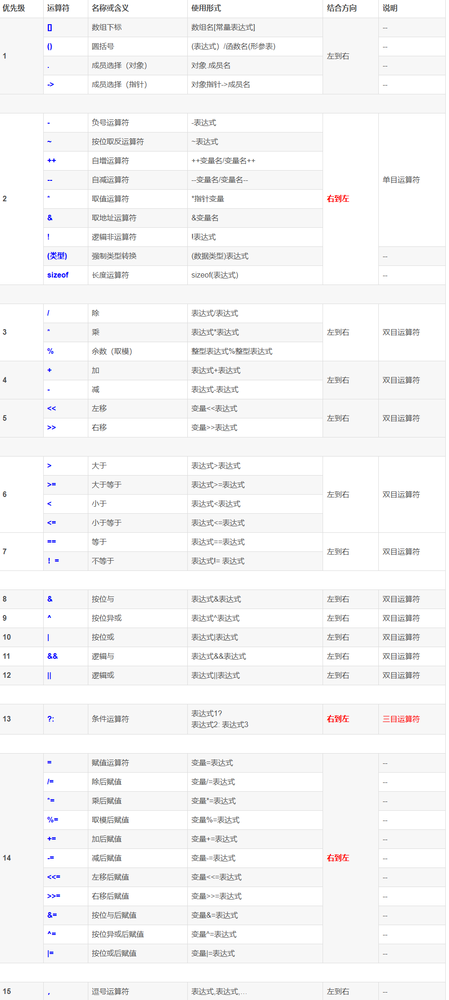

# 3. 运算符与表达式

## 3.1 算数运算符与关系运算符

### 3.1.1 运算符的分类

1. **算数运算符（`+ - * / %`）**
2. **关系运算符（`> < == >= <= !=`）**
3. **逻辑运算符（`! && ||`）**
4. 位运算符（`<< >> ~ | ^ &`）
5. **赋值运算符（`=及其扩展赋值运算符`）**
6. 条件运算符（`? :`）
7. 逗号运算符（`,`）
8. 指针运算符（`* &`）
9. **求字节运算符（`sizeof`）**
10. **强制类型转换运算符（`(ElemType)`）**
11. 分类运算符（`. ->`）
12. 下标运算符（`[]`）
13. 其他（`如函数调用运算符()`）

### 3.1.2 算数运算符及算数表达式

* 当操作符的两边都是整型数的时候，它就执行整除运算，其他情况下执行浮点运算
### 3.1.3 关系运算符与关系表达式

* `> < == >= <= !=`六个关系运算符的表达式的值只有真（1）和假（0）
* C语言中没有布尔类型。所以0值代表假，1值代表真
* 关系运算符的优先级低于算术运算符  
* 有多个判断时需要配合逻辑运算符，如：`if(3<a && a<10)`不能写成`if(3<a<10)`

### 3.1.4 运算优先级

算数运算符的优先级高于关系运算符，关系运算符的优先级高于逻辑与逻辑或运算符，相同优先级的运算符从左至右进行结合。

记住运算优先级，去掉多余的小括号

## 3.2 逻辑运算符与赋值运算符，求字节运算

### 3.2.1 逻辑运算符与逻辑表达式

短路运算（逻辑与和逻辑或）
~~~c
#include <stdio.h>  
int main(){  
    int i = 0;  
    i && printf("1");  
    int j =1;  
    j && printf("2");  
    int x = 0;  
	x || printf("3");  
	int y =1;  
	y || printf("4");
}
//输出结果：
//2
//3
~~~

当i为假时不会进行逻辑与后面的逻辑运算，当x为真时不会进行逻辑或后面的逻辑运算

### 3.2.2 赋值运算符

* 变量才可以作为左值（left operand）
* `a+=3`和`a=a+3`
* `b*=5`和`b=b*5`

### 3.2.3 求字节运算符

sizeof是一个运算符，不像其他运算符是一个符号，sizeof是字母组成的，用于求常量或变量所占用的空间大小。 