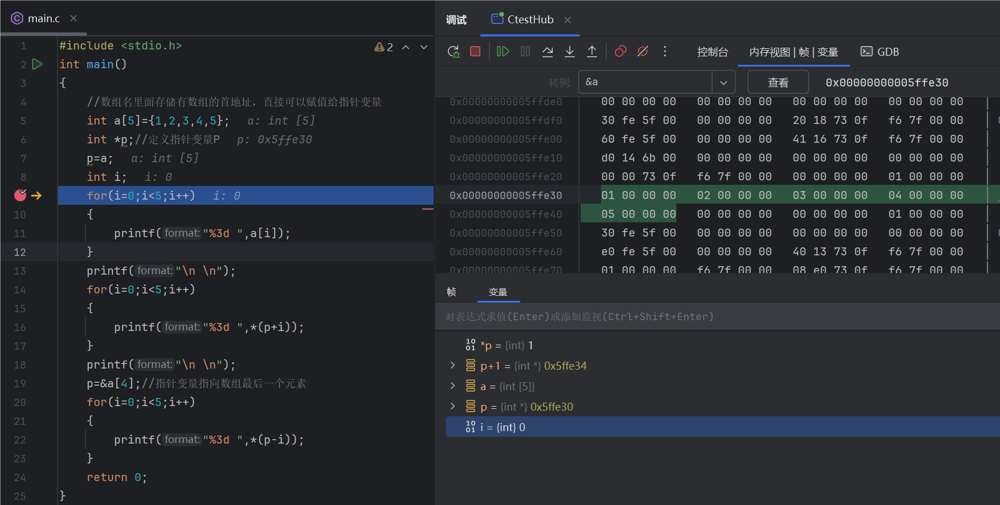

# 6. 指针

## 6.1 指针的本质（间接访问原理）

### 6.1.1 指针的定义

内存区域中的每字节都对应一个编号，这个编号就是“地址”。如果在程序中定义了一个变量，那么在对程序进行编译时，系统就会给这个变量分配内存单元。

* 直接访问：按变量地址存取变量值的方式（` printf("&d",i)`；`scanf("&d",&i);`）
* 间接访问：将变量i的地址存放到另一个变量中

~~~c
#include <stdio.h>  
int main()  
{  
    int i = 5;  
    int *i_pointer = &i;//定义一个指针变量  
    printf("i = %d\n", i);//直接访问  
    printf("i_pointer = %d\n", *i_pointer);//间接访问  
    return 0;  
}
~~~

**指针变量**是一种特殊的变量，它用来存放变量地址。

* 定义格式：`基类型 *指针变量名`
* 示例：`int *i_pointer`，注意这里的*i_pointer*才是变量名，没有星号`*`
* 指针变量本身所占的空间大小在在32位程序中占4字节，在64位程序中占8个字节（考研往往强调的是32位程序）
* 指针变量的初始化时某个变量取地址来赋值（必须指定相同的类型，整型变量对应整型指针等）

**指针**可以直接理解为变量的地址的同义词

* 注意区分指针变量
* 如果有一个变量专门用来存放另一变量的地址（即指针），那么称它为"指针变量"

### 6.1.2 取地址操作符与取值操作符

* 取地址操作符为`&`，也称引用，通过该操作符可以获取一个变量的地址值
* 取值操作符为`*`，也称解引用，通过该操作符可以得到一个地址对应的数据
* `&`和`*`的优先级是相同的，但是要按照自右向左的顺序运行

## 6.2 指针的传递使用场景

指针的使用场景通常只有2个，即传递与偏移。

不同函数之间的栈空间是有权限相互访问的

 ~~~c
#include <stdio.h>  
void change(int *j)  
{  
    *j=10;//*j等价于变量i，间接访问变量i  
}  
int main()  
{  
    int i = 5;  
    // int *i_pointer = &i;  
    // change(i_pointer);    
    change(&i);// 传地址，和上面的被注释掉的原理是一样的  
    printf("i = %d\n", i);  
    return 0;  
}
 ~~~

## 6.3 指针的偏移使用场景 

### 6.3.1 指针的偏移

指针的偏移就像地址的加减可以找到相邻的地址，但是对于指针的乘除就像找地址的乘除一样没有意义。  

* 在这里的第一和第二的输出结果都是一样的是`1 2 3 4 5`，第三个是`5 4 3 2 1`
* 偏移的长度是其类型的长度，也就是偏移sizeof(Elemtype)，这里的p和p+1的地址相差了4

### 6.3.2 指针与一维数组

数组名作为实参传递给子函数时，是弱化为指针的

~~~c
#include <stdio.h>  
void change(char *d)  
{  
    *d = 'H';  
    d[1]='E';  
    *(d+2)='L';  
}  
int main()  
{  
    char c[10] = "Hello";  
    change(c);  
    puts(c);  
    return 0;  
}
//输出：
//HELlo
~~~

## 6.4 指针与malloc动态内存申请，栈与堆的差异

### 6.4.1 指针与动态内存申请

之前定义的各种类型的变量都是在栈空间的，而栈空间的大小在编译时就是确定的。如果使用的空间的大小是不确定的，那么就要使用堆空间。

~~~c
#include <stdlib.h>
void *malloc(size_tsize);//申请空间
.....
free(size_tsize)//释放空间
~~~

默认返回得是无类型指针`void *`，无法进行偏移，所以需要强制转换类型

~~~c
#include <stdio.h>  
#include <stdlib.h>//malloc使用的头文件  
#include <string.h>  
int main()  
{  
    int size ;//代表要申请多大的空间  
    char *p;//void*类型的指针不能进行偏移操作
    scanf("%d",&size);//输入想要申请的空间大小  
    p=(char*)malloc(size);//申请size大小的空间  
    strcpy(p,"Hello World");  
    puts(p);  
    free(p);//释放申请的空间  
    return 0;  
}
~~~

* 添加malloc使用的头文件`#include <stdlib.h>`
* 申请空间太小会存在堆空间的访问越界
* 强制转换返回类型
* 最后**释放**申请的空间（**非常重要**），给的地址必须时最初malloc返回的地址
* 注意指针本身的大小和其指向空间的大小是两码事，不能和前面的变量类比去理解

### 6.4.2 栈空间与堆空间

**栈 stack**是计算机系统提供的数据结构，计算机会在底层对栈提供支持：分配专门的寄存器存放栈的地址，压栈操作、出栈操作都有专门的指令执行，这就决定了栈的效率比较高。

**堆 heep**则是 C，C++函数库提供的数据结构，它的机制很复杂，例如为了分配一块内存，库函数会按照一定的算法（具体的算法请参考关于数据结构、操作系统的书籍)在堆内存中搜索可用的足够大小的空间，如果没有足够大小的空间(可能由于内存碎片太多），那么就有可能调用系统功能去增加程序数据段的内存空间，这样就有机会分到足够大小的内存，然后返回。

**堆的效率要比栈低得多。** 栈空间由系统自动管理，而堆空间的申请和释放需要自行管理（c语言中的malloc函数为例），所以在具体例子中需要通过 free 函数释放堆空间。

~~~c
#include <stdio.h>  
#include <stdlib.h>  
#include <string.h>  
  
char* print_stack()  
{  
    char c[100]="I'm a print_stack function";  
    char *p;  
    p=c;  
    return p;  
}  
  
char* print_malloc()  
{  
    char *p = (char *)malloc(100);//堆空间在整个运行中一直有效，不会因为函数的消亡而结束。  
    strcpy(p, "I'm a print_malloc function");  
    return p;  
}  
  
int main()  
{  
    char *p;  
    p = print_stack();  
    puts(p);  
    p = print_malloc();  
    puts(p);  
    free(p);// 释放堆空间  
    return 0;  
}
//结果：
//乱码
//I'm a print_malloc function
~~~

* 堆空间在整个运行中一直有效，不会因为函数的消亡而结束。
* 只有free时堆空间才会释放