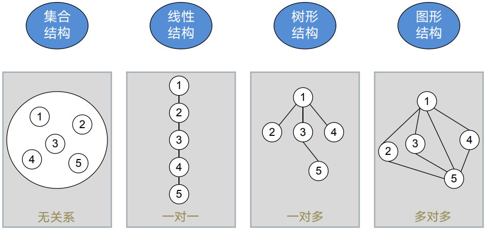
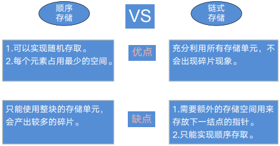

# 9. 数据结构概述

## 9.1 逻辑结构与存储结构

对比

* 逻辑结构：逻辑元素之间的逻辑关系（抽象的，对人友好的）
* 存储结构：数据结构在计算机中的表示（具体的，对计算机友好的）

逻辑结构

存储结构：任何存储结构都是用顺序存储或者链式存储来实现。

链式存储的C语言实现

~~~cpp
Typdef struct Lnode{
	ElemType data;
	struct Lnode *next;
}Lnode,*LinkList;
Lnode *L;
L=(LinkList)malloc(sizeof(Lnode));
A->next=B;B->next=C
~~~

## 9.2 算法

算法：对特定问题求解步骤的描述（有穷、确定、可行、输入、输出）

## 9.3 时间复杂度

时间复杂度：算法中所有语句的频度（执行次数）之和，记为$T(n)=O(f(n))$，其中n是问题的规模，f(n)是问题规模n的某个函数。

常见时间复杂度（最高阶数越小，说明算法的时间性越好）

$$O(1)<O(\log_{2}{n})<O(n)<O(n\log_{2}{n})<O(n^2)<O(n^3)<O(2^n)<O(n!)$$

时间复杂度的计算忽略高阶项系数和低阶项

## 9.4 空间复杂度

空间复杂度$S(n)$指算法运行过程中所使用的辅助空间的大小。记为：$S(n)=O(f(n))$

* 除了需要存储算法本身的指令、常数、变量和输入数据外，还需要存储对数据操作的存储单元。（n个元素数组排序，不需要额外的空间，空间复杂度就是$O(1)$）
* 若输入数据所占空间只取决于问题本身，和算法无关，这样只需分析该算法在实现时所需的辅助单元即可。
* 算法原地工作是指算法所需的辅助空间是常量，即$O(1)$。