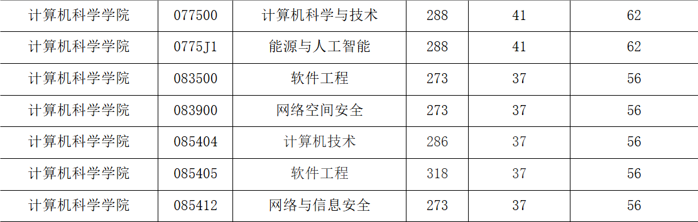

# 1. 专业目录

[专业目录](https://www.swpu.edu.cn/gs/info/1074/4604.htm)

# 2. 分数线

* [204年分数线](https://www.swpu.edu.cn/gs/info/1074/4453.htm)

# 3. 自命题925考试大纲

* [官网925考试大纲](https://www.swpu.edu.cn/gs/info/1074/4554.htm)
* [925考点梳理](925考点.md)

# 4. 专业课（925）考试

> 考试时间180分钟，数据结构及操作系统各75分，满分为150。

1. 单项选择题：每个问题都只有一个选择，根据题目内容选择正确答案
2. 填空题：根据题目要求，填充对应位置的内容，
3. 判断题：根据题目内容判断其描述问题的正确性
4. 应用及算法设计题：根据题目内容完成相应问题的求解，要求给出具体求解过程