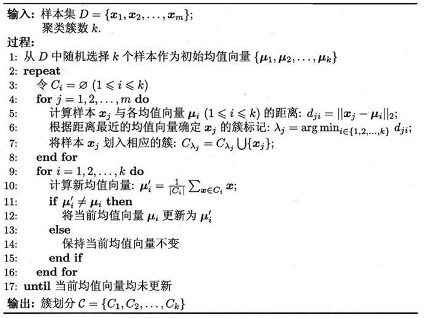
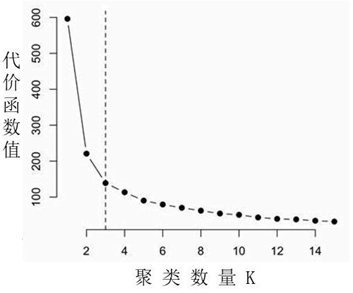

# 介绍

1. **定义**：K-means是我们最常用的基于距离的聚类算法，其认为两个目标的距离越近，相似度越大。
2. **目标**：最小化类内间距。
3. 给定样本集，K-means算法针对聚类所得簇划分最小化平方误差平方误差刻画了簇内样本围绕均值向量的紧密程度，平方误差值越小则簇内样本相似度越高。
4. 但是要找到平方误差的最优解需要考察样本集中所有可能的簇划分，这是一个NP难问题。
5. 是一种无监督算法

# 算法过程

## 文本描述

1. 随机初始化k个聚类中心的位置;
2. 计算每一个点到聚类中心的距离选取最小值分配给`k(i)`
3. 移动聚类中心(其实就是对所属它的样本点求平均值，移动是位置)
4. 重复2，3直到损失函数也就是所有样本点到其所归属的样本中心的距离的和最小)
5. 最后整体分类格局会变得稳定

## 伪代码

# 寻找K值

* 使用肘部算法
* 在下图中代价函数的值会迅速下降，在K=3的时候达到一个肘点。在此之后，代价函数的值会就下降得非常慢，所以选择K=3。
* 
# 优缺点

## 优点

- 属于无监督学习，无须准备训练集
- 原理简单，实现起来较为容易
- 结果可解释性较好

## 缺点

- 需手动设置k值。在算法开始预测之前，我们需要手动设置k值，即估计数据大概的类别个数，不合理的k值会使结果缺乏解释性
- 可能收敛到局部最小值,在大规模数据集上收敛较慢
- 对于异常点、离群点敏感
- 非凸形状无法聚类