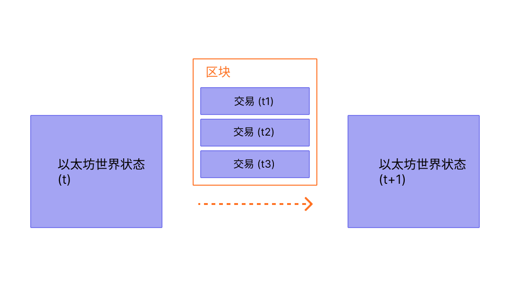

区块是指一批交易的组合，并且包含链中上一个区块的哈希。 这将区块连接在一起（成为一个链），因为哈希是从区块数据中加密得出的。 这可以防止欺诈，因为以前的任何区块中的任何改变都会使后续所有区块无效，而且所有哈希都会改变，所有运行区块链的人都会注意到。

## 为什么要有区块？

为了确保以太坊网络上的所有参与者保持同步状态并就交易的确切历史达成共识，我们将交易分为多个区块。 这意味着同时有数十个（甚至数百个）交易被提交、达成一致并同步。

通过间隔提交，所有网络参与者有足够时间达成共识：即使交易请求每秒发生数十次，但以太坊上的区块仅仅大约每十二秒创建并提交一次。

## 区块如何工作

为了保存交易历史，区块被严格排序（创建的每个新区块都包含一个其父块的引用），区块内的交易也严格排序。 除极少数情况外，在任何特定时间，网络上的所有参与者都同意区块的确切数目和历史， 并且正在努力将当前的活动交易请求分批到下一个区块。

随机选择的验证者在网络上构建完区块后，该区块将传播到整个网络；所有节点都将该区块添加至其区块链的末尾，然后挑选新的验证者来创建下一个区块。 目前，确切的区块构建过程和提交/共识过程由以太坊的“权益证明”协议规定。

## 权益证明协议

权益证明是指：

- 验证节点必须向存款合约中质押 32 个以太币，作为抵押品防止发生不良行为。 这有助于保护网络，因为如果发生不诚实活动且可以证实，部分甚至全部质押金额将被销毁。
- 在每个时隙（12 秒的时间间隔）中，会随机选择一个验证者作为区块提议者。 他们将交易打包并执行，然后确定一个新的“状态”。 他们将这些信息包装到一个区块中并传送给其他验证者。
- 其他获悉新区块的验证者再次执行区块中包含的交易，确定他们同意对全局状态提出的修改。 假设该区块是有效的，验证者就将该区块添加进各自的数据库。
- 如果验证者获悉在同一时隙内有两个冲突区块，他们会使用自己的分叉选择算法选择获得最多质押以太币支持的那一个区块。

## 区块时间

区块时间是指两个区块之间的时间间隔。 在以太坊中，时间划分为每 12 秒一个单位，称为“时隙slots”。 在每个时隙内，选择一个单独的验证者提议区块。 假设所有验证者都在线且完全正常运行，则每个时隙内都会有一个区块产生，意味着区块时间是 12 秒。 但是，偶尔验证者在被要求提议区块时不在线，导致有时候一些时隙是空的。

## 区块大小

区块本身的大小是有界限的。 每个区块的目标大小为 1500 万单位燃料，但区块的大小将根据网络需求而增加或减少，直至达到 3000 万单位燃料的区块限制（目标区块大小的 2 倍）。 区块中所有交易消耗的总燃料量必须低于区块的燃料限制。 这很重要，因为它可以确保区块不能任意扩大。 如果区块可以任意扩大，由于空间和速度方面的要求，性能较差的全节点将逐渐无法跟上网络。 区块越大，在下一个时隙中及时处理它们需要的算力就越强大。 这是一种集中化的因素，可以通过限制区块大小来抵制。