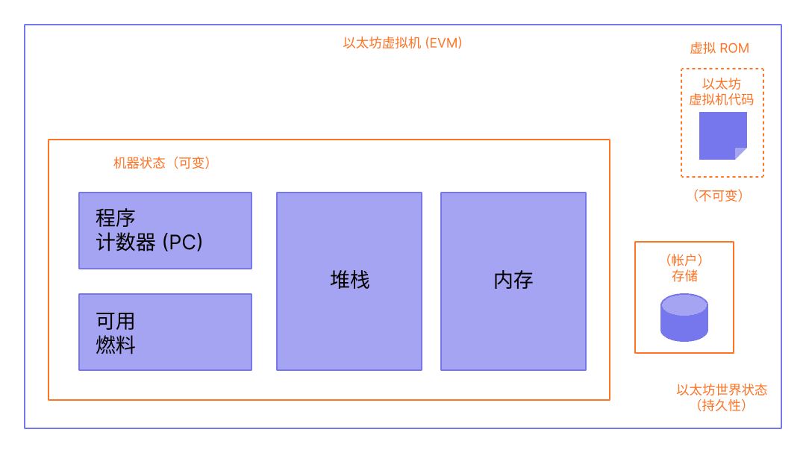

## 从账本到状态机

通常使用“分布式账本”的类比来描述像比特币这样的区块链，它使用密码学的基本工具来实现去中心化的货币。 账本保存着活动记录，而活动必须遵守一套规则，这些规则限制用户在修改账本时可以做什么和不可以做什么。

虽然以太坊有自己的本机加密货币 (ETH)，遵循几乎完全相同的直观规则，但它也支持更强大的功能：智能合约。 对于此更复杂的功能，需要一个更复杂的类比。 以太坊不是分布式账本，而是分布式状态机器。 以太坊的状态是一个大型数据结构，它不仅保存所有帐户和余额，而且还保存一个机器状态，它可以根据预定义的一组规则在不同的区块之间进行更改，并且可以执行任意的机器代码。 在区块中更改状态的具体规则由 EVM 定义。

## 以太坊状态转换函数

EVM 的行为就像一个数学函数：在给定输入的情况下，它会产生确定性的输出。 因此，将以太坊更正式地描述为具有**状态转换函数**非常有帮助：

$$Y(S,Y) = S’$$

给定一个旧的有效状态 `（S）`> 和一组新的有效交易 `（T）`，以太坊状态转换函数 `Y（S，T）` 产生新的有效输出状态 `S'`

### 状态

在以太坊环境中，状态是一种称为Merkle Patricia  trie（改进版默克尔帕特里夏树）的巨大数据结构，它保存所有通过哈希关联在一起的帐户并可回溯到存储在区块链上的单个根哈希。

### 交易

交易是来自帐户的密码学签名指令。 交易分为两种：一种是消息调用交易，另一种是合约创建交易。

合约创建交易会创建一个新的合约帐户，其中包含已编译的智能合约字节码。 每当另一个帐户对该合约进行消息调用时，它都会执行其字节码。

## EVM 说明

EVM 作为一个堆栈机运行，其栈的深度为 1024 个项。 每个项目都是 256 位字，为了便于使用，选择了 256 位加密技术（如 Keccak-256 哈希或 secp256k1 签名）。

在执行期间，EVM 会维护一个瞬态内存（作为字可寻址的字节数组），该内存不会在交易之间持久存在。

然而，合约确实包含一个 Merkle Patricia  trie（作为可字寻址的字数组），该 trie 与帐户和部分全局状态关联。

已编译的智能合约字节码作为许多 EVM opcodes（以太坊虚拟机操作码）执行，它们执行标准的堆栈操作，例如 `XOR`、`AND`、`ADD`、`SUB`等。 EVM 还实现了一些区块链特定的堆栈操作，如 `ADDRESS`、`BALANCE`、`BLOCKHASH` 等。

