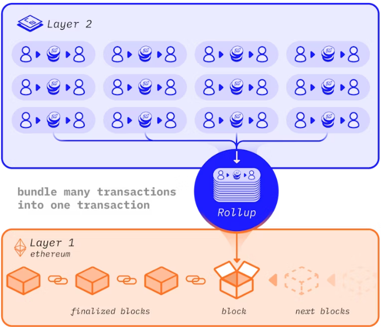

## 公共网络

每个人都能通过互联网连接到公共网络。 任何人都可以在公共区块链上读取或创造交易，并且可以验证已经执行的交易。 对等节点间的共识决定交易的添加和网络状态。

### 以太坊主网

主网是指主要的以太坊生态区块链，所有具有实际价值的交易都发生在该链的分散账本中。

大众和交易所涉及的 ETH 价格是主网的 ETH。

### 以太坊测试网

除了主网外，还有公开的测试网。 这是一种模拟生态环境的网络，协议开发者或智能合约开发者可以使用它们测试尚未部署在主网上的协议升级和智能合约。 你可以把它看作生产与装配服务器的模拟。

在部署到主网之前，你应该在测试网测试编写的任何合约代码。 在与现有智能合约集成的去中心化应用程序中，大多数项目将副本部署到测试网。

大多数测试网最初都使用需要许可的权威证明共识机制。 这意味着会选择少量节点来验证交易并创建新区块——在此过程中将他们的身份进行抵押。 或者，有些测试网采用开放的权益证明共识机制，每个人都可以测试运行验证者，就跟以太坊主网一样。

测试网上的以太币被认为是没有实际价值的；然而，针对已变得稀少或难以获得的特定类型测试网以太币，仍存在一些交易市场。 由于实际中与以太坊（甚至在测试网上）进行交互时需要使用以太币，所以大多数人从水龙头免费获取测试网以太币。 大多数水龙头是网络应用程序，你可以给它输入一个请求发送以太币的地址。

### 二层网络测试网

二层网络 (L2) 是一种统称，用来描述一系列特定的以太坊扩容解决方案。二层网络是一条扩展以太坊并继承以太坊安全保障的独立区块链。 二层网络测试网通常与公共以太坊测试网紧密关联。

#### 什么是一层网络？

一层网络是底层区块链。以太坊和比特币都是一层网络区块链，**因为它们是基石，各种二层网络都构建于其上**。二层网络项目的示例包括以太坊上的“卷叠”和基于比特币的闪电网络。所有这些二层网络项目上的用户交易活动最终都可以回到一层网络区块链。

以太坊还充当二层网络的数据可用性层。二层网络项目将它们的交易数据发布到以太坊上，依赖以太坊实现数据可用性。这些数据可以用来确定二层网络的状态，或对二层网络上的交易提出争议。

**以太坊作为一层网络的情况包括：**

1. **节点运营商网络**用于保障安全并验证网络
2. **区块生产者网络**
3. **区块链**本身以及交易数据历史记录
4. **网络的共识机制**

####  为什么需要二层网络？

区块链的三个目标属性是**去中心化、安全和可扩展**。区块链三难困境中指出，简单的区块链架构只能实现三个属性中的两个。想要安全的去中心化区块链吗？这意味着你需要牺牲可扩展性。

以太坊当前每天处理 100 多万笔交易。以太坊的使用需求可能会导致交易费用价格居高不下。这就是二层网络的用武之地。

#### 二层网络的好处

##### 可扩展性

二层网络的主要目标是在不牺牲去中心化和安全性的情况下提高交易吞吐量（每秒交易数量）。

以太坊主网（一层网络）只能大约每秒处理 15 笔交易。当使用以太坊的需求较高时，网络会出现拥堵，这会提高交易费，那些承担不起这些费用的用户就会被“挤出”。二层网络是通过在一层网络区块链之外处理交易来降低这些费用的解决方案。

##### 降低费用

通过将多笔脱链交易合并成一笔单独的一层网络交
易，交易费将大幅降低，从而使所有人都能更容易地
参与以太坊。

##### 维护安全

二层网络区块链在以太坊主网上结算交易，使用户能
够受益于以太坊网络的安全性。

#### 二层网络是如何工作的?

二层网络是以太坊扩容解决方案的统称，这些解决方案在处理以太坊一层网络以外的交易的同时,还能利用以太坊一层网络强有力的去中心化安全性。二层网络是一个对以太坊进行扩展的单独区块链。

层网络有几种不同类型，各有自己的权衡取舍和安全模型。二层网络减轻了一层网络的交易负担，使其拥塞情况得以改善，并增强了整体可扩展性。

##### 卷叠

卷叠将数百笔交易打包(或“卷叠”)到一层网络的一项交易中。这会将一层网络的交易费分散到整个卷叠中的所有用户，降低每个用户的费用。卷叠中的交易数据会提交到一层网络，但执行由卷叠独立进行。通过将交易数据提交到一层网络，卷叠可以继承以太坊的安全性。这是因为在数据上传到一层网络后，回滚卷叠交易需要回滚以太坊。

卷叠有两种形式：乐观卷叠和零知识卷叠，它们的主要区别在于交易数据提交到一层网络的方式。

##### 乐观卷叠

乐观卷叠的“乐观”体现在其假定交易是有效的，但可以在必要时提出质疑。如果交易被怀疑无效，则会运行一项错误性证明，验证是否已经发生无效交易。

##### 零知识卷叠

零知识卷叠使用有效性证明，其中的交易是脱链计算的，然后将压缩数据提供给以太坊主网，以证明其有效性。

#### 广义二层网络

广义二层网络的行为与以太坊别无二致，但成本更低。你在以太坊一层网络能做的任何事，在二层网络也能做到。

#### 应用特定的二层网络

应用特定的二层网络是专门为特定应用领域而优化从而提升性能的项目。

## 私有网络

如果以太坊网络的节点未连接到公共网络（ 主网或测试网），则以太坊网络就是私有网络。 在这种情况下，私有仅指保留或隔离，而不是保护或安全。

### 开发网络

要开发以太坊应用程序，你需要在私有网络上运行该应用程序以了解它的运行情况，然后再进行部署。 如同在自己的计算机上创建用于 Web 开发的本地服务器，你可以创建本地区块链实例来测试你的去中心化应用程序。 这样，迭代将比公共测试网快很多。

### 联盟网络

共识过程由一组预定义的受信任节点控制。 例如，在由知名学术机构组成的私有网络中，每个学术机构管理一个节点，并且区块由网络中的签名者阈值进行验证。如果说公共以太坊网络像公共互联网，那么联盟网络就像私有内部网。