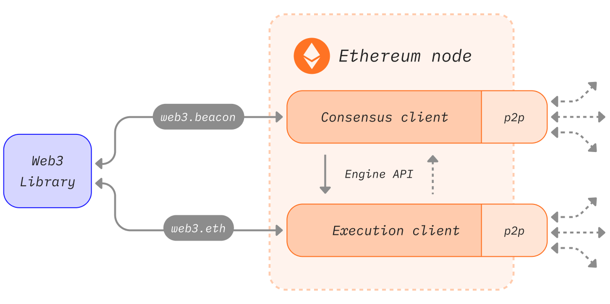
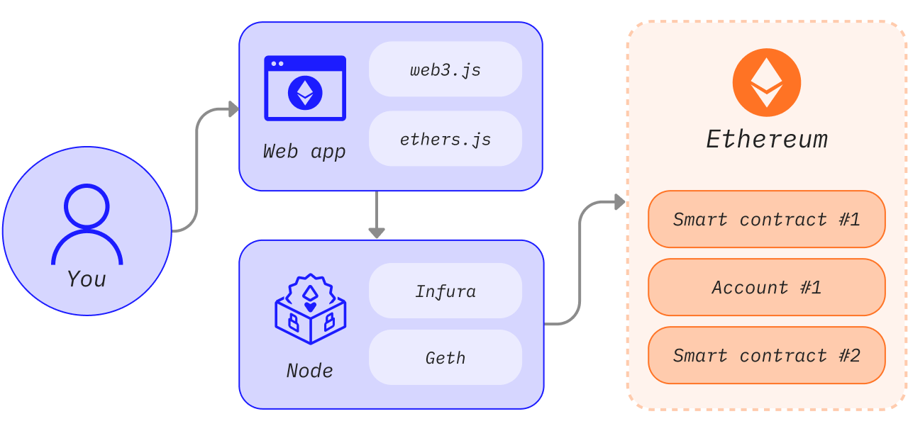
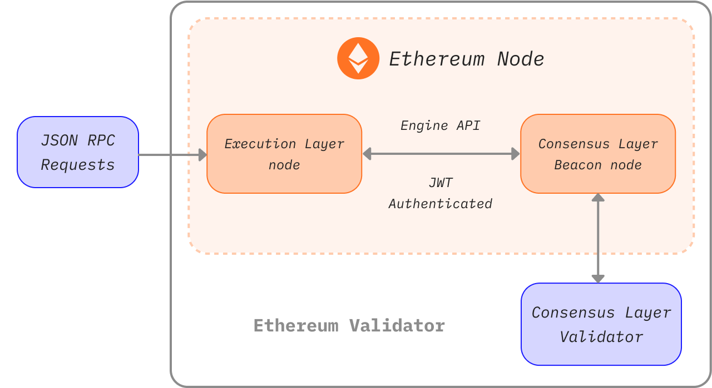

以太坊是一个由计算机组成的分布式网络，这些计算机运行可验证区块和交易数据的软件，称为节点。 结点必须在计算机上运行才能将其转化为以太坊节点。 一个节点由两个独立的软件（名为“客户端”）构成。

## 什么是节点和客户端？

“节点”是指任何以太坊客户端软件的实例，它连接到其他也运行以太坊软件的计算机，形成一个网络。 客户端是以太坊的实现，它根据协议规则验证数据并保持网络安全。 一个节点需要运行**两种客户端软**件：共识客户端和执行客户端。

- 执行客户端（也称为执行引擎、EL 客户端或旧称“以太坊 1”客户端）侦听网络中广播的新交易，并在以太坊虚拟机中执行它们，并保存所有当前以太坊数据的最新状态和数据库。
- 共识客户端（也称为信标节点、CL 客户端或旧称“以太坊 2”客户端）实现权益证明共识算法，使网络能够根据来自执行客户端的经验证数据达成一致。 此外还有名为“验证者”的第三种软件，它们可被添加到共识客户端中，使节点能参与保护网络安全。

这些客户端软件相互协作，以追踪以太坊的链头，并允许用户与以太坊网络进行交互。这种模块化设计称为封装复杂性，包含多个协同运作的软件。 此方法让无缝实施合并变得更简单，客户端软件更易于维护和开发。

### 全节点Full Node

全节点对区块链进行逐块验证，包括下载和验证每个块的块体和状态数据。 全节点分多种类别——有些全节点从创世区块开始，验证区块链整个历史中的每一个区块。 另一些全节点则从更近期的区块开始验证，而且它们信任这些区块是有效的（如 Geth 的“快照同步”）。 无论验证从哪里开始，全节点只保留相对较新数据的本地副本（通常是最近的 128 个区块），允许删除比较旧的数据以节省磁盘空间。 旧数据可以在需要时重新生成。

- 存储全部区块链数据（会定期修剪，所以全节点并不存储包含创世块在内的所有状态数据）
- 参与区块验证，验证所有区块和状态。
- 全节点可以从本地储存中检索所有状态，或从“快照”中重新生成。
- 为网络提供服务，并应要求提供数据。

### 归档节点Archive Node

归档节点是从创世块开始验证每个区块的全节点，它们从不删除任何下载的数据。

- 存储全节点中保存的所有内容，并建立历史状态存档。 如果你想查询区块 #4,000,000 的帐户余额，或者想简单可靠地测试自己的一组交易而不使用跟踪挖掘它们，则需要归档节点。
- 这些数据以太字节为单位，这使得归档节点对普通用户的吸引力较低，但对于区块浏览器、钱包供应商和链分析等服务来说则很方便。

以归档以外的任何方式同步客户端将导致区块链数据被修剪。 这意味着，不存在包含所有历史状态的归档，但全节点能够在需要时构建它们。

### 轻节点Light Node

轻节点只下载区块头，而不会下载每个区块。 这些区块头包含区块内容的摘要信息。 轻节点会向全节点请求其所需的任何其他信息。 然后，轻节点可以根据区块头中的状态根独自验证收到的数据。 轻节点可以让用户加入以太坊网络，无需运行全节点所需的功能强大的硬件或高带宽。 最终，轻节点也许能在手机和嵌入式设备中运行。 轻节点不参与共识（即它们不能成为矿工/验证者），但可以访问功能和安全保障和全节点相同的以太坊区块链。

轻客户端是以太坊积极发展的一个领域，我们预计很快就会看到共识层和执行层的新轻客户端。 一些潜在的途径可在广播网络上提供轻客户端数据。 这些途径的优点在于，广播网络可以支持轻节点网络而不需要全节点来处理请求。

### 执行客户端Execution client

执行客户端负责交易处理、交易广播、状态管理和支持以太坊虚拟机。 它**不**负责区块构建、区块广播或处理共识逻辑。 这些都是共识客户端的责任。

执行客户端会创建执行有效负载——交易列表、更新状态树和其他与执行相关的数据。 共识客户端在每个区块中添加执行有效负载。 执行客户端还要在新的区块中重新执行交易，以确保其有效性。 执行交易在执行客户端的嵌入式计算机中完成，这些计算机被称为EVM。

执行客户端还通过远程过程调用方法（JSON-RPC 应用程序接口）提供用户界面，让用户可以查询以太坊区块链、提交交易和部署智能合约。 远程过程调用通常由 Web3js、Web3py这样的库处理，或者由浏览器钱包等用户界面处理。

简而言之，执行客户端是：

- 以太坊的用户网关
- 托管以太坊虚拟机、以太坊状态和交易池的地方。

### 共识客户端Consensus client

共识客户端处理使节点与以太坊网络保持同步的全部逻辑。 这包括从对等节点接收区块并运行分叉选择算法，从而确保节点始终遵循累积证明最多的链（由验证者有效余额加权计算而得）。 与执行客户端相似，共识客户端拥有自己的对等网络并通过该网络共享区块和认证。

共识客户端不参与对区块的证明或提议——这是由验证者完成的，而验证者是共识客户端的一种可选附加组件。 没有验证者的共识客户端只会追踪链头，使节点保持同步。 因此，用户可以使用其执行客户端与以太坊进行交易，并确信它们在正确的链上。

### 验证者Validators

节点运营商可以在存款合约中存入 32 个以太币来为其共识客户端添加一个验证者。 验证者客户端与共识客户端捆绑在一起，并且可随时添加到节点中。 验证者会处理认证和区块提议。 它们使节点能够累积奖励或因为惩罚而丢失以太币。 运行验证者软件还使节点有资格被选中来提议一个新区块。

##  节点架构

以太坊节点由执行客户端和共识客户端这两种客户端构成。这两种客户端与其各自的点对点（对等）网络连接。 分离对等网络是有必要的，因为执行客户端通过它们的对等网络广播交易，确保它们能够管理自己的本地交易池，同时共识客户端通过它们的对等网络广播区块，保证共识和链增长。

## 为什么要运行节点

### 对自己

运行自己的节点能够以私密、自给自足的去信任方式使用以太坊。 使用自己的客户端验证数据可以让我们信任整个网络。 

- 你的节点根据共识规则独自验证所有交易和区块。 这意味着你不必依赖网络中的任何其他节点或完全信任它们。
- 你可以将以太坊钱包与你自己的节点一起使用。 你可以更安全、更私密地使用去中心化应用程序，因为你不必将地址和余额泄露给中间商。 你可以用自己的客户端检查所有内容。MetaMask和许多其他钱包提供远程过程调用导入，这让它们可以使用你的节点。
- 你可以运行和自我托管其他依赖于以太坊数据的服务。 例如，可以是信标链验证者、二层网络等软件、基础设施、区块浏览器、支付机构等。
- 你可以提供自己的自定义远程过程调用端点。 你甚至可以公开地向社区提供这些端点，以帮助他们避免与大型中心化供应商合作。
- 你可以使用**进程间通信 (IPC)** 连接到节点，或者重写节点将你的程序作为插件加载。 这样可以减少网络延迟，例如在使用 web3 库处理大量数据时或者当你需要尽快替换交易时（即抢先交易）会带来很大帮助。
- 你可以直接质押以太币以保护网络并获得奖励。 请参见[单独质押](https://ethereum.org/zh/staking/solo/)以便开始操作。

### 对网络

多样化的节点对于以太坊的健康、安全和运行弹性非常重要。

- 全节点强制执行共识规则，因此无法欺骗它们接受不遵循规则的区块。 这在网络中提供了额外的安全性，因为如果所有节点都是轻节点，不进行完整验证，验证者可能会攻击网络。
- 如果遇到攻击并且攻破了权益证明加密经济防御，全节点可以执行社交恢复以选择跟随最诚实的链。
- 网络中的节点越多，网络就更加多样化和更加健壮，这是去中心化的最终目标，可实现一个抗审查的可靠系统。
- 全节点使依赖区块链数据的轻量级客户端能够访问这些数据。 轻节点不存储整条区块链，而是通过区块头中的状态根验证数据。 如果有需要，它们可以向全节点请求更多信息。

如果你运行一个全节点，整个以太坊网络都会从中受益，即使你没有运行验证者。

## 如何运行结点

要启动自己的以太坊节点，第一步是选择你的运行方式。 根据要求和各种可能性，你必须选择客户端实现（执行客户端和共识客户端）、环境（硬件、系统）和客户端设置参数。

