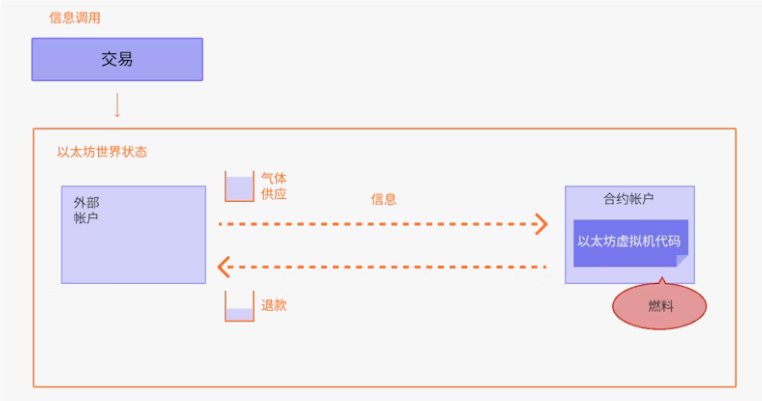

交易是来自账户的加密签名指令。账户将启动交易以更新 Ethereum网络的状态。最简单的交易是将 ETH 从一个账户转移到另一个账户。

## 什么是交易？

以太坊交易是指由EOA账户发起的操作，而不是合约账户。例如，如果 Bob 向 Alice 发送了 1 个 ETH，则必须从 Bob 的账户中扣款，并且必须将 Alice 的账户记入贷方。在这个交易事务中发生了状态的改变。

改变 EVM 状态的交易需要广播到整个网络。任何节点都可以广播在EVM上执行交易的请求;发生这种情况后，验证者将执行交易并将产生的状态更改传播到网络的其余部分。

交易需要付费，并且必须包含在经过验证的区块中。

所提交的交易包括下列信息：

- `from` - 发送者的地址，该地址将签署交易。 这将是一个外部帐户，因为合约帐户不能发送交易。
- `to` — 接收地址（如果是外部帐户，交易将传输值。 如果是合约帐户，交易将执行合约代码）
- `signature` – 发送者的标识符。 当发送者的私钥签署交易并确保发送者已授权此交易时，生成此签名。
- `nonce` - 一个有序递增的计数器，表示来自帐户的交易数量
- `value` – 发送者向接收者转移的以太币数量（面值为 WEI，1 个以太币 = 1e+18wei）
- `input data` – 可包括任意数据的可选字段
- `gasLimit` – 交易可以消耗的最大数量的燃料gas单位。 EVM指定每个计算步骤所需的燃料单位
- `maxPriorityFeePerGas` - 作为小费提供给验证者的最高gas值
- `maxFeePerGas` - 愿意为交易支付的每单位燃料的最高费用（包括 `baseFeePerGas` 和 `maxPriorityFeePerGas`）

Gas 是对验证者处理交易所需的计算的引用。用户必须为此计算支付费用。`gasLimit` 和 `maxPriorityFeePerGas` 确定支付给验证者的最高交易费用。

~~~json
{
  from: "0xEA674fdDe714fd979de3EdF0F56AA9716B898ec8",
  to: "0xac03bb73b6a9e108530aff4df5077c2b3d481e5a",
  gasLimit: "21000",
  maxFeePerGas: "190",
  maxPriorityFeePerGas: "10",
  nonce: "3",
  value: "10000000000"
}
~~~

但是交易对象需要使用发送者的私钥进行签名。这证明该交易只能来自发件人，而不是欺诈性发送。

## 交易类型

以太坊有几种不同类型的交易：

- 常规交易：从一个帐户到另一个帐户的交易。
- 合约部署交易：没有“to”地址的交易，数据字段用于合约代码。
- 执行合约：与已部署的智能合约进行交互的交易。 在这种情况下，“to”地址是智能合约地址。

## **Gas**

交易执行需要消耗 Gas，简单的转账交易需要 21000 单位 Gas。任何未在交易中使用的气体将退还至用户账户。

假设Bob向Alice转账1ETH，Bob 要在 190 gwei 的 `baseFeePerGas` 和 10 gwei 的 `maxPriorityFeePerGas` 向 Alice 发送 1 ETH，他将需要支付`(190+10)*21000=4200000gwei`即0.0042个ETH。

* Bob的账户将被扣除-1.0042 ETH（1 ETH 给爱丽丝+0.0042 ETH 作为手续费）
* Alice 的账户将增加+1.0 ETH
* 基础费用将被燃烧 -0.00399 ETH
* 校验器保留小费+0.000210 ETH

## 交易生命周期

交易提交后，就会发生以下情况：

1. 以加密方式生成的交易哈希： `0x97d99b.....38ff017`，如果成功上链，在这个交易哈希会被存储在下一个区块当中（详细见区块章节）
2. 该交易被广播到网络，并添加到由所有其他待处理的网络交易组成的交易池中。
3. 验证者必须选择你的交易并将它包含在一个区块中，以便验证交易并认为它“成功”。
4. 随着时间的流逝，包含你的交易的区块将升级成“合理”状态，然后变成“最后确定”状态。 通过这些升级，可以进一步确定 你的交易已经成功并将无法更改。