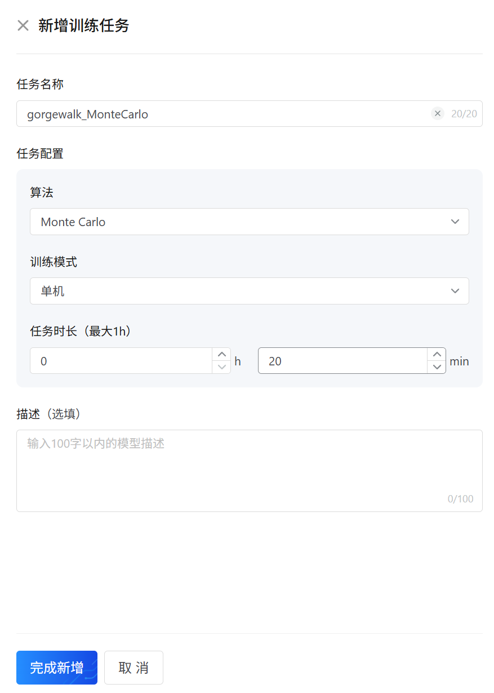

## 1 训练模型

### 1.1 书写模型代码

### 1.2 新增训练任务

1. 选择算法
2. 选择训练模型
3. 选择任务时长

### 1.3 进行模型训练

### 1.4 查看训练监控

## 2 模型管理

### 2.1 提交到模型管理

### 2.2 查看模型管理

## 3 模型评估
### 3.1 新增评估任务

### 3.2 运行评估任务

### 3.3 查看结果