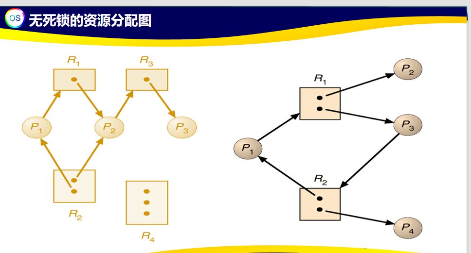
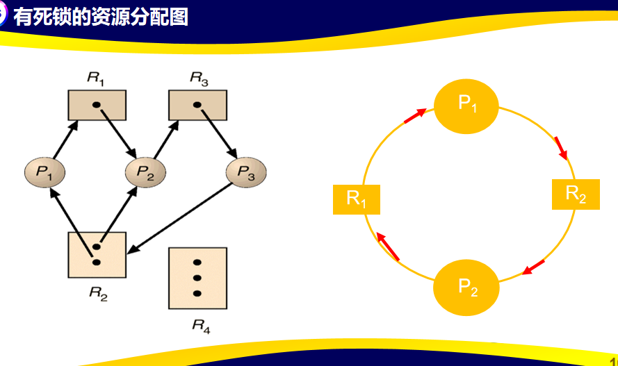

## 第一张 绪论

==【思考题】在计算机系统中,为什么区分管态和目态?==

答：

1. **保护系统资源**
	- 计算机系统中有许多关键资源，像 CPU、内存、I/O 设备等。在管态下，操作系统拥有最高权限，能对这些资源进行全面管理和控制。
	- 例如，只有在管态下，才能执行内存分配、设备驱动等操作。
	- 而目态下的用户程序权限受限，不能随意访问和操作这些关键资源，可防止用户程序因误操作或恶意操作破坏系统资源，
	- 保障系统的稳定性和安全性。

2. **保障系统安全**
	- 管态下的操作系统代码经过严格测试和验证，可执行特权指令，完成系统底层的关键操作。
	- 用户程序运行在目态，只能执行非特权指令。
	- 如果不区分，用户程序就可能执行特权指令，如修改系统关键数据、关闭中断等，导致系统崩溃或出现安全漏洞。
	- 区分管态和目态，可将操作系统和用户程序隔离，降低安全风险。

3. **实现功能分层**
	- 管态负责操作系统内核功能，如进程管理、内存管理、设备管理等，提供底层的系统服务和资源调度。
	- 目态下用户程序专注于实现用户的业务逻辑，如办公软件处理文档、游戏程序实现游戏功能等。
	- 这种分层方式使系统功能结构清晰，便于管理和维护，也有利于操作系统的开发和升级。

## 第2章

  
思考：有没有下列状态转换的存在？  
• 就绪→阻塞  
• 阻塞→执行

*答案：没有*

---

在单CPU系统中，当N个进程并发时，  
就绪队列中进程最多有___个？最少有___个？  
处于执行状态的进程最多有___个？最少___个？  
处于阻塞状态的进程最多有___个？最少有___个？  
（三态模型思考）  
*N-1 0*  
*1 0*  
*N 0*

---

线程为什么没有挂起和激活?

*线程一般是跟着它所属的进程“行动”的。
进程挂起就是把进程从内存送到外存，等之后再激活送回内存。
但线程自己基本不占啥系统资源，它要靠所属进程的资源才能运行。所以当进程被挂起时，里面的线程也就跟着暂时不参与调度了；进程被激活，线程也就跟着能继续工作了 ，不需要单独对线程进行挂起和激活操作。
另外，线程切换很快、开销小，设计线程就是为了让程序能更高效地并发运行，如果像进程那样单独挂起和激活线程，就会增加很多管理上的麻烦，反而降低了效率，所以一般线程没有挂起和激活这两个状态变化。*

## 第三章 处理机

假定系统中有3个进程P1､P2､P3,共12台磁带机｡
进程P1总共要用10台 磁带机,进程P2和P3分别要用4台和9台;
假设在 t0时刻,进程P1､P2､P3 已分别获得5台､2台､2台磁带机,尚有3台磁带机空闲,如下表：
问：此时系统是安全的吗？安全序列为？

| 进程  | 最大需求 | 已分配 | 可用  |
| --- | ---- | --- | --- |
| P1  | 10   | 5   | 3   |
| P2  | 4    | 2   |     |
| P3  | 9    | 2   |     |

*经分析,在 t0时刻系统是安全的｡安全序列为(P2,P1,P3)*

---

某系统有3个并发进程竞争资源R，每个进程都需要5个R，那么至少要（  ）个R，才保证系统一定不会发生死锁？

（5-1）x3+1
=*13*

---

根据资源分配图判断是否存在死锁

## 第4章 进程同步

P1,P2以及存储X 位于三个不同的寄存器

P1和P2可以同时读取X
此时均为0
分别得到 0，2
存储可覆盖所以最后可能为0或2

严格按照顺序执行时，先加后减，数值不变仍为1

---

证明：Peterson算法能够正确实现两个进程的互斥，符合临界区调度三原则。

采用反证法。

假设Peterson算法错误，不能实现两个进程的互斥，则两个进程要么同时进入临界区，要么均不能进入临界区。
若两个进程同时进入临界区，则两个进程的while条件应该同时为假。
两个进程执行到while语句时`inside[0]=true且inside[1]=true`。
两个进程的while条件不可能同时为真或同时为假，因此，其中必有且只有一个进程可以顺利进入临界区。
若turn=1，则进程P0的while条件为真，P0等待；进程P1的while条件为假，不等待，P1可以进入临界区。
反之，若turn=0，则P1等待，P0可进入临界区。
即两个进程的while条件不可能同时为真或同时为假，因此，其中必有且只有一个进程可以顺利进入临界区。假设错误，命题得证。

---