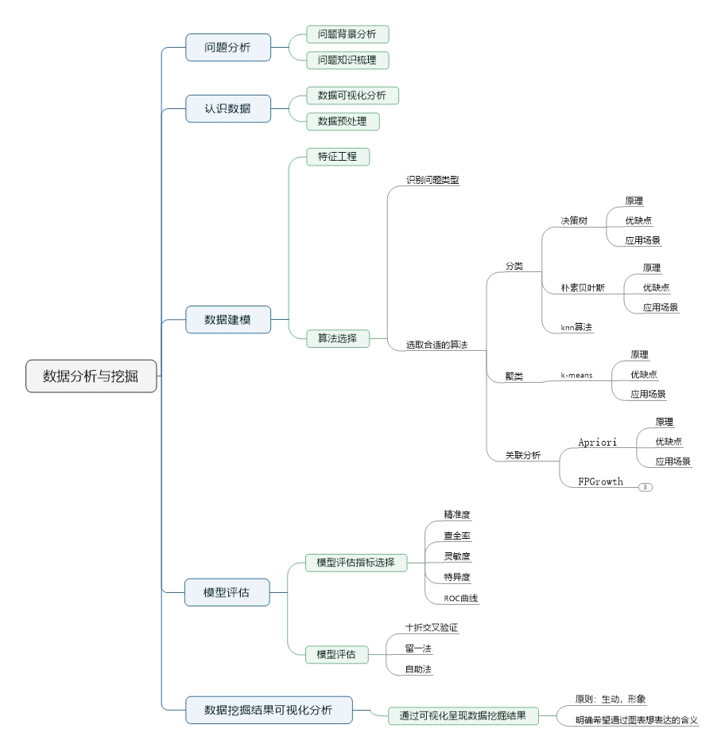

##### 1. 数据挖掘与知识发现之间的关系(教材1.2）。

KDD过程包括数据清理、数据集成、数据选择、数据转换、 数据挖掘、模式评估和知识表示

##### 2. 数据挖掘的主要功能（教材1.2）？

特征描述、鉴别、关联、分类、聚类、趋势和离群点分析

##### 3. 数据挖掘标准流程（参考ppt中的流程图）？

##### 4. 数据探索的意义及其主要内容（教材第二章）。

_数据探索的意义_

1. 有助于完成数据挖掘过程中第一个主要步骤：数据预处理
2. 有助于理解数据、洞悉数据甚至简化其后的数据分析任务

主要内容

1. 了解数据由什么类型的属性或字段组成？每个属性具有何种类型的数据值，哪些是离散的，哪些是连续的。
2. 数据看上去如何？值如何分布？是否存在脏数据？能否看出离群点？
3. 各个属性之间有什么样的关联性？

##### 5. 数据对象和属性的基本概念（教材2.1或ppt内容）

- 数据集由数据对象组成，一个数据对象代表着一个实体。
- 数据库的行对应于数据对象，列对应于属性
- 通常数据对象用属性描述，也被称为样本、实例、元组、数据点或对象。
- 属性是一个数据字段，表示数据对象的一个特征，也被称为维，特征和变量

##### 6. 数据的基本统计描述方法有哪些？特别是数据的集中趋势度量，四分位数. 极差等计算（教材2.2）？

中心趋势度量

##### 7. 常见的几种相似性度量方式的计算，特别是不同类型的属性相似性的度量（教材2.4）

##### 8. K-means算法的基本原理及其优缺点。

##### 9. 数据预处理的主要任务其基本步骤（教材3.1）

##### 10. 数据预处理的意义与目的（教材3.1）

##### 11. 常见的缺失值处理手段有哪些（教材3.2.1）

##### 12. 常见的噪声处理手段有哪些，分箱的意义与类型？（教材2.4）

##### 13. 抽样是数据归约技术的一种，常见的抽样方式有哪些（教材3.4.8）

##### 14. 数据质量通常涉及的因素有哪些。

##### 15. 常用的数据变换策略有哪些？

##### 16. 数据规范化的常用方法，特别是计算案例学习（教材3.5）

##### 17. 关联规则挖掘的意义与步骤，什么是先验性质以及其意义？（教材6）

##### 18. apriori算法的基本流程，及具体案例分析？

##### 19. FP-group算法的算法原理及基本流程。

##### 20. ID3算法的基本流程与步骤，参照ppt掌握决策树的生成过程。

##### 21. 分类与聚类的区别？

##### 22. 分类模型评估指标的度量方式及具体计算过程，结合例题进行分析，要求能够掌握计算公式。

##### 23. 特征工程中新增特征的方法

##### 24. 朴素bayes算法的原理及实现过程（参考ppt）

##### 25. 实验中常用包的作用和意义。

##### 26. 常见的分类. 聚类. 关联分析方法有哪些？

##### 27. 论述题主要是考察大家的数据挖掘思维（类似实验汇报）

PS：复习方式：计算题多复习书本和ppt例题加深算法理解。