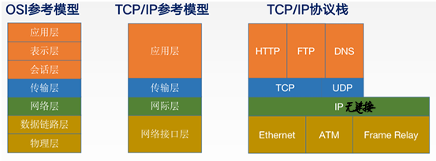

##  TCP/IP参考模型

### 1. OSI参考模型与TCP/IP模型的**相同**点

1. 都分层
2. 基于独立的协议栈的概念
3. 可以实现异构网络互联

### 2. OSI参考模型与TCP/IP模型的**不同**点

4. OSI定义**三**点：服务、协议、接口
5. OSI**先**出现，参考模型先于协议发明，不偏向特定协议
6. TCP/IP设计之初就考虑到异构网**互联**问题，将IP作为重要层次
7. TCP/IP和OSI在网络层和传输层不同

|     | ISO/OSI参考模型 | TCP/IP模型 |
| --- | ----------- | -------- |
| 网络层 | 无连接+面向连接    | 无连接      |
| 传输层 | 面向连接        | 无连接+面向连接 |

