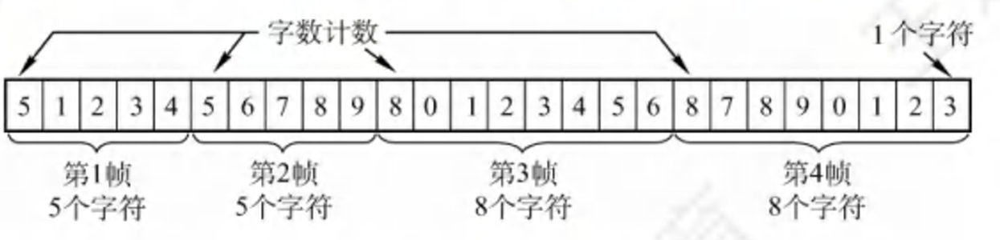
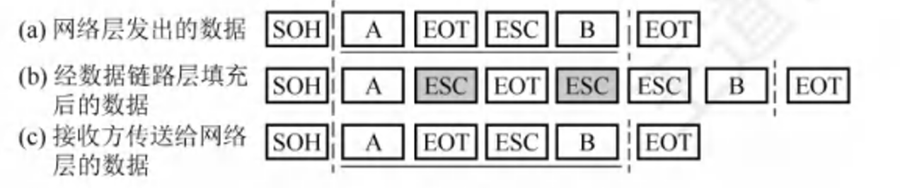
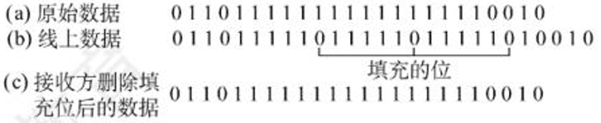

# 数据链路层

- 数据链路层的功能
- 组帧
- 差错控制
	- 检错编码
	- 纠错编
- 流量控制与可靠传输机制
	- 流量控制、可靠传输与滑动窗口机制
	- 停止-等待协议
	- 后退N帧协议（GBN）
	- 选择重传协议（SR）
- 介质访问控制
	1. 信道划分:频分复用、时分复用、波分复用、码分复用
	2. 随机访问:ALOHA 协议:CSMA协议:CSMA/CD协议:CSMACA
	3. 轮询访问:令牌传递协议
- 局域网
	- 局域网的基本概念与体系结构
	- 以太网与IEEE 802.3
	- IEEE 802.11 无线局域网
	- VLAN的基本概念与基本原理
- 广域网
	- 广域网的基本概念
	- PPP协议
- 数据链路层设备
	- 以太网交换机及其工作原理

## 1 点对点信道

### 1.1 概念体系
- 数据链路
	- 相邻节点传送数据报的逻辑通道
- 链路
	- 节点间传输介质的物理连接（如$双绞线 \rightarrow 光纤 \rightarrow 微波$）
	- 按介质分类：双绞线、光纤、微波
	- 有线链路、无线链路
- 节点
	- 主机+路由器
- 帧
	- 封装网络层数据报
	- 协议数据单元

## 2 数据链路层的功能概述

1. 为网络层提供服务
2. 链路管理
3. 封装成帧（组帧）
4. 差错控制
5. 流量控制
6. 可靠传输
7. 介质访问控制

### 2.1 为网络层提供服务
- 三种服务
	1. 确认的无连接服务
	2. 有确认的无连接服务
	3. 有确认的面向连接的服务
- 作用
	- 加强物理层传输原始bit流的功能，修正为逻辑上无差错的数据链路

### 2.2 链路管理

- 数据链路层连接的建立、维持和释放过程

### 2.3 封装成帧（组帧）

#### 2.3.1 定义

- 给一段数据的前后分别添加首部和尾部

#### 2.3.2 概念
1. **帧长**：
	- 帧的数据部分长度加上首部和尾部的长度
	- 帧的数据部分 MTU 长度需要大于首部和尾部
2. **最大传输单元 MTU**：
	- 一个链路层数据帧能承载的最大数据量（$MTU = 1500\ \text{B}$）
	- MTU长度需要大于首部和尾部
	- 帧的数据部分
	- 以太网的MTU=1500B
3. **帧定界**：
	  - 确定帧的界限
	  - 帧定律：$01111110$（十六进制 $0x7E$）
4. **帧同步**：
	 - 接收方能够从二进制流中识别帧的起始与终止
	 - 需去除"定界"附加信息并恢复数据原貌
5. **透明传输**：
	- 无论数据内容如何组合，均能无差错传输
	- 接收方要能够去除“帧定界”的附加信息，把帧“恢复原貌”

#### 2.3.3 实现组帧的4种方法

##### I. 实现组帧的4种方法

1. 字符计数法：
	- 在帧首部使用一个计数字段来记录该帧所含的字节数（如 `SOH` 开头）
	- 缺陷
		- 任何一个计数字段出错，都会导致后续所有帧无法定界
		- 若计数字段出错（失去帧边界划分的依据），接收方无法判断传输帧的结束位和下一帧的开始位，失去同步
	- 

2. 字节填充法：
   - 字符
	- 控制字符
		- SOH（strat of header）：帧的最前面
		- EOT（end of transmission）：帧的末尾
	- 转义字符
		- ESC：放置在特殊字符的前面，防止特殊字符被误判为帧的首尾界定符
	- 图示

3. 零比特填充法：
	- 在HDLC协议中使用
	- 定义：使用特殊字符0111110来标志帧的开始和结束
	- 发：遇到5个连续的1，就自动在其后插入一个0
	- 收：收到5个连续的1，就自动删除后面紧跟的0
	- 图示
	- 口诀：五一一零
4. 违规编码法：
	- 使用违规编码序列来界定帧的起始和终止
	- 适用于冗余编码和特殊编码环境
	- 局域网IEEE802标准采用

##### II. 市场使用情况

- 常用
	- 零比特填充法
	- 违规编码法
- 不常用
	- 字符计数法：计数字段的脆弱性
	- 字节填充法：复杂性、不兼容
### 2.4 差错控制

#### 2.4.1 差错

- 位错：某些位出现差错
	- 常见错误：比特差错（1变成0，0变成1）
- 帧错：帧丢失、帧重复或帧失序（传输错误）

#### 2.4.2 差错控制分类

### 2.5 流量控制

### 2.6 可靠传输

### 2.7 介质访问控制

## 3 局域网

### 3.1 局域网的基本概念
- 定义
- 特点
- 三要素

### 3.2 局域网的体系结构

- 三种特殊局域网
	1. 以太网
	2. 令牌
	3. FDDI

### 3.3 以太网和IEEE802.3

- 传输介质
- MAC地址
- MAC帧

### 3.4 IEEE802.11无线局域网

- 组成
	- 有固定基础设施无线局域网
	- 无固定基础设施移动自组织网络
- MAC帧
	- 3种类型
		1. 数据帧（MAC首部、帧主体、帧检验序列FCS）
		2. 控制帧
		3. 管理帧
	- 记忆口诀

### 3.5 虚拟局域网VLAN
- 概念
	- 802.1Q帧（VLAN的重要组成）
	- VID
	- 干线链路（汇聚链路）
- 3种划分方式（不同的VID映射关系）
	1. 基于接口
	2. 基于MAC地址
	3. 基于IP地址

## 4 广域网

## 5 设备