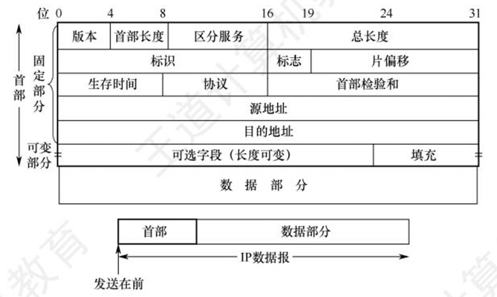

# 网络层

- 网络层的功能
	- 异构网络互连
	- 路由与转发
	- SDN基本概念
	- 拥塞控制
- 路由算法
	- 静态路由与动态路由
	- 距离-向量路由算法
	- 链路状态路由算法
	- 层次路由
- **IPv4**
	- IPv4 分组
	- IPv4 地址与NAT
	- 子网划分与子网掩码、CIDR、路由聚合、ARP、DHCP与ICMP
- IPv6
	- IPv6 的主要特点
	- IPv6 地址
- **路由协议**
	- 自治系统
	- 域内路由与域间路由
	- RIP路由协议
	- OSPF路由协议
	- BGP路由协议
- IP 多播
	- 多播的概念
	- IP 多播地址
- 移动 IP
	- 移动 IP 的概念
	- 移动 IP 通信过程
- **网络层设备**
	- 路由器的组成和功能
	- 路由表与路由转发

## 1 网络层功能

### 1.1 异构网络互联

#### 1.1.1 何为异构？

每个网络的拓扑结构不同、物理层&链路层的实现不同、主机类型也各不相同

#### 1.1.2 重要设备

路由器（Router）/网关（Gateway）

在TCP/IP文献中，路由器称之为网关（Gateway）

### 1.2 路由转发

### 1.3 路由

各个路由器之间相互配合，规划IP数据报（分组）的最佳转发路径

各个路由器需要运行“**路由协议**”，最终生成各自的“**路由表**“

## 2 转发

一台路由器，根据自己的“转发表”，将收到的IP数据报从合适的接口转发出去

转发表=精简版路由表。更精简的数据结构有助于快速检索

### 2.1 拥塞控制

#### 2.1.1 拥塞

- 原因：网络上出现过量分组，超负荷，引起网络性能下降
- 现象：网络上的分组增加，但吞吐量反而降低

#### 2.1.2 拥塞控制

- 开环控制（静态的方法）
	- 在部署网络时，就提前设计好预防拥塞的方法。一旦网络系统开始运行，就不再修改
- 闭环控制（动态的方法）
	- 动态监视网络状态，及时发现哪里发生拥塞，并将拥塞信息传递给相关路由器（如：通过ICMP）
	- 相关路由器及时调整“路由表”

### 2.2 SDN

## IPv4

### IPv4分组（数据报）格式

- 首部
	- 固定部分
		1. 版本
		2. 首部长度
		3. 区分服务
		4. 总长度
		5. 标识
		6. 标志
		7. 片偏移
		8. 生存时间（TTL）
		9. 协议
		10. 首部检验和
		11. 源地址
		12. 目的地址
	- 可变部分
		13. 可选字段
		14. 填充
- 数据部分 