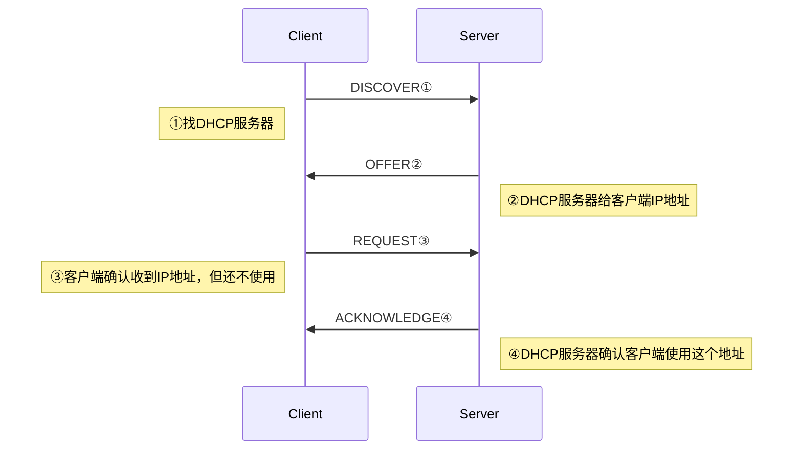
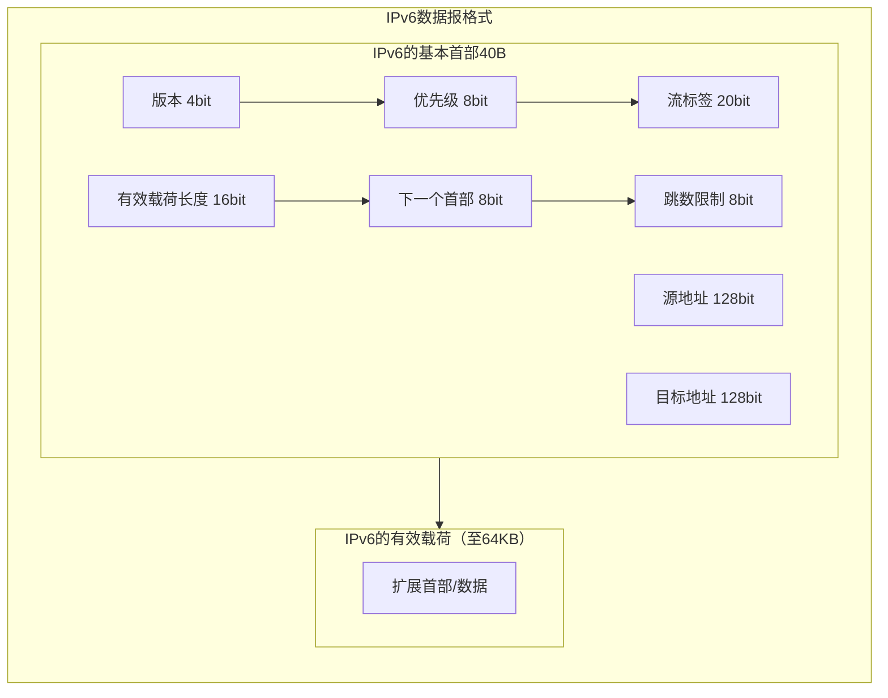
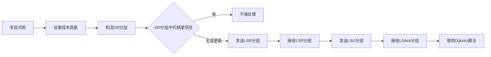
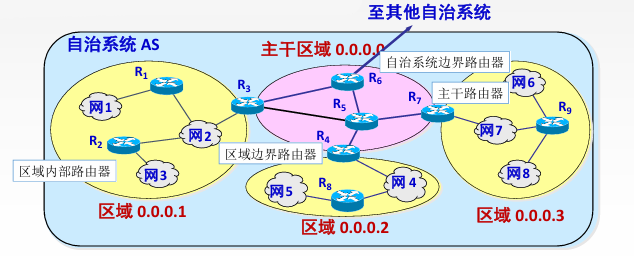

# 网络层

- 网络层的功能
	- 异构网络互连
	- 路由与转发
	- SDN基本概念
	- 拥塞控制
- 路由算法
	- 静态路由与动态路由
	- 距离-向量路由算法
	- 链路状态路由算法
	- 层次路由
- **IPv4**
	- IPv4 分组
	- IPv4 地址与NAT
	- 子网划分与子网掩码、CIDR、路由聚合、ARP、DHCP与ICMP
- IPv6
	- IPv6 的主要特点
	- IPv6 地址
- **路由协议**
	- 自治系统
	- 域内路由与域间路由
	- RIP路由协议
	- OSPF路由协议
	- BGP路由协议
- IP 多播
	- 多播的概念
	- IP 多播地址
- 移动 IP
	- 移动 IP 的概念
	- 移动 IP 通信过程
- **网络层设备**
	- 路由器的组成和功能
	- 路由表与路由转发

## 1 网络层功能

### 1.1 异构网络互联

#### 1.1.1 何为异构？

每个网络的拓扑结构不同、物理层&链路层的实现不同、主机类型也各不相同

#### 1.1.2 重要设备

路由器（Router）/网关（Gateway）

在TCP/IP文献中，路由器称之为网关（Gateway）

### 1.2 路由转发

### 1.3 路由

各个路由器之间相互配合，规划IP数据报（分组）的最佳转发路径

各个路由器需要运行“**路由协议**”，最终生成各自的“**路由表**“

### 1.4 转发

一台路由器，根据自己的“转发表”，将收到的IP数据报从合适的接口转发出去

转发表=精简版路由表。更精简的数据结构有助于快速检索

### 1.5 拥塞控制

#### 1.5.1 拥塞

- 原因：网络上出现过量分组，超负荷，引起网络性能下降
- 现象：网络上的分组增加，但吞吐量反而降低

#### 1.5.2 拥塞控制

- 开环控制（静态的方法）
	- 在部署网络时，就提前设计好预防拥塞的方法。一旦网络系统开始运行，就不再修改
- 闭环控制（动态的方法）
	- 动态监视网络状态，及时发现哪里发生拥塞，并将拥塞信息传递给相关路由器（如：通过ICMP）
	- 相关路由器及时调整“路由表”

### 1.6 SDN

## 2 IPv4

### 2.1 IPv4分组（数据报）

![]（attachment/IPv4分组（数据报）格式.png）

#### 2.1.1 IPv4分组格式
- 首部
	- 固定部分：20B
		1. 版本：区分网络层使用的IP协议版本（v4/v6）
		2. 首部长度：表示整个首部的长度，4bit表示了0~15，**单位为x4B**，即首部最大长度为 $X4B \times 15 = 60B$
		3. 区分服务：无需理会
		4. 总长度：表示首部+数据部分总长度，**单位x1B**
		5. 标识：由IP数据包的“源主机”生成，通常是自增序列
		6. 标志
			- 最低位MF：0表示这是最后一个分片，1表示后面还有分片
			- 次低位DF：0允许分片，1不允许分片
			- 最高位：无需理会
		7. 片偏移：表示在“被分片前”的位置，**单位为x8B**
		8. 生存时间（TTL）：数据报在网络中可通过的路由器数的最大值
		9. 协议：TCp协议服务值为6，UDP协议服务值为17
		10. 首部检验和
			- 每个路由器仅校验首部，而不校验数据部分
			- 如果该字段设为全0，表示不用校验
			- 校验和的计算方法与UDP相同
		11. 源地址：发送方地址
		12. 目的地址：接收方地址
	- 可变部分：0~40B
		1. 可选字段
		2. 填充
- 数据部分：实际传输过程中，“数据部分”的长度受下一段链路的最短/最长帧长限制

#### 2.1.2 IP数据报分片

最大传送单元MTU：一个链路层数据帧能承载的最大数据量，以太网的MTU=1500B

如果一个IP数据报的总长度超出了下一段链路的MTU，就需要路由器将其分片

每个分片都是一个可以被单独转发的IP数据报，都包含首部

##### 注意点

1. IP数据报的“分片”可能在源主机、或任何一个路由器中发生
2. 只有目的主机才会对分片进行“重组”
3. 各分片有可能乱序到达目的主机
4. 由于首部的“片偏移”字段是以x8B为单位，因此，==除了最后一个分片外，其他每个分片的数据部分必须是8B的整数倍==

#### 2.1.3 IP数据报TTL字段

TTL的初始值通常由源主机设置。每经过一个路由器，路由器就将TTL减1，如果TTL减到0，就直接丢弃分组，并向源主机发送ICMP报文（通知出现异常）。

### 2.2 IP地址

#### 2.2.1 IP地址分类

- 单播地址
	- A类1~126
	- B类128~191
	- C类192~223
- 多播地址
	- D类224~239

#### 2.2.2 IP地址结构

IP地址的两级结构：<网络号><主机号>

网络号不定长，可根据前几个比特判断类别，从而 推测出网络号占多少位，进而判断类型

| 开头   | 类型  |
| ---- | --- |
| 0    | A类  |
| 10   | B类  |
| 110  | C类  |
| 1110 | D类  |
| 1111 | E类  |

#### 2.2.3 IP地址的分配

1. 每台主机、每个路由器接口被分配的IP地址都是全球唯一的
2. 路由器和路由器连接的接口可以不分配IP地址，但路由器和其他节点连接的接口必须分配IP地址
3. 从属于同一个网络的所有主机、路由器接口的IP地址“网络号”都相同
4. 当一台新主机接入网络时，需要给它分配一个IP地址、并配置“默认网关”（路由器的IP地址）
5. IP地址资源分配不灵活，利用率低，有限的IP地址资源将很快耗尽

### 2.3 子网划分

#### 2.3.1 子网划分

主机号占n bit，将前k bit抠出来作为子网号，用剩余的 n-k bit作为主机号，这样就能划分出 $2^k$个子网（每个子网包含的IP地址块大小相等）

- 子网划分前，IP地址为两级结构=<网络号，主机号>
- 子网划分后，IP地址为三级结构=<网络号，子网号，主机号>
- 每个子网地址中，主机号不能分配为全0/全1，全0表示子网本身，全1为子网广播地址

#### 2.3.2 子网掩码

- 作用
	- 用子网掩码、IP地址"逐位与"，算出<网络号,子网号>（可合称为“网络前缀"）
	- 只有网络前缀相同的IP地址，才归属于同一个网络（或子网）
- 注意
	- 如果一个网络内部进行了子网划分，那么这个网络中的每台主机、每个路由器接口都需要配置IP地址、默认网关、子网掩码
	- 如果一台路由器支持子网划分技术，那么在它的转发表中，需要包含<目的网络号，子网掩码，转发接口>

#### 2.3.3 默认子网掩码

如果一个传统网络（A/B/C类）内部没有进行子网划分，那么可以将对应此网络的转发表项设置为“默认子网掩码”

|    A类     |     B类      |      C类       |
| :-------: | :---------: | :-----------: |
| 255.0.0.0 | 255.255.0.0 | 255.255.255.0 |

#### 2.3.4 默认路由

- 默认路由（默认转发表项）设置：<目的网络号全0，子网码全0>
- 在路由器转发表中，如果所有表项都不匹配，那么将从“默认路由”转发出去

#### 2.3.5 主机发送IP数据报的过程

1. **判断目的主机和本机是否属于同一个网络**
	- 检查本机IP地址和目的IP地址的网络前缀是否相同（需要用本机配置的子网掩码“逐位与”）。
	- 若网络前缀相同，说明目的主机和本机属于同一个网络；若网络前缀不同，说明不属于同一网络。
2. **将IP数据报封装成MAC帧并发送到链路上**
	- 如果目的主机与本机属于同一个网络，就通过ARP协议找到目的主机的MAC地址，再将IP数据报封装成帧，并将帧发送给目的主机。
	- 如果目的主机与本机不属于同一个网络，就通过ARP协议找到默认网关的MAC地址，再将IP数据报封装成帧，并将帧发送给默认网关。

#### 2.3.6 路由器转发IP数据报的过程

1. **接收IP数据报**
	-  路由器的某个接口收到一个IP数据报。
2. **校验和目的IP地址提取**
	- 对IP数据报首部进行校验，并从中找到目的IP地址。
3. **查转发表**
	- 转发表的表项包含<目的网络号，子网掩码，转发接口>。
	- 检查目的IP地址与每个表项能否匹配（将目的IP地址、子网掩码“逐位与”，匹配表项中的目的网络号）。
	- 注：
		1. 至少“默认路由”表项一定是可以匹配成功的。
		2. 采用 CIDR 技术后由于路由聚合一个IP地址在转发表中可能会匹配多个表项，此时应使用最长前缀匹配原则。
4. **转发IP数据报**
	- 根据查转发表的结果，将IP数据报从匹配的接口转发出去。
	- 注：如果匹配的“转发接口”和该IP数据报的入口相同，就不用再把IP数据报转发回去。

### 2.4 无分类编址CIDR

#### 2.4.1 背景
   - 取消了IP地址传统的A/B/C/D/E分类。
   - 采用无分类编址CIDR，IP地址块分配更灵活，利用率更高，一定程度上缓解了IP地址耗尽（时代背景：1993年）。

#### 2.4.2 基本原理
   - IP地址 = {<网络前缀>,<主机号>}，其中网络前缀不定长。
   - CIDR记法 ——128.14.32.153/30，表示在这个IP地址中，网络前缀占30bit，主机号2bit。

#### 2.4.3 CIDR地址块的子网划分
   - **定长子网划分**：在一个CIDR地址块中，把主机号前$k$bit 报出来作为定长子网号，这样就能划分出$2^k$个子网（每个子网包含的IP地址块大小相等）。
   - **变长子网划分**：在一个CIDR地址块中，划分子网时，子网号长度不固定（每个子网包含的IP地址块大小不同）。
   - 注意：在每个子网中，主机号全0、全1的IP地址不能分配给特定节点私用。

#### 2.4.4 子网划分解题技巧
   - 可以利用类似于“从根到叶构造二叉哈夫曼树”的技巧。
     - 原始CIDR地址块作为根节点（假设可以自由分配的主机号占 $h$ bit）。
     - 每个分支节点必须同时拥有左右孩子，左0、右1（反过来也行）。
     - 每个叶子结点对应一个子网，根据根节点到达叶子结点的路径来分析子网对应的IP地址块范围。
     - 整棵树的高度不能超过h-1（因为即使最小的子网即点对点链路至少要保留$2$bit 主机号）。

### 2.5 路由聚合（构成超网）
#### 2.5.1 路由聚合的原理

4. **原理**：对于一个路由转发表，如果几条路由表项的转发接口相同， 部分网络前缀也相同，那么可以将这几条路由表项聚合为一条。
5. **优点**：路由表更小，查询更快
6. **缺点**：可能会引入无效地址

#### 2.5.2 最长匹配原理

路由器在转发数据包时，从路由表中选择与目标IP地址匹配最长的前缀（即最具体的路由）进行转发。

### 2.6 NAT网络地址转换

#### 2.6.1 私有IP地址（内网IP）
   - **范围**:
     - 10.0.0.0～10.255.255.255
     - 172.16.0.0～172.31.255.255
     - 192.168.0.0～192.168.255.255
   - **用途**:
     - 只允许分配给局域网内部的节点，不允许分配给互联网上的节点。
     - 每个局域网内部都可以自行分配这些私有IP地址。
     - 私有IP地址是可复用的，只要求局域网内唯一，不要求全球唯一。

#### 2.6.2 全球IP地址（外网IP）
   - 通常由ISP提供，全球唯一。
   - 外网IP是一个局域网与外界通信时所需使用的IP地址。

#### 2.6.3 网络地址转换（NAT）
   - **作用**: 转发IP数据报时，进行内网IP、外网IP的相互转换。
   - **NAT表**: 记录地址转换关系，格式为内网IP:端口号@外网IP:端口号。
   - **NAT路由器**:
     - 从内网转发到外网，会更改源IP地址、源端口号。
     - 从外网转发到内网，会更改目的IP地址、目的端口号。
     - NAT路由器包含传输层的功能（因为端口号是传输层的概念）。
- 与普通路由器的区别
	   - 普通路由器转发IP数据报时，不会改变源IP、目的IP地址。
	   - 普通路由器仅包含网络层及以下的功能。

### 2.7 地址解析协议（ARP）

#### 2.7.1 回顾MAC地址
   - MAC地址（48bit）是网络适配器出厂时分配好的，全球唯一。
   - 一台主机至少有一个网络适配器（网络插口背后的芯片），因此主机至少有一个MAC地址。
   - 一台路由器有多个转发接口，每个接口背后都是一个网络适配器，因此路由器有多个MAC地址。

#### 2.7.2 ARP的作用
   - 在一个局域网内部，可以通过ARP协议查询到一个IP地址对应的MAC地址。

#### 2.7.3 ARP表（ARP缓存）
   - 记录（IP地址, MAC地址）之间的映射关系。
   - 一个数据结构（每台主机、每台路由器都有自己的ARP表）。
   - 需要定期更新ARP表项。

#### 2.7.4 ARP过程
1. **ARP请求分组**:
     - 内容：
	     1. 我是谁？：我的IP地址是X，我的MAC地址是Y。
	     2. 我想找谁？：我想找的这个家伙，IP地址是Z。
     - ARP请求分组封装进MAC帧（帧目的地址=全1，源地址=Y）（==广播帧==）
 2. **ARP响应分组**:
     - 内容：你好，我就是你要找的那个人，我的IP地址是Z，我的MAC地址是V。
     - ARP响应分组封装进MAC帧（帧目的地址=Y，源地址=V）（==单播帧==）

### 2.8 动态主机配置协议（DHCP）

#### 2.8.1 基本概念

- **DHCP协议的作用**:
	- 给刚接入网络的主机动态分配IP地址
	- 配置默认网关、子网掩码

- **DHCP使用客户/服务器模型 (C/S)**:
	- **DHCP客户**
	    - 就是新接入网络的主机（希望获得IP地址等配置）
	- **DHCP服务器**
	    - 就是负责分配IP地址的那台主机，管理一系列IP地址池
	    - 注：在家庭网络中，通常由家庭路由器兼职“DHCP服务器”
	    - 在一个大型网络内可以有多台DHCP服务器

- **DHCP是应用层协议，基于UDP**:
	- 客户UDP端口号=$68$
	- 服务器UDP端口号=$67$

#### 2.8.2 DHCP协议运行的过程

##### I. 客户端→服务器：DHCP发现报文
- 携带信息：客户主机的MAC地址（还可以提出对IP地址租用期的要求）
- 网络层：源IP地址=$0.0.0.0$，目的IP地址=$255.255.255.255$（广播IP数据报）
- 链路层：源MAC=客户的MAC地址，目的MAC=全1（广播帧）

##### II. 客户端→服务器：DHCP提供报文
- 携带信息：给客户分配的IP地址、租用期、子网掩码、默认网关
- 网络层：源IP=DHCP服务器的IP地址，目的IP=$255.255.255.255$（广播IP数据报）
- 链路层：源MAC=服务器的MAC地址，目的MAC=客户的MAC地址（单播帧）

##### III. 客户端→服务器：DHCP请求报文
- 携带信息：客户机确认要使用的IP地址
- 网络层：源IP=$0.0.0.0$，目的IP=$255.255.255.255$（广播IP数据报）
- 链路层：源MAC=客户的MAC地址，目的MAC=全1（广播帧）

##### IV. 客户端→服务器：DHCP确认报文
- 携带信息：与报文②类似
- 网络层：源IP=DHCP服务器的IP地址，目的IP=$255.255.255.255$（广播IP数据报）
- 链路层：源MAC=服务器的MAC地址，目的MAC=客户的MAC地址（单播帧）

## 3 IPv6

### 3.1 为什么有IPv6

- 应为CIDR和NAT治标不治本，IPv6在根本上解决问题
	- 改进了首部格式
	- 快速处理/转发数据报
	- 支持QoS

### 3.2 IPv6数据报格式

1. IPv6的基本首部（40B）
	
	1. **版本 (Version)** - 4位
	   - 指定IP协议版本，对于IPv6该值为6。

	2. **通信量类别 (Traffic Class)（优先级）** - 8位
	   - 类似于IPv4的服务类型（TOS），用于区分不同优先级的数据流，支持QoS（Quality of Service）。

	3. **流标签 (Flow Label)** - 20位
	   - 标识特定流的数据报，有助于路由器识别需要特殊处理的数据流，比如那些要求特定服务质量或实时服务的数据流。

	4. **有效载荷长度 (Payload Length)** - 16位
	   - 表示紧随基本报头之后的数据部分的总长度，包括所有扩展报头和上层协议数据单元。最大值为65535字节。

	5. **下一个首部 (Next Header)** - 8位
	   - 指示紧跟在基本报头之后的头部类型。它可以是一个扩展报头或上层协议（如TCP、UDP）。

	6. **跳限制 (Hop Limit)** - 8位
	   - 类似于IPv4的TTL（Time To Live），每经过一个路由器该值减1，当其变为0时，数据包将被丢弃。

	7. **源地址 (Source Address)** - 128位
	   - 发送者的IP地址。

	8. **目的地址 (Destination Address)** - 128位
	   - 接收者的IP地址。
2.  IPv6的有效载荷（至64KB）

### 3.3 IPv4和IPv6的不同

1. IPv6将地址从32位 (4B) 扩展到**128位 (16B)**，更大的地址空间。
2. IPv6将IPv4的校验和字段彻底移除，以减少每跳的处理时间。
3. IPv6将IPv4的可选字段移出首部，变成了**扩展首部**，成为灵活的首部格式，路由器通常不对扩展首部进行检查，大大提高了路由器的处理效率。
4. IPv6支持**即插即用**（即自动配置），不需要DHCP协议。
5. IPv6首部长度必须是**8B的整数倍**，IPv4首部是4B的整数倍。
6. IPv6**只能在主机处分片**，IPv4可以在路由器和主机处分片。
7. ICMPv6：附加报文类型“分组过大”。
8. IPv6支持资源的预分配，支持实时视像等要求，保证一定的带宽和时延的应用。
9. IPv6取消了协议字段，改成下一个首部字段。
10. IPv6取消了总长度字段，改用有效载荷长度字段。
11. IPv6取消了服务类型字段。

### 3.4 IPv6的地址表现形式

1. IPv6地址的一般形式
	- IPv6地址由$8$组$16$位（即$4$个十六进制数字）组成，每组之间用冒号分隔。
	- 示例：`2001:0db8:85a3:0000:0000:8a2e:0370:7334`

2. IPv6地址的压缩形式
	- 连续的全零组可以用双冒号`::`表示，但一个IPv6地址中只能出现一次双冒号。
		- 示例：
		    - 原始地址：`2001:0db8:85a3:0000:0000:8a2e:0370:7334`
		    - 压缩后：`2001:db8:85a3::8a2e:370:7334`
	- 注意：如果存在多个连续的全零组，双冒号只能使用一次。如果有多个位置可以应用双冒号，则选择最左边的一个。 
		- 另一示例：
			- 原始地址：`2001:0000:0000:0000:0000:0000:1428:57ab`
			- 压缩后：`2001::1428:57ab`

### 3.5 IPv6的基本地址类型

1. **单播**
   - 一对一通信
   - 可做源地址+目的地址

2. **多播**
   - 一对多通信
   - 可做目的地址

3. **任播**
   - 一对多中的一个通信
   - 可做目的地址

### 3.6 IPv4向IPv6的过渡

1.	双栈协议
	- 允许设备同时支持IPv4和IPv6
	- 设备可以拥有一个IPv4地址和一个或多个IPv6地址
	- 优先尝试通过IPv6通信，若不可行则回退到IPv4

2.	隧道技术
	- 在IPv4网络中传输IPv6数据包（或反之）
	- 主要用于连接被IPv4网络分隔开的IPv6网络
	- 需要在两端配置适当的接口来**封装和解封装数据包**

## 4 路由协议

### 4.1 路由算法

#### 4.1.1 静态路由算法（非自适应路由算法）

##### 特征
  - 管理员手工配置路由信息。
  - 简便、可靠，在负荷稳定、拓扑变化不大的网络中运行效果很好，广泛用于高度安全性的军事网络和较小的商业网络。
  - 路由更新慢，不适用大型网络。

#### 4.1.2 动态路由算法（自适应路由算法）

##### 特征

  - 路由器间彼此交换信息，按照路由算法优化出路由表项。
  - 路由更新快，适用大型网络，及时响应链路费用或网络拓扑变化。
  - 算法复杂，增加网络负担。

##### 分类
- 全局性
	- 链路状态路由算法 $OSPF$
	- 所有路由器掌握完整的网络拓扑和链路费用信息。
- 分散性
	- 距离向量路由算法 $RIP$
    - 路由器只掌握物理相连的邻居及链路费用。

### 4.2 自治系统AS

#### 4.2.1 为什么会出现自治系统AS

1. 因特网规模很大
2. 许多单位不想让外界知道自己的路由选择协议，但还想连入因特网。

#### 4.2.2 自治系统AS定义

- 在单一的技术管理下的一组路由器，而这些路由器使用一种AS内部的路由选择协议和共同的度量以确定分组在该AS内的路由。
- 同时还使用一种AS之间的路由协议以确定在AS之间的路由。
- 一个AS内的所有网络都属于一个行政单位来管辖。
- 一个自治系统的所有路由器在本自治系统内都必须连通。

### 4.3 域内路由与域间路由

#### 4.3.1 域内路由（Intra-domain Routing）

- 定义：域内路由指的是在同一个自治系统内部进行的数据包路由选择过程。自治系统通常是由单一管理实体控制的一组路由器和网络。
- 目的：确保数据包能够高效、可靠地在自治系统的**内部网络之间传输**。
- 协议示例：
    - **RIP**（Routing Information Protocol）：一种较早的距离向量路由协议，适合小型网络。
    - **OSPF**（Open Shortest Path First）：一种链路状态路由协议，广泛应用于中大型网络，因其高效性和灵活性而受欢迎。
- 特点：
    - 路由决策基于详细的网络拓扑信息。
    - 网络变化时能快速适应并更新路由表。

#### 4.3.2 域间路由（Inter-domain Routing）

- 定义：域间路由涉及的是不同自治系统之间的路由选择，即如何在不同的AS之间有效地转发数据包。
- 目的：**连接不同的自治系统**，并提供一种机制来交换路由信息，以便数据可以从一个AS顺利传送到另一个AS。
- 协议示例：
    - **BGP**（Border Gateway Protocol）：目前最常用的域间路由协议。BGP允许AS之间交换路由信息，并根据策略决定最佳路径。
- 特点：
    - 更加注重安全性和策略控制，因为涉及到跨越不同的管理域。
    - BGP使用TCP作为传输层协议，确保了可靠性。
    - 能够承载大量的路由条目，并支持复杂的路由策略。

~~~mermaid
flowchart TD
    subgraph z["外部网关协议EGP"]

	        direction LR
	        a["自治系统A"] <-- BGP-4 --> b["自治系统B"]

    end

    subgraph a["自治系统A(小网络)"]
	    subgraph c["内部网关协议IGP"]
	        direction LR
	        A[RIP]
	        B[OSPF]
	    end
    end

    subgraph b["自治系统B(小网络)"]
	    subgraph d["内部网关协议IGP"]
	        direction LR
	        D[RIP]
	        E[OSPF]
	    end
    end

~~~

### 4.4 RIP路由协议

#### 4.4.1 RIP协议概述
- **定义**：一种分布式的基于距离向量的路由选择协议，是因特网的标准协议。
- **最大优点**：简单

#### 4.4.2 工作机制
- **维护最佳距离记录**：每个路由器都需维护从自身到其他所有目的网络的唯一最佳距离记录，即一组距离值。
- **距离计算**：
  - 距离通常以“跳数”表示，即数据包从源端口到目的端口所经过的路由器个数。
  - 每经过一个路由器，跳数加1。
  - 直接连接的网络距离为1。
  - RIP允许一条路由最多包含15个路由器，因此距离为16表示网络不可达。

#### 4.4.3 适用范围

- **适用场景**：RIP协议只适用于小规模互联网。

#### 4.4.4 RIP协议信息交换

1. 交换对象：仅和相邻路由器交换信息
2. 交换内容：路由器交换的信息是自己的路由表
3. 交换频率：
	- 每30秒交换一次路由信息，然后路由器根据新信息更新路由表。
    - 若超过180秒没有收到邻居路由器的通告，则判定邻居没了，并更新自己路由表。

##### R2路由表演示

~~~mermaid
flowchart LR
	id1([Net1]) <--> id5[(R1)]
	id2([Net2]) <-->  id6[(R2)]
	id3([Net3]) <-->  id7[(R3)]

	id5[(R1)] <-->  id2([Net2])
	id6[(R2)] <-->  id3([Net3])
	id7[(R3)] <-->  id4([Net4])

~~~

| 目的网络 | 距离  | 下一跳路由器 |
| ---- | --- | ------ |
| Net2 | 1   | 直接交付   |
| Net1 | 2   | R1     |
| Net4 | 2   | R3     |

#### 4.4.5 收敛过程

- 路由器刚开始工作时，只知道直接连接的网络的距离（距离为1），接着每一个路由器也只和数目非常有限的相邻路由器交换并更新路由信息。
- 经过若干次更新后，所有路由器最终都会知道到达本自治系统任何网络的最短距离和下一跳路由器的地址，即“收敛”。

#### 4.4.6 距离向量算法

##### I. 修改相邻路由器发来的RIP报文中的所有表项

- 对地址为X的相邻路由器发来的RIP报文，修改此报文中的所有项目：把“下一跳”字段中的地址改为X，并把所有的“距离”字段+1。

~~~mermaid
flowchart LR
	id1([Net3]) <--> id5[(R2)]
	id2([Net2]) <-->  id6[(Rx)]
	id3([Net3]) <-->  id7[(R1)]

	id5[(R2)] <-->  id2([Net2])
	id6[(Rx)] <-->  id3([Net3])

	id6a[Rx路由表：Net3，2，R2]
	id7a[Rx路由表：Net3，3，X]
~~~

##### II. 处理修改后的RIP报文中的每一个项目

1. R1路由表中若没有Net3，则把该项目填入R1路由表。
2. R1路由表中若有Net3，则查看下一跳路由器地址：
    - 若下一跳是X，则用收到的项目替换源路由表中的项目；
    - 若下一跳不是X，原来距离比从X走的距离远则更新，否则不作处理。

##### III. 超时处理

- 若180秒还没收到相邻路由器X的更新路由表，则把X记为不可达的路由器，即把距离设置为16。

##### IV. 返回

#### 4.4.7 RIP优缺点

##### I. 优点

1. 简单、开销小、收敛过程快
2. 好消息传播快（更新路由快）

##### II. 缺点

1. 限制了网络规模，最大为15，16即为不可达
2. 网络规模越大开销越
3. 坏消息传播慢1（网络出现故障时，多次交换信息才能完成收敛）

### 4.5 OSPF路由协议

#### 4.5.1 协议概述

- **开放性**：OSPF（开放最短路径优先）协议是公开发布的，不受单一厂商控制。
- **算法基础**：使用Dijkstra提出的最短路径算法SPF，确保数据包通过最短路径传输。

#### 4.5.2 主要特征

- **分布式链路状态协议**：OSPF的核心在于其分布式的链路状态机制，各路由器共享网络拓扑信息。

#### 4.5.3 OSPF的工作特点

##### I. 和谁交换？

- **所有路由器**：OSPF采用洪泛法，向自治系统内的所有路由器发送信息。每个路由器将收到的信息转发给其所有相邻的路由器，最终使整个区域内的路由器都获得该信息的副本。

##### II. 交换什么？

- **链路状态信息**：发送的信息包括本路由器与相邻路由器的链路状态，具体涉及：
    - 相邻路由器的标识。
    - 链路的度量值（如费用、距离、时延、带宽等）。

##### III. 多久交换？

- **动态更新**：只有当链路状态发生变化时，路由器才会向其他路由器发送更新信息。这保证了信息的及时性和准确性。

##### IV. 最终结果

- **全网拓扑图**：通过上述过程，所有路由器都能建立一个完整的链路状态数据库，形成全网的拓扑图，从而实现高效的数据传输和路由选择。

##### V. 更新频率

- 每隔30min，要刷新一次数据库中的链路状态。

##### VI. 适用于大规模互联网

由于一个路由器的链路状态只涉及到与相邻路由器的连通状态，因而与整个互联网的规模并无直接关系。因此当**互联网规模很大**时，OSPF协议要比距离向量协议 RIP好得多。

##### VII. 收敛速度快

0SPF不存在坏消息传的慢的问题，它的**收敛速度很快**

#### 4.5.4 链路状态路由算法

1. 每个路由器发现它的邻居结点【HELLO问候分组】，并了解邻居节点的网络地址。
	- 路由器通过发送HELLO分组来发现邻居，并获取邻居的网络地址。
2. 设置到它的每个邻居的成本度量metric。
	- 确定与每个邻居之间的链路成本度量（metric）。
3. 构造【DD数据库描述分组】，向邻站给出自己的链路状态数据库中的所有链路状态项目的摘要信息。
	- 构建并发送DD分组，包含链路状态数据库的摘要信息。
4. 如果DD分组中的摘要自己都有，则邻站不做处理；如果没有有的或者更新的，则发送【LSR链路状态请求分组】请求自己没有的和比自己更新的信息。
	- 如果DD分组中的摘要信息已经存在，则不做处理；否则，发送LSR分组请求缺失或更新的信息。
5. 收到邻站的LSR分组后，发送【LSU链路状态更新分组】进行更新。
	- 收到LSR分组后，发送LSU分组更新链路状态信息。
6. 更新完毕后，邻站返回一个【LSAck链路状态确认分组】进行确认。
	- 更新完成后，发送LSAck分组进行确认。
7. 使用Dijkstra根据自己的链路状态数据库构造到其他节点间的最短路径。
	- 使用Dijkstra算法计算到其他节点的最短路径。

#### 4.5.5 OSPF区域

- 为了使 OSPF能够用于规模很大的网络，OSPF将一个自治系统再划分为若干个更小的范用，叫做区域。
- 每一个区域都有一个32位的区域标识符(用点分十进制表示)
- 区域也不能太大，在一个区域内的路由器最好不超过200

### 4.6 BGP路由协议

#### 4.6.1 BGP协议工作的特征

1. 和谁交换？和其他AS的临站BGP发言人交换信息
2. 交换什么? 交换的网络可达性的信息，即要到达某个网络所要经过的一系列AS。 
3. 多久交换? 发生变化时更新有变化的部分。

#### 4.6.2 BGP协议的特点

- BGP支持 **CIDR**，因此 BGP的路由表也就应当包括目的网络前缀、下一跳路由器，以及到达该目的网络所要经过的各个自治系统序列。
- 在 BGP刚刚运行时，BGP的邻站是交换整个的BGP路由表。但以后只需要在**发生变化时更新有变化的部分**。这样做对节省网络带宽和减少路由器的处理开销都有好处。

#### 4.6.3 BGP协议交换信息的过程

1. 建立连接
    - 两个BGP路由器通过TCP建立连接。
2. 发送开放消息
    - 连接建立后，双方发送`OPEN`消息来初始化参数并建立邻居关系。
3. 交换路由信息
    - 路由器使用`UPDATE`消息向对方发送可达网络的信息和路径详情。
4. 选择最佳路径
    - 根据收到的路由信息和设定的策略，路由器决定到达每个网络的最佳路径。
5. 更新路由表
    - 将选中的最佳路径加入路由表，并在有变化时进行更新。
6. 保持连接
    - 定期发送`KEEPALIVE`消息以维持连接状态，确保邻居间持续通信。

## 5 IP 多播（组播）

### 5.1 IP多播的个概念

1. 多播：让源主机一次发送的单个分组可以抵达用一个组地址标识的若干目的主机，即一对多的通信
2. IP多播：在互联网上进行的多播

### 5.2 IP多播地址

- 是IPv4地址中的D类地址
- 注意
	- 不提供可靠交付
	- 只能用于目的地址
	- 不产生ICMP错误报文
	- 仅应用于UDP

### 5.3 在局域网上进行多播

- 因为局域网支持硬件多播，只需要把IP多播地址映射成多播MAC地址
- 多播IP地址与以太网MAC地址的映射关系不是唯一的

### 5.4 IGMP与多播路由协议

- 网际组管理协议IGMP
	- 让连接到本地局域网上的多播路由器，知道本局域网上是否有主机参加或退出了某个多播组
	- IGMP报文被封装在IP数据报中传送
- 两阶段
	- 主机向多播组的多播地址发送一个IGMP报文，申请加入
	- 周期性的探寻本地局域网上的主机
- 多播转发树

## 6 移动 IP

### 6.1 移动IP的概念

- 移动IP技术
    - 是移动结点（计算机/服务器等）以固定的网络IP地址，实现跨越不同网段的漫游功能，并保证基于网络IP的网络权限在漫游过程中不发生任何改变。
- 移动结点
    - 具有永久IP地址的移动设备。
- 归属代理（本地代理）
    - 一个移动结点的永久“居所”称为归属网络，在归属网络中代表移动节点执行移动管理功能的实体叫做归属代理。
- 永久地址（归属地址/主地址）
    - 移动站点在归属网络中的原始地址。
- 外部代理（外地代理
    - 在外部网络中帮助移动节点完成移动管理功能的实体称为外部代理。
- 转交地址（辅地址）
    - 可以是外部代理的地址或动态配置的一个地址。

### 6.2 移动IP通信的过程

移动IP通信过程归纳如下：

- A刚进入外部网络：
	1. 获得外部代理的转交地址（外部代理广播报文）。
	2. 移动节点通过外部代理发送注册报文给归属代理（包含永久地址 & 转交地址）。
	3. 归属代理接收请求，并将移动节点的永久地址和转交地址绑定（以后到达该归属代理的数据报且要发往移动节点的数据报将被封装并以隧道方式发给转交地址），并返回一注册响应报文。
	4. 外部代理接收注册响应，并转发给移动节点。

- A移动到了下一个网络：
	1. 在新外部代理登记注册一个转交地址。
	2. 新外部代理给本地代理发送新的转交地址（覆盖旧的）。
	3. 通信

- A回到了归属网络：
	1. A向本地代理注销转交地址。
	2. 按原始方式通信。

## 7 网络层设备

### 7.1 三种设备的区别

- 路由器：可以互联两个不同网络层协议的网段
- 网桥：可以互联两个物理层和链路层不同的网段
- 集线器：不能互联两个物理层不同的网段

| 设备类型 | 能否隔离冲突域 | 能否隔离广播域 |
| --- | --- | --- |
| 物理层设备【傻瓜】 (中继器、集线器) | × | × |
| 链路层设备【路人】 (网桥、交换机) | √ | × |
| 网络层设备【大佬】 (路由器) | √ | √ |

### 7.2 路由器的组成和功能

#### 7.2.1 路由器组成

1. ​**输入端口**​  
    - 物理层：信号接收与比特流解调  
    - 数据链路层：帧校验与协议解析  
    - 网络层：  
    - 查转发表（Forwarding Table）  
    - 分组缓存管理
2. ​**交换结构**​（Switching Fabric）  
    - 总线交换：共享总线传输  
    - 交叉开关：并行传输通道  
	- 共享内存：CPU集中控制
    
3. ​**输出端口**​  
	- 网络层：分组调度算法（FIFO/PQ/WFQ）
	- 数据链路层：封装帧结构 
	- 物理层：信号调制与发送
    
4. ​**路由处理器**​  
	- 运行路由协议（RIP/OSPF/BGP）  
	- 维护路由表（Routing Table）
	- 执行网络管理功能（SNMP）
    

#### 7.2.2 核心功能

1. ​**网络互连**​
	- 连接异构网络（不同物理层/数据链路层）
	- 实现网络层协议转换（IPv4/IPv6）
    
2. ​**路由选择**​  
	- 动态路由：通过路由协议生成最优路径
	- 静态路由：管理员手动配置路由表
    
3. ​**分组转发**​  
    - 查表转发：根据目的IP匹配最长前缀 
	- QoS控制：优先级标记（DSCP）与流量整形
    
4. ​**网络管理**​  
    - 拥塞控制：RED随机早期检测算法
	- 安全防护：ACL访问控制与防火墙功能

### 7.3 路由表与路由转发

- 路由表
	- 根据路由选择算法得出。
	- 主要用途是进行路由选择。
	- 通常用软件来实现。

| 目标网络IP地址      | 子网掩码    | 下一跳IP地址 | 接口  |
| ------------- | ------- | ------- | --- |
|               |         |         |     |
|               |         |         |     |
|               |         |         |     |
| 0.0.0.0（默认路由） | 0.0.0.0 |         |     |

- 转发表
	- 由路由表得来。
	- 可以用软件实现，也可以用特殊的硬件来实现。
	- 必须包含完成转发功能所必需的信息。
	- 每一行必须包含从要到达的目的网络到输出端口和某些MAC地址信息的映射。

