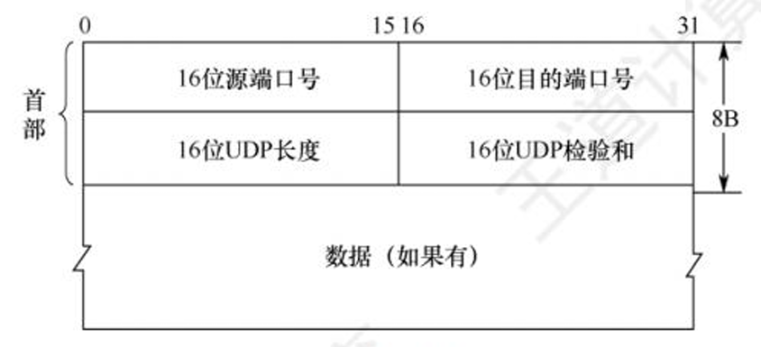
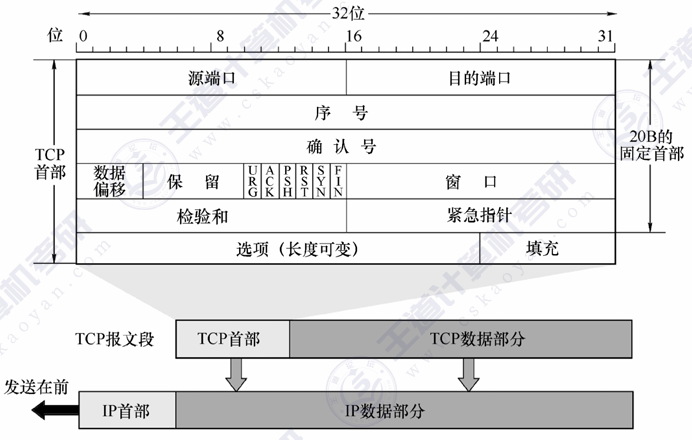

# 传输层

- 传输层提供的服务
	- 传输层的功能
	- 传输层寻址与端口
	- 无连接服务和面向连接服务
- UDP
	- UDP数据报
	- UDP检验
- TCP
	- TCP段
	- TCP连接管理
	- TCP可靠传输
	- TCP流量控制与拥塞控制

## 1 传输层和网络层的对比

### 1.1 网络层
网络层实现了“主机到主机”的通信。网络层在IP数据报的首部，指明源IP地址、目的IP地址。

### 1.2 传输层
传输层实现了“端到端”（进程到进程）的通信。传输层在 $\mathsf{TCP}$ (或 $\mathsf{UDP}$) 报文段的首部，指明源端口、目的端口。

## 2 端口

### 2.1 端口的作用
1. 通过“端口号”标识本主机的一个特定进程
	- 注意：每台主机的端口号是相互独立的
	- 注意：TCP、UDP两种协议的端口号是相互独立的
2. TCP或UDP协议，通过Socket套接字=$\{IP地址：端口号\}$，唯一地标识网络中的一台主机上的一个应用进程
	- 分为UDP嵌套字和TCP嵌套字
### 2.2 端口号的分类
- 服务器使用的端口号
	- 熟知端口号 0~1023 —— 通常只能用于被熟知的重要应用程序
	- 登记端口号 1024~49151
- 客户端使用的端口号
- 短暂端口号 49152~65535

| 应用程序  | FTP | TELNET | SMTP | DNS | TFTP | HTTP | SNMP |
| ----- | --- | ------ | ---- | --- | ---- | ---- | ---- |
| 熟知端口号 | 21  | 23     | 25   | 53  | 69   | 80   | 161  |

## 3 传输层的作用

1. 实现端到端（进程到进程）的通信

2. 复用和分用
	- 复用（从上到下）：在发送数据的时候，同一台主机上的多个进程可以使用同一个传输层协议
	- 分用（从下到上）：在接收数据的时候，传输层可以把数据正确交付到目的进程

3. 差错检测
	- TCP检测出差错后丢弃数据，并通知发送方重传
	- UDP检测出错误后直接丢弃数据，且不通知发送方

4. 向应用层提供两种服务
  - 面向连接的、可靠的端到端传输服务（TCP）—— 确保数据正确/完整，但开销大、实时性较差
  - 无连接的、不可靠的端到端传输服务（UDP）—— 数据可能出错/丢失，但速度快、开销小

## 4 UDP协议

### 4.1 UDP协议与TCP的特点对比

#### 4.1.1 UDP协议特点
- UDP首部很小，只占8B
- UDP每次传输一个完整的报文，不支持报文自动拆分、重装
- UDP是无连接的、不可靠的（可靠性可以交给应用层处理），也不支持拥塞控制
- UDP支持一对一（封装成单播IP数据报）、一对多传输（封装成广播/多播IP数据报）

#### 4.1.2 TCP协议特点
- TCP首部更大，占20~60B
- TCP支持报文自动拆分、重装，因此可以传输长报文
- TCP是有连接的、可靠的、支持拥塞控制
- TCP仅支持一对一传输（因为通信双方的传输层必须先建立连接）

### 4.2 UDP数据报

#### 4.2.1 首部

首部固定长度为8B，即64bit

1. **16位源端口号**：发送进程的端口号，如果不需要对方回复可以设置全为0
2. **16位目的端口号**：接收进程的端口号（必填）
3. **16位UDP长度**: UDP数据报（包括首部和数据）的总长度
	- 以字节Byte为单位
	- UDP数据报的理论最大长度=65535Byte
4. **16位UDP检验和**: 由发送方的传输层计算并填入校验和，接收方的传输层检测是否有差错。（如果无需校验，可以填入全0)

#### 4.2.2 数据
- **数据**：一个完整的应用层报文

### 4.3 UDP检验

#### 4.3.1 一种新的差错检验算法
- 检验和的计算：将原始数据以16bit为一组，进行二进制加法（最高位产生的进位需要回卷），加法运算的最终结果逐位取反，得到16bit“检验和”
- 差错检验方法:接收方将收到的内容以16bit为一组，进行二进制加法(最高位产生的进位需要回卷)
	- 如果加法结果为全1，说明没有差错
	- 如果加法结果不是全1，说明有差错

#### 4.3.2 UDP校验要点
- 发送方在计算检验和之前，需要添加伪首部，计算完校验和之后，拆除伪首部
- 接收方在差错检验之前，需要添加伪首部，检验完之后，拆除伪首部
    - 如果检验出差错，就丢弃该UDP数据报
    - 如果无差错，就接收该UDP数据报

## 5 TCP

### 5.1 TCP报文段

#### 5.1.1 TCP段格式

##### 详解

1. **源端口**：发送方进程的端口号
2. **目的端口**：接收方进程的端口号
3. **序号（seq）**：用于标记数据部分在原始字节流中的位置
	- 起始“序号”是发送方自己设置的，**不一定从0开始**
	- “序号”在真题中常简记为小写的seq
4. **确认号（ack或ack_seq）**：用于反馈，表示字号在该确认号之前的所有字节都已正确收到，“**累计确认**”。
5. **数据偏移**DataOffset：4bit，表示TCP首部长度，以x4B为单位
	- TCP首部最长 = 15 × 4 = 60B
6. **保留**：6bit，暂时没啥用，通常全部置为0
7. **URG紧急位**：1bit，URG=1时，紧急指针有效。表示这是紧急数据，应尽快插队发送
8. **ACK**：
9. **PSH推送位**：1bit, PSH=1时表示希望接收方尽快回复（用于交互式通信）
10. **RST复位位**：1bit，RST=1时，表示出现严重差错(如主机崩溃)，必须释放连接。也可用于拒绝一个非去报文段（如恶意的黑客攻击）
11. **SYN**：1bit，当 SYN =1时表示这是一个连接请求或连接接受报文。
	- 只有握手①、握手②的SYN=1，其他所有TCP报文段都是SYN=0
12. **FIN**：1bit，当FIN=1时，表明此报文段的发送方的数据 已发送完毕，要求释放传输连接。
	- 只有挥手①、挥手③的FIN=1，其他所有TCP报文段都是FIN=0
13. **窗口（rwnd或rcvwnd）**：16bit，表示接收窗口的大小。即从本报文段首部中的ack seq算起，接收方还能接收多少数据(以字节为单位)
	-  这个字段是实现“流量控制”的关键
14. **校验和**：原理与UDP雷同，计算检验和之前也需要添加12B 伪首部(只需将UDP 伪首部的协议字段的 17 改成6，UDP 长度字段改成 TCP 长度)
15. **紧急指针**：紧急数据专用序号，原理与上面那个“序号seq”字段相同
16. **选项**（长度可变）：可以为空，也可以为非空
17. **填充**：凑足4B的整数倍

##### 专业术语

- 若SYN=1，可称为SYN段
- 若FIN=1，可称为FIN段
- 若ACK=1，可称为ACK段
- MSS（ Maximum Segment size，最大段长）
	- 建立TCP连接时，在握手①、握手②选项中协商MSS
	- 通常MSS不会设置太大，以免在IP层被分片
	- MSS的值表示在接下来的数据传输中，一个TCP报文段最多携带多少数据(首部不算在内)

### 5.2 TCP连接管理

### 5.3 TCP可靠传输

### 5.4 TCP流量控制与拥塞控制

