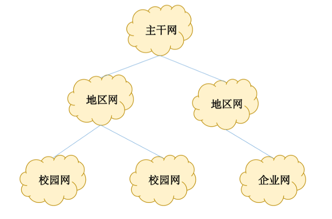
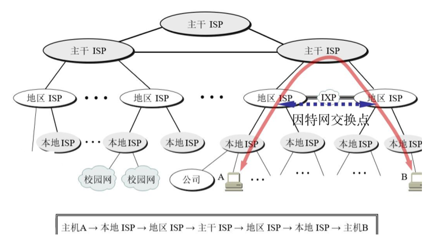
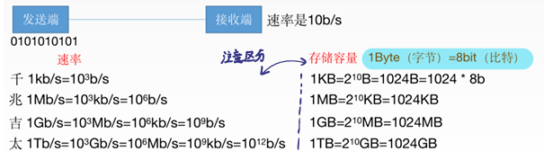
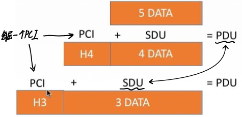

# 1. 计算机网络的概念

## 1.1 计算机网络的定义

- 一个将分散的、具有独立功能的**计算机系统**，通过**通信设备**与**线路**连接起来，由功能完善的软件实现**资源共享**和**信息传递**的系统。
	- 计算机系统：OS
	- 通信设备：中继器，集线器，交换机
	- 线路：网线，可以是逻辑的（wifi）
	- N网互联
		- 电信网络
		- 有线电视网络
		- 计算机网络
		- 电网
		- ......
- 计算机网络是**互连**的、**自治**的计算机的集合
	- 互连：通过通信链路互联互通
	- 自治：无主从关系

## 2. 计算机网络的功能

1. 数据通信
2. 资源共享：同一个计算机网络上的其他计算机可使用某台计算机的计算机资源的行为，可共享**硬件**、**软件**、**数据**，
3. 分布式处理：多台计算机各自承担同一工作任务的不同部分（Hadoop平台）
4. 提高可靠性
5. 负载均衡：使各计算机之间更亲密

# 3. 计算机网络的发展

- 一阶段：ARPAnet→internet互联网→Internet因特网
	- IP是Internet因特网的基本通讯协议
	- TCP帮助IP实现可靠传输
- 二阶段：三级结构
- 三阶段：多层ISP结构
	- ISP网络服务提供商
# 4. 计算机网络的组成

## 4.1 计算机网络组成部分

- 硬件
- 软件
- 协议（一系列规则和约定的集合）
## 4.2 计算机网络的工作方式
- 边缘部分：用户直接使用
	- C/S方式Client/Server
	- P2P方式peer-to-peer
	- B/S方式Browser/Server
- 核心部分：为边缘部分服务
## 4.3 计算机网络的组成部分
- 通讯子网
	- 传输数据
	- 实现**数据通信**
	- 端与端之间的通信 = 2个端中的进程之间的通信
	- 各种传输介质、通信设备、相应的网络协议组成
- 资源子网
	- 实现**资源共享**/数据处理
	- 实现资源共享的设备和软件的集合
	- 封装处理数据

# 5. 计算机网络的分类

1. 按分布范围分（用使用的技术判断类型）
	- 广域网WAN（Internat的核心部分）：交换技术
	- 城域网MAN
	- 局域网LAN：（广播技术）
	- 个人区域网PAN
2. 按使用分
	- 公共网
	- 专用网
3. 按交换技术分（数据如何变换）
	- 电路交换：打电话
	- 报文交换（存储转发）
	- 分组交换（存储转发）
4. 按拓扑结构
	- 总线型
	- 星型
	- 环型
	- 网状型：常用于广域网
5. 按传输技术分
	- **广播式网络**：共享公共通信信道（总线型）
	- **点对点网络**：使用分组存储转发和路由选择机制（网状型）

# 6. 计算机网络的性能指标

## 6.1 速率

- 速率即**数据率**或称**数据传输率**或**比特率**
- 比特1/0位
- 连接在计算机网络上的主机在数字信道上传送数据位数的速率
- 单位是`b/s`，`kb/s`，`Mb/s`，`Gb/s`，`Tb/s`
- 1Byte（字节） = 8bit（比特）
	- 注意区分**速率**常用单位bit和**存储**常用单位Byte
## 6.2 带宽

1. “**带宽**”原本指某个信号具有的频带宽度，即最高频率与最低频率之差，单位是赫兹(Hz)
2. 计算机网络中，带宽用来表示网络的通信线路传送数据的能力，通常是指单位时间内从网络中的某一点到另一点所能通过的“**最高数据率**”。单位是“比特每秒”:`b/s`，`kb/s`，`Mb/s`，`Gb/s`
3. **网络设备所支持的最高速度**

## 6.3 吞吐量

1. 吞吐量表示在**单位时间**内**通过某个网络（或信道、接口）** 的数据量。单位`b/s`，**kb/s**，**Mb/s**等。
2. 吞吐量受网络的带宽或网络的额定速率的限制
3. 电脑和交换机之间的链路带宽是**理想**情况，交换机和各服务器之间的速率之和即吞吐量才是**真实**值。
## 6.4 时延
- 定义
	- **延迟（迟延）**：指数据（报文/分组/比特流）从网络（或链路）的一端传送到另一端所需的时间
	- 单位是**秒s**
- 分类
	1. 发送时延（传输 时延）：发送第一个到发送最后一个bit完毕所需时间
		- $发送时延=\frac{数据长度}{传输带宽(发送时延)}$ 
		- 由最高速率决定
	2. 传播时延：取电磁波传播速度和链路长度
		- $传播时延=\frac{信道长度}{电磁波在信道上的传播速率}$
	3. 排队时延：等待输入/输出链路可用（路由器上）
	4. 处理时延：检错，找出口（路由器上）

## 6.5 时延带宽积

- 公式：$时延带宽积=传播时延\times 带宽$（$bit= s \times b/s$）
- 时延带宽积又称为以**比特为单位的链路长度**
- 某段链路现在有多少比特（**路上bit有多少**）→ 容量

## 6.5 往返时延**RTT**

- 从发送方发送数据开始（**第一个bit放上信道**），到发送方收到接收方的确认（接收方收到数据后立即发送确认），总共经历的时延。
- RTT越大，在收到确认之前，可以送的数据越多
- $往返传输时延 = 传播时延 \times 2$，**二倍传播时延**
- RTT末端处理时间

## 6.6 利用率

- $信道利用率 = \frac{有数据通过时间}{(有+无)数据通过时间}$
- 网络利用率：信道利用率加权平均值

# 7. 计算机网络层次结构

## 7.1 计算机网络体系结构

- 网络体系结构是从**功能**上描述计算机网络结构
- 计算机网络体系结构简称网络体系结构是**分层结构**
- 每层遵循某个/些**网络协议**以完成本层功能。
- **计算机网络体系结构**是计算机网络的**各层及其协议**的集合。
- 第n层在向n+1层提供服务时，此服务不仅包含第n层本身的功能，还包含由下层服务提供的功能。
- 仅仅在**相邻层间有接口**，且所提供服务的具体实现细节对上一层完全屏蔽。
- 体系结构是**抽象**的，而实现是指能运行的一些软件和硬件。

## 7.2 发送文件前

1. 发起通信的计算机必须将数据通信的通路进行激活。
2. 要告诉网络如何识别目的主机。
3. 发起通信的计算机要查明目的主机是否开机，并且与网络连接正常。
4. 发起通信的计算机要弄清楚，对方计算机中文件管理程序是否已经做好准备工作。
5. 确保差错和意外可以解决。

## 7.3 分层的基本原理

1. 各层之间相互**独立**，每层只实现一种相对独立的功能。
2. 每层之间**界面自然清晰**，易于理解，相互交流尽可能少，
3. 结构上可分割开。每层都采用**最合适的技术**来实现。
4. 保持**下层**对**上层**的独立性，上层**单向使用**下层提供的服务
5. 整个分层结构应该能促进标准化工作

## 7.4 计算机网络如何分层

1. 实体：第n层中的活动元素称为n层实体。同一层的实体叫对等实体。
2. 协议：为进行网络中的对等实体数据交换而建立的规则、标准或约定称为网络协议。**【水平】**
	- 协议的三要素
		- 语法：规定传输数据的格式
		- 语义：规定所要完成的功能
		- 同步：规定各种操作的顺序
3. 接口（访问服务点SAP）：上层使用下层服务的入口。
4. 服务:下层为相邻上层提供的功能调用。**【垂直】**
	- SDU服务数据单元：为完成用户所要求的功能而应传送的数据。
	- PCI协议控制信息：控制协议操作的信息。
	- PDU协议数据单元：对等层次之间传送的数据单位

# 8. 体系结构与参考模型

## 8.1 OSI

### 8.1.1 应用层

- 所有能与用户交互参数网络流量的程序

### 8.1.2 表示层
- 作用
	- 用于处理**2个通信系统**中**交换信息**的表示方式（语法和语义）
	- 任意2台设备
	- 数据传递
- 功能
	1. 数据格式变换（翻译官）
	2. 数据加密解密
	3. 数据压缩和恢复
- 主要协议
	1. JPEG
	2. ASCII

### 8.1.3 会话层
- 作用
	- 向表示层实体/用户进程提供建立连接并在连接上有序地传输数据。这是会话，也是建立同步建立同步（SYN）
- 功能
	1. 建立、管理、终止会话
	2. 使用校验点可使会话在通信失效时从**校验点/同步点**继续恢复通信，实现数据同步（适用于大文件传输）
- 主要协议
	1. ADSP
	2. ASP

### 8.1.4 传输层

- 作用
	- 负责主机中**两个进程**的通信,即**端到端**通信
		- 上四层：**端到端**
		- 下三层：**点到点**
- 传输单位：报文段、用户数据段
- 功能
	1. **可**靠传输，不可靠传输（是否基于确认机制）
	2. **差**错控制（纠错）
	3. **流**量控制（控制收发双方的速度）
	4. 复**用**分用
		- 复用：多个应用层进程可同时使用下面运输层的服务
		- 分用：运输层把收到的信息分别交给上面应用顾中相应的进程
- 主要协议
	1. TCP
	2. UDP

### 8.1.5 网络层（IP层）
- 作用
	- 负责把**分组**从源端传到目的端，为分组交换网上的不同主机提供通信服务。
- 网络层传输单位：**数据报**
- 功能
	1. 路由选择（最佳路线）
	2. 流量控制（协调收发速度）
	3. 差错控制（纠错）
	4. 拥塞控制
		- 若所有结点都来不及接受分组，而要丢弃大量分组的话，网络就处于拥塞拥塞状态。
		- 采取一定措施，缓解这种拥塞。
- 协议
	1. IP
	2. IPX
	3. ICMP
	4. IGMP
	5. ARP
	6. RARP
	7. OSPF

### 8.1.6 数据链路层

- 作用
	- 负责把网络层传下来的数据报**组装成帧**
- 数据链路层/链路层的传输单位：**帧**
- 功能
	1. 成帧（定义帧的开始和结束）
	2. 差错控制（**帧错**+**位错**）
	3. 流量控制
	4. 访问（接入）控制（**控制信道的访问**）
- 协议
	1. SDLC
	2. HDLC
	3. PPP
	4. STP

### 8.1.7 物理层

- 作用
	- 负责在物理媒体上实现比特流的透明传输
	- 透明传输：指不管所传数据是什么样的比特组合，都应当能够在链路上传送
- 物理层传输单位：比特bit
- 功能
	1. 定义接口特性
	2. 定义传输模式（**半工、半双工、双工**）
	3. 定义传输速率
	4. 比特同步
	5. 比特编码
- 协议
	1. Rj45
	2. 802.3
## 8.2 TCP/IP

### 8.2.1 OSI参考模型与TCP/IP模型的**相同**点

1. 都分层
2. 基于独立的协议栈的概念
3. 可以实现异构网络互联

### 8.2.2 OSI参考模型与TCP/IP模型的**不同**点

1. OSI定义**三**点：服务、协议、接口
2. OSI**先**出现，参考模型先于协议发明，不偏向特定协议
3. TCP/IP设计之初就考虑到异构网**互联**问题，将IP作为重要层次
4. TCP/IP和OSI在网络层和传输层不同

|     | ISO/OSI参考模型 | TCP/IP模型 |
| --- | ----------- | -------- |
| 网络层 | 无连接+面向连接    | 无连接      |
| 传输层 | 面向连接        | 无连接+面向连接 |

## 8.3 五层参考模型

### 8.3.1 五层参考模型的解析

- 应用层：支持各种网络应用FTP、SMTP、HTTP
- 传输层：进程-进程的数据传输 TCP、UDP
- 网络层：源主机到目的主机的数据分组路由与转发IP、ICMP、OSPF等
- 数据链路层：把网络层传下来的数据报组装成帧Etnernet、PPP
- 物理层：比特传输

### 8.3.2 五层参考模型的数据封装与解封装

