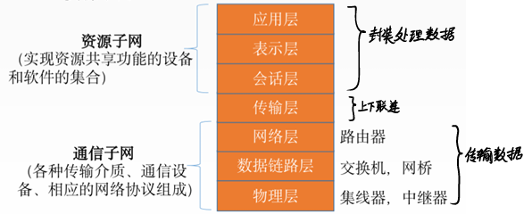
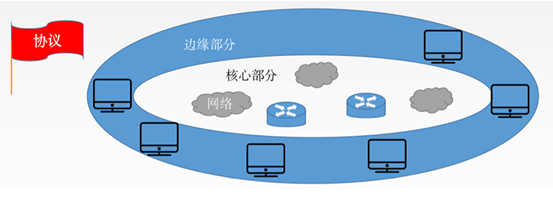

# 1. 计算机网络的概念

## 1.1 计算机网络的定义

- 一个将分散的、具有独立功能的**计算机系统**，通过**通信设备**与**线路**连接起来，由功能完善的软件实现**资源共享**和**信息传递**的系统。
	- 计算机系统：OS
	- 通信设备：中继器，集线器，交换机
	- 线路：网线，可以是逻辑的（wifi）
	- N网互联
		- 电信网络
		- 有线电视网络
		- 计算机网络
		- 电网
		- ......
- 计算机网络是**互连**的、**自治**的计算机的集合
	- 互连：通过通信链路互联互通
	- 自治：无主从关系

## 2. 计算机网络的功能

1. 数据通信
2. 资源共享：同一个计算机网络上的其他计算机可使用某台计算机的计算机资源的行为，可共享**硬件**、**软件**、**数据**，
3. 分布式处理：多台计算机各自承担同一工作任务的不同部分（Hadoop平台）
4. 提高可靠性
5. 负载均衡：使各计算机之间更亲密

# 3. 计算机网络的发展

- 一阶段：ARPAnet→internet互联网→Internet因特网
	- IP是Internet因特网的基本通讯协议
	- TCP帮助IP实现可靠传输
- 二阶段：三级结构
- 三阶段：多层ISP结构
	- ISP网络服务提供商
# 4. 计算机网络的组成

## 4.1 计算机网络组成部分

- 硬件
- 软件
- 协议（一系列规则和约定的集合）
## 4.2 计算机网络的工作方式
- 边缘部分：用户直接使用
	- C/S方式Client/Server
	- P2P方式peer-to-peer
	- B/S方式Browser/Server
- 核心部分：为边缘部分服务
## 4.3 计算机网络的组成部分
- 通讯子网
	- 传输数据
	- 实现**数据通信**
	- 端与端之间的通信 = 2个端中的进程之间的通信
	- 各种传输介质、通信设备、相应的网络协议组成
- 资源子网
	- 实现**资源共享**/数据处理
	- 实现资源共享的设备和软件的集合
	- 封装处理数据

# 5. 计算机网络的分类

1. 按分布范围分（用使用的技术判断类型）
	- 广域网WAN（Internat的核心部分）：交换技术
	- 城域网MAN
	- 局域网LAN：（广播技术）
	- 个人区域网PAN
2. 按使用分
	- 公共网
	- 专用网
3. 按交换技术分（数据如何变换）
	- 电路交换：打电话
	- 报文交换（存储转发）
	- 分组交换（存储转发）
4. 按拓扑结构
	- 总线型
	- 星型
	- 环型
	- 网状型：常用于广域网
5. 按传输技术分
	- **广播式网络**：共享公共通信信道（总线型）
	- **点对点网络**：使用分组存储转发和路由选择机制（网状型）

# 6. 计算机网络的性能指标

## 6.1 速率

- 速率即**数据率**或称**数据传输率**或**比特率**
- 比特1/0位
- 连接在计算机网络上的主机在数字信道上传送数据位数的速率
- 单位是`b/s`，`kb/s`，`Mb/s`，`Gb/s`，`Tb/s`
- 1Byte（字节） = 8bit（比特）
	- 注意区分**速率**常用单位bit和**存储**常用单位Byte
## 6.2 带宽

1. “**带宽**”原本指某个信号具有的频带宽度，即最高频率与最低频率之差，单位是赫兹(Hz)
2. 计算机网络中，带宽用来表示网络的通信线路传送数据的能力，通常是指单位时间内从网络中的某一点到另一点所能通过的“**最高数据率**”。单位是“比特每秒”:`b/s`，`kb/s`，`Mb/s`，`Gb/s`
3. **网络设备所支持的最高速度**

## 6.3 吞吐量

1. 吞吐量表示在**单位时间**内**通过某个网络（或信道、接口）** 的数据量。单位`b/s`，**kb/s**，**Mb/s**等。
2. 吞吐量受网络的带宽或网络的额定速率的限制
3. 电脑和交换机之间的链路带宽是**理想**情况，交换机和各服务器之间的速率之和即吞吐量才是**真实**值。
## 6.4 时延
- 定义
	- **延迟（迟延）**：指数据（报文/分组/比特流）从网络（或链路）的一端传送到另一端所需的时间
	- 单位是**秒s**
- 分类
	1. 发送时延（传输 时延）：发送第一个到发送最后一个bit完毕所需时间
		- $发送时延=\frac{数据长度}{传输带宽(发送时延)}$ 
		- 由最高速率决定
	2. 传播时延：取电磁波传播速度和链路长度
		- $传播时延=\frac{信道长度}{电磁波在信道上的传播速率}$
	3. 排队时延：等待输入/输出链路可用（路由器上）
	4. 处理时延：检错，找出口（路由器上）

## 6.5 时延带宽积

- 公式：$时延带宽积=传播时延\times 带宽$（$bit= s \times b/s$）
- 时延带宽积又称为以**比特为单位的链路长度**
- 某段链路现在有多少比特（**路上bit有多少**）→ 容量

## 6.5 往返时延**RTT**

- 从发送方发送数据开始（**第一个bit放上信道**），到发送方收到接收方的确认（接收方收到数据后立即发送确认），总共经历的时延。
- RTT越大，在收到确认之前，可以送的数据越多
- $往返传输时延 = 传播时延 \times 2$，**二倍传播时延**
- RTT末端处理时间

## 6.6 利用率

- $信道利用率 = \frac{有数据通过时间}{(有+无)数据通过时间}$
- 网络利用率：信道利用率加权平均值

# 7. 计算机网络层次结构

## 7.1 计算机网络的分层结构

## 7.2 分层结构的定义

## 7.3 发送文件前

## 7.4 分层的基本原理

## 7.4 计算机网络如何分层

# 8. 体系结构与参考模型

## 8.1 OSI

## 8.2 TCP/IP

## 8.3 五层参考模型