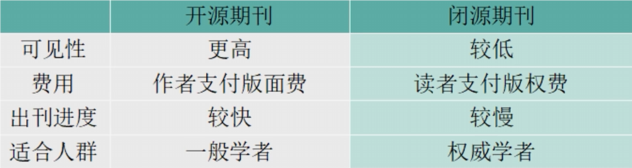
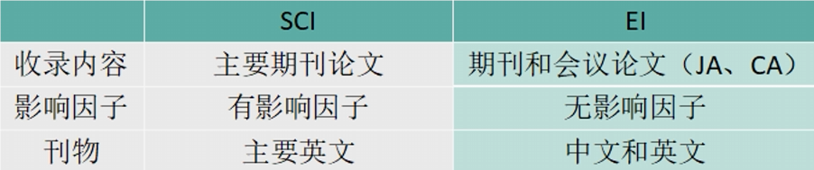

# 期刊与会议

期刊与会议是并行的概念。

期刊论文是指发表在学术期刊上的论文。

学术期刊可以分为闭源期刊和开源期刊两种。

**会议**一般是由研究所或协会举办的，会议结束后会出一本会议过程中的论文集，其中收录的就叫会议论文。换句话说，会议论文是针对学术会议投稿的论文。

期刊与会议论文都是学术成果的体现，但有所不同。一般来说，会议的审稿周期较短，2周左右，而期刊较长一般最快也要 1到 2个月。

认可度方面期刊论文大于会议论文，会议论文的认可度取决于学术会议的权威性，相较于其他专业，计算机领域对会议有更高的认可度。

# SCI与EI

SCI与EI同样也是并行的概念 

**SCI**是美国信息研究所创办的文献索引工具，收录了很多领域的各种期刊，在sci收录的期刊上发表的论文就是 sci论文。

**影响因子**简称if是某期刊前 2年发表的论文被引用总次数除以该期刊在这 2年内发表的论文总数。这是一个国际上通用的期刊影响力评价指标，中科院根据影响因子将sci收录的文章分为 4个区，一区和二区的影响因子高，三区和四区的影响因子低

**EI**是由美国工程师学会联合会创办的大型综合性索引工具。不同于sci主要收录期刊论文。EI既收录期刊论文也收录会议论文，ei没有影响因子，有JA、CA2种检索论文的方式，其中JA检索期刊论文CA检索会议论文

# 核心期刊

目前学术界对期刊质量进行了跟踪评价与定级把最为重要的一级称为核心期刊。简单来说呢中文期刊众多良莠不齐，核心期刊就是众多中文期刊中筛选出来的比较有学术价值的一类，例如北大核心、南大核心等。目前来说，论文的含金量一般可以按照如下排名：sci期刊＞ei期刊＞ei会议≥中文核心期刊＞＞中文谱刊

# 大学生创新创业训练计划

大学生创新创业训练计划是国家为了培养高水平创新人才，而实施的训练项目。每年3、4月份报名，周期一年。大创的流程包括 3、4月联系导师组建团队填写申报书，5、6月份立项答辩实施项目。11月份中期答辩，次年4、5月份结题答辩在立项答辩的过程中，会根据答辩情况将项目分级包括校级、省级、国家级、国家级精品，大创是有经费补贴的，根据不同的级别经费补贴的力度也不同。

# 软著

软著的申请有2个途径，官网自主申请和代理申请。在国家版权网站申请是免费的只是，下证时间长过程繁琐，代理申请相较于自助申请时间短，流程简单，根据下证的时间长短有不同的费用，从几百到几千不等。总体来说，拿证周期大概2个月。在校学生也可以在学校官网搜索软件著作权，学校一般会有软注申请流程的指导，你只需要把申请需要的材料交给学校相关人员即可，学校会交给代理机构由代理机构帮忙申请，这个过程同代理申请一致也需要缴纳一定费用，但是一般可以使用科研项目的经费报销。

申请软著需要的主要材料包括：软件著作权申请表，报告书（软件总体设计、软件详细设计、使用说明书等），软件源码源程序（每页不少于50行，如果总代码少于 60页则全部提交否则提交前 30页和后 30页）注意虽然申请软注对源代码行数没有硬性规定，但是为了保证原创性提高通过的概率，代码行数应该尽可能的多。