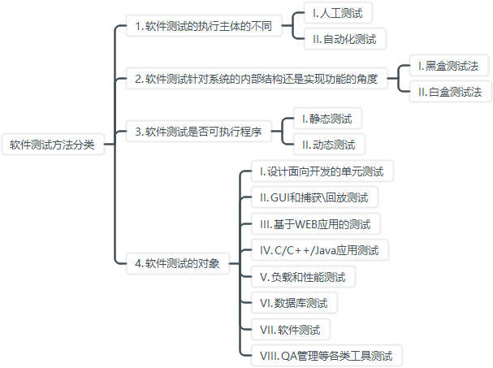

# 1. 软件测试的基本原则

1. 所有的软件测试都应追溯到用户需求
2. 尽早地和不断地进行软件测试
3. 不可能完全地测试 
4. 增量测试，由小到大
5. 避免测试自己的程序
6. 设计充分完善的测试用例
	- 完善的测试用例
	- 完善的测试用例集
7. 注意测试中的群集现象
8. 确认缺陷的有效性
9. 合理安排测试计划
10. 进行回归测试
	- 测试用例集合的维护
	- 缺陷之间的关联性
11. 测试结果地统计、分析和可视化
12. 及时更新测试

# 2. 软件测试的概念

## 2.1 软件开发模式

1. 大棒模式
2. 边写边改模式
3. 瀑布模式
4. 快速原型测试
5. 螺旋开发模式
6. BDD行为驱动开发
7. DDD领域驱动开发
8. TDD测试驱动开发
9. 迭代开发

## 2.2 TDD测试驱动开发

- Test - Driven Development一种软件开发方法
- 强调在编写实际功能代码之前，先编写==测试用例==来描述软件功能的预期行为
- 测试先行

## 2.2 软件测试的分类

1. 软件测试的执行主体的不同
	- 人工测试
	- 自动化测试
2. 软件测试针对系统的内部结构还是实现功能的角度
	- 黑盒测试法
	- 白盒测试法
3. 软件测试是否可执行程序
	- 静态测试
	- 动态测试
4. 软件测试的对象
	- 设计面向开发的单元测试
	- GUI和捕获\回放测试
	- 基于WEB应用的测试
	- C/C++/Java应用测试
	- 负载和性能测试
	- 数据库测试
	- 软件测试
	- QA管理等各类工具测试


# 3. 软件测试的方法

## 3.1 静态测试

- 不在计算机上实际执行所测试的软件而进行的测试（区别于动态测试）
- 主要**检查代码和设计的一致性**，代码对标准的遵循、可读性，代码逻辑表达的正确性，代码结构的合理性等方面。
- 目的是发现违背程序编写标准的问题，程序中不安全、不明确和模糊的部分，找出程序中不可移植部分、违背程序编程风格的问题，包括**变量检查**、**命名和类型审查**、**程序逻辑审查**、**程序语法检查**、**程序结构检查**等内容。
- 可借助软件工具自动进行
- 检查表：把程序中可能发生的各种错误或缺陷进行分类，对每一类列举出尽可能多的典型错误或缺陷，然后把它们制成表格，供再审查时使用。
- 成本更低，效率更高，可在软件开发生命周期早期阶段发现软件的缺陷。

## 3.2 动态测试

- 黑盒测试技术
- 白盒测试技术
- 灰盒测试技术

## 3.3 黑盒测试

- 功能测试或数据驱动测试
- 完全不考虑程序内部的逻辑结构和内部特性，只依据软件的需求规格说明书，检查程序的功能是否符合它的功能说明。

### 3.3.1 黑盒测试有哪些

1. **边界值分析法**
2. **等价类测试法**
3. 错误推测法
4. 因果图法
5. 功能图法
6. 决策表法
7. UseCase法（场景法）
8. 正交实验法

### 3.3.2 等价类测试法

- 等价类：将输入数据域划分成若干个子集（等价类），然后从每个子集中选取少数具有代表性的数据作为测试用例。
- 一般：不考虑输入数据之间的相互关系，只关注单个输入数据的有效和无效取值范围所划分出来的等价类。
- 弱/强：单/多缺陷假设（单个输入数据出错/多个数据输入错误）
- 健壮：考虑了无效值（无效等价类），是否能对无效数据处理，评价在面对无效输入时的处理能力

组合合成

1. 弱一般等价类
2. 强一般等价类
3. 弱健壮等价类
4. 强健壮等价类

## 3.4 白盒测试

针对被测程序的源代码，测试者可以完全不考虑程序的功能，所以，**如果需求规约中的功能没有实现，那么白盒测试很难发现**。

### 3.4.1 白盒测试有哪些

1. **逻辑覆盖法**
2. 域测试
3. 符号测试
4. Z 路径覆盖


### 3.4.2 逻辑覆盖法基本概念


**流图**：程序流程图简化为控制流图，简称流图

**路径**：表示程序通路的节点序列表示，也可用弧线表示。

**独立路径**：程序入口到出口的多次执行中，每次至少有一个语句（包括运算、赋值、输入、输出或判断）是新的，未重复的。控制流图来看就是从入口进入控制流图后，至少经历一条从未走过的弧。


**环形复杂度**（圈复杂度）
- 衡量程序逻辑复杂度。
- 基本路径方法：提供程序基本集的独立路径数量和确保所有语句至少执行一次的测试数量上界。
- 程序越复杂，路径数越多。
- 为了使程序图成为强连通图，从图的入口点到出口点加一条用线表示的有向边，使图成为强连通图。

**复杂度计算**

1. 复杂度$V(G)$计算公式：$V(G_1) = e-n+p$
	需修改控制流图，每一个结束点都增加一个到启始点的边，形成强连通图
	e：边数（弧的个数）
	n：节点数
	p：连通分量的个数（常为1）
	强连通图的复杂度V(G) = 线性独立环路的数量（ 图中被划分的区域的数量）
2. 复杂度$V(G)$计算公式：$V(G_2) = e-n+2p$
	- e：边数（弧的个数）
	- n：节点数
	- p：连通分量的个数（常为1）


### 3.4.3 逻辑覆盖--逻辑覆盖标准

1. **语句覆盖**：最基本的覆盖标准，使得每一条可执行语句至少被执行一次
2. **判定覆盖**（分支覆盖）：使得每个判定的所有可能结果（T/F）至少出现一次。
3. **条件覆盖**：==使得判定中的每个**逻辑条件**的所有可能结果至少出现一次==
4. **判定/条件覆盖**：使得判定中每个条件的所有可能结果至少出现一次，并且每个判定本身的所有可能结果也至少出现一次
5. **条件组合覆盖**：使得每个判定中条件结果的所有可能组合都至少出现一次
6. **点覆盖**：覆盖流图中的所有节点
7. **边覆盖**：覆盖流图中的所有边
8. **路径覆盖**：使得程序的所有可能执行路径都至少被执行一次

书写测试白盒测试的测试用例，实现逻辑覆盖


## 3.5 灰盒测试

对软件的部分内部结构有一定了解，但不像白盒测试那样深入到每一行代码，侧重于功能验证的同时，也会利用部分内部信息来指导测试用例的设计，关注软件的功能和结构之间的交互，以及这些交互如何影响软件的外部行为。


# 4. 软件开发阶段

1. 项目规划阶段
2. 需求阶段（**在本阶段同步开启软件测试**）
3. 详细设计与概要设计阶段
4. 编码阶段
5. 软件测试阶段（**不是一个独立的阶段，贯穿整个开发流程**）
6. 维护阶段

## 4.1 软件测试阶段内容

1. 规格说明书审查
2. 系统和程序设计审查
3. **单元测试**：对用源代码实现的每一个程序单元进行测试，检查各个程序模块是否正确地实现了规定的功能。
4. **集成测试**：将已测试过的模块组装起来，主要对与设计相关的软件体系结构的构造进行测试。
5. 确认测试：检查已实现的软件是否满足了需求规格说明中确定了的各种需求以及软件配置是否完全、正确。
6. **系统测试**：把已经经过确认的软件纳入实际运行环境中，与其它系统成份组合在一起进行测试。
7. **验收测试**：检验软件产品的最后一道工序，主要突出用户的作用，同时软件开发人员也应有一定的程度参与。


# 5. 软件测试的4个级别

1. 单元测试
2. 集成测试
	- 回归测试
3. 系统测试
4. 验收测试


## 5.1 单元测试（模块测试）

主要工作分为**两个步骤**：人工静态检查（**静态测试**）和动态执行跟踪（**动态测试**）。

- 由谁来执行：程序员
- 什么时候执行：开发人员在编写代码的同时编写单元测试用例

- 针对的是软件设计的最小单位，程序模块
- 多个模块可以平行地独立进行单元测试
- 白盒测试用例为主，黑盒为辅


## 5.2 集成测试

### 5.2.1 集成模式

* 一次性集成测试模式：先按模块分别测试，再全部组装后全量测试。
* 增量式集成测试模式（渐增式集成）：首先按模块进行测试，再将测试后的模块组装上，实现一边模块测试，一边组装模块，直到最后完成全量测试。

### 5.2.2 集成方法（增量式集成测试的2种方法）

**（1）自顶向下集成**

从主控模块开始，依软件控制层次结构向下逐步集成模块，可采用深度优先或广度优先策略，按深度方向组装能先实现验证完整软件功能。

其具体步骤包括：先测试主控模块（用桩程序替代附属模块），再按选定策略用实际模块替换桩模块并同时测试，为防新错误需做回归测试，不断重复直至完成。

- 优点：能尽早检验程序主要控制和决策机制、早发现错误
- 缺点：测试高层模块时低层用桩模块替代不能反映真实情况、重要数据难及时回送，测试不充分；不需要驱动模块但建立桩模块较难且会增加复杂度与附加测试；复杂算法及涉及真正输入 / 输出的易出问题模块在底层，后期才测试到，若发现问题易导致过多回归测试。

**（2）自底向上集成**

自底向上集成从软件结构最低层的“原子”模块开始组装测试，因自底向上组装，给定层次模块的子模块已测试完成，无需桩模块，测试所需信息可直接运行子模块获取。 

其具体步骤为：先将低层模块组合成实现特定子功能的族，写驱动程序协调输入输出后进行测试，去掉驱动程序向上移动组合形成更大子功能族，不断重复直至完成。 

- 缺点：程序直到最后一个模块加上去才成为实体，主要控制到最后才接触到
- 优点：无需桩模块，建立驱动模块相对容易，复杂算法及涉及真正输入 / 输出的易出问题模块能尽早组装测试，可早期解决问题，还能实施多个模块并行测试以提高测试效率

**（2）混合集成**

- 一般对软件结构的上层使用自顶向下结合的方法，对下层使用自底向上结合的方法。
- 在组装测试中，要确定关键模块并尽早对其进行测试。
- **关键模块**：能满足特定软件需求，处于程序模块结构的较高层次即高层控制模块，较为复杂且容易出现错误，还有明确定义的性能要求。

### 5.2.3 持续集成

自底向上集成时，先期完成的模块将是后期模块的桩程序，而自顶向下集成时，先期完成的模块将是后期模块的驱动程序。从而使后期模块的单元测试和集成测试出现了部分的交叉，不仅节省了测试代码的编写，也有力于提高工作效率。

持续集成可以减少集成阶段消灭缺陷所消耗的时间，从而提高软件开发的质量与效率。

### 5.2.4 回归测试

每当软件发生变化时，我们就必须进行回归测试，重新测试原有的功能，以便确定修改是否达到了预期的目的检查修改是否损害了原有的正常功能。

对修改过的代码重新运行现有的测试，确定更改是否破坏了在更改之前有效的任何事物，并且在必要的地方编写新测试。执行回归测试时，首要考虑的应该是覆盖范围足够大但不浪费时间。尽可能少花时间执行回归测试，但不减少在旧的、已经测试过的代码中检测新失败的可能性。


## 5.3 系统测试

通过确认测试的软件，作为基于整个计算机系统的一个元素，与计算机硬件、外设、某些支持软件、数据和人员等其它系统元素结合在一起，在实际运行（使用）环境下，据需求分析规格说明来对计算机系统进行一系列的严格有效的测试以发现软件的潜在问题，保证系统的运行。

### 5.3.1 系统测试和功能测试的对比：
- 功能测试：验证软件功能的实现情况，不考虑各种环境以及非功能问题，如安全性、可靠性、性能等。
- 系统测试：通常在更大的范围内进行的测试，着重对系统的性能、特性进行测试。

### 5.3.2 系统测试的目的
- 通过与系统的需求定义作比较，发现软件与系统定义不符合或与之矛盾的地方。

### 5.3.3 系统测试环境：
- 硬件环境
- 软件环境

### 5.3.4 系统测试内容：
1. 强度测试
2. 性能测试
3. 恢复测试
4. 安全测试
5. 可靠性测试
6. 安装测试
7. 容量测试
8. 文档测试

## 5.4 验收测试

通过一系列**黑盒测试**完成，确保软件准备就绪，可以让最终用户将其用于执行软件的既定功能和任务。

配置复审环节：保障软件配置齐全，分类有序，并且包括软件维护所必须的细节。

α测试：在内部进行，由开发人员和测试人员共同参与，目的是在软件发布给外部用户之前，对软件的功能、性能、稳定性等方面进行全面的检查。经过α测试调整的软件产品成为β版本。
β测试：将软件发布给外部的部分用户进行的测试，目的是获取外部用户对软件的反馈，进一步发现软件在实际使用环境中可能出现的问题，并在此阶段完成所有手册文本的完全定稿。


# 6. App应用测试

- 功能测试
- 非功能测试
- 专项测试

## 6.1 功能测试

1. UI 测试
	- 导航测试
	- 图形测试
	- 内容测试
2. 业务功能测试
3. 其他功能测试
	- 运行 App 测试
	- 应用的前后台切换
	- 免登录测试
	- APP 更新测试
	- 离线浏览测试
	- 数据更新测试
	- 定位服务测试
	- 时间影响测试
	- 客户端数据库测试
4. 用户体验测试

## 6.2非功能测试

1. 安装、卸载测试
2. 安全测试
	- 权限测试
	- 安装与卸载安全测试
	- 数据安全测试
	- 通讯安全测试
	- 人机接口安全测试
3. 性能测试
	- 响应
	- 内存
	- CPU
	- FPS
	- GPU 渲染
	- 耗电量
4. 兼容性测试

## 6.3 APP 专项测试

- 相关特定操作测试
- 弱网测试
- 网络超时测试
- 操作类型测试
- 交叉事件测试
- 第三方推送测试
- push 消息测试

# 7.  微服务架构应用测试

1. 单元测试
	- 定义单元测试的边界
	- 单元测试的流程
	- 监控单元测试的覆盖率
2. 集成测试
3. 组件测试
4. 契约测试
5. 端到端测试
6. 云端测试
7. 性能测试
8. 测试流水线

# 8. 嵌入式系统测试

嵌入式系统测试主要在以下4个阶段进行
1. 单元测试
2. 软件集成测试
3. 硬件/软件集成测试：嵌入式软件所特有的，验证嵌入式软件与其所控制的硬件设备能否正确地交互。
4. 系统集成测试

目标环境测试和宿主环境测试
- 在嵌入式软件测试中，常常要在基于目标的测试和基 于宿主的测试之间做出折中。
- 基于目标的测试消耗较多的经费和时间，而基于宿主的测试 代价较小，但毕竟是在模拟环境中进行的。
- 目前的趋势是把更多的测试转移到宿主环境中 进行，但是，目标环境的复杂性和独特性不可能完全模拟。

对于嵌入式设备内存问题的危害很大，主要有以下3 种类型：内存泄漏、内存碎片和内存崩溃。
# 9. 代码

## 9.1 Junit

断言（assert）方法，考察[3.4.3 逻辑覆盖--逻辑覆盖标准](#3.4.3%20逻辑覆盖--逻辑覆盖标准)中的条件覆盖代码。

`import static org.junit.Assert.*;`，`import org.junit.Test;`导入包

### 9.1.1 测试用例与测试代码

测试代码
```java
public class Calc {  
    int add (int a, int b) {  
        int c = a + b;  
        return c;  
    }  
    int subtract (int a, int b) {  
        int c = a - b;  
        return c;  
    }  
    int multiply (int a, int b) {  
        int c = a * b;  
        return c;  
    }  
    int divide (int a, int b) {  
        int c ;  
        if (b == 0) {  
            throw new ArithmeticException("Divide by zero");  
        }  
        c = a / b;  
        return c;  
    }  
}
```

测试用例

| 测试编号 |   测试名称   | 输入值 A | 输入值 B |  复合条件  |           预期输出            |
| :--: | :------: | :---: | :---: | :----: | :-----------------------: |
| TC01 |   测试加法   |   2   |   3   |   无    |             5             |
| TC02 |   测试减法   |   3   |   2   |   无    |             1             |
| TC03 |   测试乘法   |   3   |   2   |   无    |             6             |
| TC04 | 测试除法（正常） |   3   |   2   | 除数不为 0 |             1             |
| TC05 | 测试除法（异常） |   3   |   0   | 除数为 0  | 抛出 ArithmeticException 异常 |

测试用例代码
```java
import org.junit.Test;  
import static org.junit.Assert.*;  
public class CalcTest01 {  
    @Test  
    public void testAdd() {  
        Calc c = new Calc();  
        int r = c.add(2, 3);  
        assertEquals(5,r);  
    }  
    @Test  
    public void testSubtract() {  
        Calc c = new Calc();  
        int r = c.subtract(3, 2);  
        assertEquals(1,r);  
    }  
    @Test  
    public void testMultiply() {  
        Calc c = new Calc();  
        int r = c.multiply(3, 2);  
        assertEquals(6,r);  
    }  
    @Test  
    public void testDivid01() {  
        Calc c = new Calc();  
        int r = c.divide(3, 2);  
        assertEquals(1.0,r,0.000001);  
    }  
    @Test(expected = ArithmeticException.class,timeout = 1)  
    public void testDivid02() {  
        Calc c = new Calc();  
        int r = c.divide(3, 0);  
    }  
}
```


## 9.2 Selenium

### 9.2.1 导入对应的包
- `org.openqa.selenium.*`
- `org.openqa.selenium.chrome.*`

### 9.2.2打开网站

```java
import org.openqa.selenium.WebDriver;  
import org.openqa.selenium.edge.EdgeDriver;  
public class test {  
    public static void main(String[] args) {  
        System.setProperty("webdriver.edge.driver","C:\\msedgedriver.exe");  
        WebDriver driver = new EdgeDriver();  
        driver.get("https://www.bilibili.com/");  
    }  
}
```

### 9.2.3 web自动化测试（进行一些简单的操作）


```java
import org.openqa.selenium.By;  
import org.openqa.selenium.WebDriver;  
import org.openqa.selenium.WebElement;  
import org.openqa.selenium.edge.EdgeDriver;  
import org.openqa.selenium.support.ui.ExpectedConditions;  
import org.openqa.selenium.support.ui.WebDriverWait;  
import java.time.Duration;  
  
public class AmazonTest {  
    public static void main(String[] args) {  
        // 设置 EdgeDriver 的路径  
        System.setProperty("webdriver.edge.driver","C:\\msedgedriver.exe");  
        // 初始化 EdgeDriver        
        WebDriver driver = new EdgeDriver();  
        // 隐式等待，最多等待10秒查找元素  
        driver.manage().timeouts().implicitlyWait(Duration.ofSeconds(10));  
        try {  
            // 打开亚马逊网站  
            driver.get("https://www.amazon.com");  
            // 定位搜索框并输入"Selenium"  
            WebElement searchBox = driver.findElement(By.id("twotabsearchtextbox"));  
            searchBox.sendKeys("Selenium");  
            // 定位搜索按钮并点击  
            WebElement searchButton = driver.findElement(By.id("nav-search-submit-button"));  
            searchButton.click();  
            // 显式等待，最多等待10秒，直到页面标题包含"Selenium"  
            WebDriverWait wait = new WebDriverWait(driver, Duration.ofSeconds(10));  
            wait.until(ExpectedConditions.titleContains("Selenium"));  
            // 打印当前页面标题  
            System.out.println(driver.getTitle());  
        } catch (Exception e) {  
            // 处理异常  
            System.err.println("Error occurred: " + e.getMessage());  
        } finally {  
            // 关闭浏览器  
            driver.quit();  
        }  
    }  
}
```

### 9.2.4 题目预测

打开下列代码的网页并点击按钮

```html
<html lang="en">
<head>
    <meta charset="UTF-8">
    <title>Button Test Page</title>
</head>
<body>
    <button id="testButton">Click Me</button>
</body>
</html>
```

~~~java
import org.openqa.selenium.*;  
import org.openqa.selenium.edge.*;  
  
  
public class click {  
  
    public static void main(String[] args) {  
        System.setProperty("webdriver.edge.driver","C:\\msedgedriver.exe");  
        WebDriver driver = new EdgeDriver();  
        try {  
            driver.get("file:///C:\\test.html");  
            WebElement button = driver.findElement(By.id("testButton"));  
            button.click();  
        } catch (Exception e) {  
              
        } finally {  
            driver.quit();  
        }  
    }  
}
~~~
