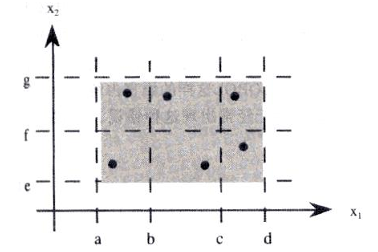
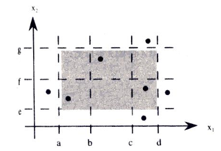
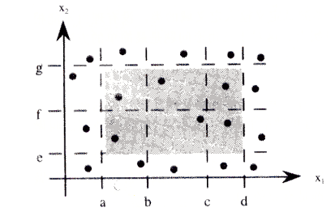
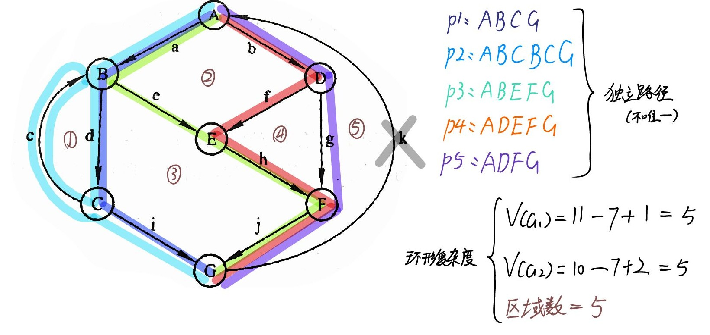

# **选择题**

## 1. 以下选项哪一个不属于动态测试

* ==代码检查法==
- 黑盒测试
- 白盒测试
- 灰盒测试

考点：


## 2. α测试与β测试属于测试的哪个阶段

* 单元测试
* 集成测试
* 系统测试
* ==验收测试==

考点：


## 3. 以下哪个是黑盒测试的方法

* 符号测试
*  ==等价类测试法==
* 程序变异以及程序控制流分析
* 数据流分析

考点：

黑盒测试方法有哪些
1. 边界值分析法
2. **等价类测试法**
3. 错误推测法
4. 因果图法
5. 决策表测试法
6. UseCase法（场景法）
7. 正交实验法


## 4. 以下哪个是白盒测试的方法

* 决策表测试法
* ==逻辑覆盖法==
* UseCase法（场景法）
* 正交实验法

考点：

白盒测试方法有哪些
1. 代码检查法
2. 静态结构分析法
3. 静态质量度量法
4. **逻辑覆盖法**
5. 基本路径测试法
6. 域测试
7. 符号测试
8. Z 路径覆盖
9. 程序变异以及程序控制流分析
10. 数据流分析


## 5. 以下哪个阶段不是常见的软件测试阶段

* 单元测试
* 集成测试
* 系统测试
* ==完验测试==

考点：


## 6. 单元测试一般由谁来执行

- ==程序员==
- 测试人员
- 项目经理
- 软件设计师

考点：

软件开发阶段里面有哪些角色：
1. 项目经理
2. 系统分析师
3. 软件架构师
4. 软件设计师
5. 程序员（开发人员）
6. 测试人员
7. 数据库管理员（DBA）


## 7. 测试工作一般在哪个阶段开始进行

- 项目规划阶段
- ==需求阶段==
- 详细设计与概要设计阶段
- 编码阶段

考点：

软件开发有哪些阶段
- 项目规划阶段
- 需求阶段（在本阶段同步开启软件测试）
- 详细设计与概要设计阶段
- 编码阶段
- 软件测试阶段
- 维护阶段


## 8. TDD的全称是什么

- ==测试驱动开发==
- 瀑布开发
- 快速原型开发
- 螺旋开发

考点：

软件开发模式有哪些：
1. 大棒模式
2. 边写边改模式
3. 瀑布模式
4. 快速原型测试
5. 螺旋测试
6. BDD行为驱动开发
7. DDD领域驱动开发
8. 迭代开发


## 9. 下图属于哪种等价类测试用例


- 弱一般等价类
- ==强一般等价类==
- 弱健壮等价类
- 强健壮等价类

考点：

- 等价类：将输入数据域划分成若干个子集（等价类），然后从每个子集中选取少数具有代表性的数据作为测试用例。
- 一般：不考虑输入数据之间的相互关系，只关注单个输入数据的有效和无效取值范围所划分出来的等价类。
- 弱/强：单/多缺陷假设（单个输入数据出错/多个数据输入错误）
- 健壮：考虑了无效值（无效等价类），是否能对无效数据处理，评价在面对无效输入时的处理能力


1. 弱一般等价类
2. 强一般等价类
3. 弱健壮等价类
4. 强健壮等价类


## 10. ？？？？

# **简答题**

## 11. 软件测试的过程中遵循哪些基本原则

1. 所有的软件测试都应追溯到用户需求
2. 尽早地和不断地进行软件测试
3. 不可能完全地测试
4. 增量测试，由小到大
5. 避免测试自己的程序
6. 设计充分完善的测试用例
	- 完善的测试用例
	- 完善的测试用例集
7. 注意测试中的群集现象
8. 确认缺陷的有效性
9. 合理安排测试计划
10. 进行回归测试
	- 测试用例集合的维护
	- 缺陷之间的关联性
11. 测试结果地统计、分析和可视化
12. 及时更新测试


## 12. 介绍集成测试

**集成模式**


* 一次性集成测试模式：先按模块分别测试，再全部组装后全量测试。
* 增量式集成测试模式（渐增式集成）：首先按模块进行测试，再将测试后的模块组装上，实现一边模块测试，一边组装模块，直到最后完成全量测试。

**集成方法（增量式集成测试的2种方法）**


1. 自顶向下集成
	- 从主控模块开始，依软件控制层次结构向下逐步集成模块，可采用深度优先或广度优先策略，按深度方向组装能先实现验证完整软件功能。
	- 其具体步骤包括：先测试主控模块（用桩程序替代附属模块），再按选定策略用实际模块替换桩模块并同时测试，为防新错误需做回归测试，不断重复直至完成。
	- 优点：能尽早检验程序主要控制和决策机制、早发现错误
	- 缺点：测试高层模块时低层用桩模块替代不能反映真实情况、重要数据难及时回送，测试不充分；不需要驱动模块但建立桩模块较难且会增加复杂度与附加测试；复杂算法及涉及真正输入 / 输出的易出问题模块在底层，后期才测试到，若发现问题易导致过多回归测试。
2. 自底向上集成
	- 自底向上集成从软件结构最低层的“原子”模块开始组装测试，因自底向上组装，给定层次模块的子模块已测试完成，无需桩模块，测试所需信息可直接运行子模块获取。 
	- 其具体步骤为：先将低层模块组合成实现特定子功能的族，写驱动程序协调输入输出后进行测试，去掉驱动程序向上移动组合形成更大子功能族，不断重复直至完成。 
	- 缺点：程序直到最后一个模块加上去才成为实体，主要控制到最后才接触到
	- 优点：无需桩模块，建立驱动模块相对容易，复杂算法及涉及真正输入 / 输出的易出问题模块能尽早组装测试，可早期解决问题，还能实施多个模块并行测试以提高测试效率
3. 混合集成
	- 一般对软件结构的上层使用自顶向下结合的方法，对下层使用自底向上结合的方法。
	- 在组装测试中，要确定关键模块并尽早对其进行测试。关键模块具有以下特征：能满足特定软件需求，处于程序模块结构的较高层次即高层控制模块，较为复杂且容易出现错误，还有明确定义的性能要求。

**持续集成**

- 自底向上集成时，先期完成的模块将是后期模块的桩程序，而自顶向下集成时，先期完成的模块将是后期模块的驱动程序。从而使后期模块的单元测试和集成测试出现了部分的交叉，不仅节省了测试代码的编写，也有力于提高工作效率。
- 持续集成可以减少集成阶段消灭缺陷所消耗的时间，从而提高软件开发的质量与效率。

**回归测试**


- 每当软件发生变化时，我们就必须进行回归测试，重新测试原有的功能，以便确定修改是否达到了预期的目的检查修改是否损害了原有的正常功能。
- 对修改过的代码重新运行现有的测试，确定更改是否破坏了在更改之前有效的任何事物，并且在必要的地方编写新测试。执行回归测试时，首要考虑的应该是覆盖范围足够大但不浪费时间。尽可能少花时间执行回归测试，但不减少在旧的、已经测试过的代码中检测新失败的可能性。

##  13. 简述软件的分类

1. 从自动化的角度分类
    - 自动化测试
    - 人工测试
2. 从测试阶段角度分类
    - 单元测试
    - 集成测试
    - 系统测试
    - 验收测试
3. 从技术角度分类
    - 黑盒测试
    - 白盒测试
    - 灰盒测试
4. 从测试目的角度分类
    - 功能测试
    - 性能测试
    - 安全测试
    - 兼容性测试
5. 从测试执行主体角度分类
    - 内部测试
    - 第三方测试
6. 从测试对象的规模角度分类
    - 模块测试
    - 子系统测试
    - 全系统测试
7. 从测试的重复性角度分类
    - 回归测试
    - 探索性测试

##  14. 简述基于微服务架构开发的App应用测试

????

考点：

-  App应用测试
- 微服务架构应用测试
- 嵌入式系统测试

# **大题**

## 15. 根据流图求出环形复杂度并写出流图的独立路径


使用公式计算环形复杂度，使用借助环形复杂度列举所有的独立路径。注意公式的选择，在于是否有K线将程序入口和出口相连接。



## 16. 根据流图书写测试用例，实现`**`覆盖

???


## 17. 使用Junit对下列代码进行测试
```java
public class Calc {  
    int add (int a, int b) {  
        int c = a + b;  
        return c;  
    }  
    int subtract (int a, int b) {  
        int c = a - b;  
        return c;  
    }  
    int multiply (int a, int b) {  
        int c = a * b;  
        return c;  
    }  
    int divide (int a, int b) {  
        int c ;  
        if (b == 0) {  
            throw new ArithmeticException("Divide by zero");  
        }  
        c = a / b;  
        return c;  
    }  
}
```
测试用例代码
```java
import org.junit.Test;  
import static org.junit.Assert.*;  
public class CalcTest01 {  
    @Test  
    public void testAdd() {  
        Calc c = new Calc();  
        int r = c.add(2, 3);  
        assertEquals(5,r);  
    }  
    @Test  
    public void testSubtract() {  
        Calc c = new Calc();  
        int r = c.subtract(3, 2);  
        assertEquals(1,r);  
    }  
    @Test  
    public void testMultiply() {  
        Calc c = new Calc();  
        int r = c.multiply(3, 2);  
        assertEquals(6,r);  
    }  
    @Test  
    public void testDivid01() {  
        Calc c = new Calc();  
        int r = c.divide(3, 2);  
        assertEquals(1.0,r,0.000001);  
    }  
    @Test(expected = ArithmeticException.class,timeout = 1)  
    public void testDivid02() {  
        Calc c = new Calc();  
        int r = c.divide(3, 0);  
    }  
}
```
## 18. 打开下列代码的网页并点击按钮

```html
<html lang="en">
<head>
    <meta charset="UTF-8">
    <title>Button Test Page</title>
</head>
<body>
    <button id="testButton">Click Me</button>
</body>
</html>
```

~~~java
import org.openqa.selenium.*;  
import org.openqa.selenium.edge.*;  
  
  
public class click {  
  
    public static void main(String[] args) {  
        System.setProperty("webdriver.edge.driver","C:\\msedgedriver.exe");  
        WebDriver driver = new EdgeDriver();  
        try {  
            driver.get("file:///C:\\test.html");  
            WebElement button = driver.findElement(By.id("testButton"));  
            button.click();  
        } catch (Exception e) {  
              
        } finally {  
            driver.quit();  
        }  
    }  
}
~~~
