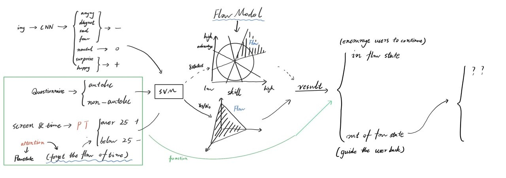

# 11.21会议

## 项目名称确定

1. 基于CNN表情分析与LLM情感解读的个性化互动优化系统
2. 基于CNN-SVM心流状态检测与引导系统
3. 基于卷积神经网络与支持向量机的心流状态检测引导系统
4. 基于CNN和SVM的心流状态优化番茄工作法
5. 利用卷积神经网络与支持向量机优化心流体验的智能番茄工作系统

## 项目解析

## 项目目前的缺陷

1. 番茄工作法的科学原理的应用，如何在软件中引导用户使用番茄工作法
	+ 如何合理的分切任务（任务难度、任务量）
	+ 如何预测的规划任务的完成时时间，预测时间的调整
2. 我们应该获得何种的设备相关数据，来推测用户相关的心流状态情况
	+ 用户在使用状态下设备的亮屏次数？移动端权限？
	+ 设备在运行状态下的其他设备使用状态？
	+ 用户可否自主提交相关内容（百分之多少的时间在使用某某软件），考虑无纸化学习用户的操作情况
3. 用户进入心流状态的判断（如何使用函数来代替SVM的效果）
	+ 结合上一点，心流状态的（伪）判断
4. 客户端初始使用的时候用户需要填写的信息有哪些，用来初始化的判断用户是否为自主性人格，为后续的心流状态的判断提供数据
5. 在番茄工作法周期的完成情况判断机制“奖惩机制”
	* 按计划完成任务，对用户予以鼓励（可能是判断这次难度的skill或advantage是否太低，是否想要再提高一点）
	* 没有按照任务完成，如何引导用户降低skill或advantage，来便于进入心流状态
6. 是否需要跨平台能力

## 项目实现与分工

刘瑜：CNN和SVM的伪实现，有能够有能够运行的模型即可，返回一定的图标数据，“证明”项目的深度学习相关内容是试试存在的。

肖鑫悦：完成客户端的开发，实现和后端的伪交互，程序内拥有完整的操作逻辑。

何艺珲：伪后端的实现，协助完成客户端设计，协助完成模型设计，完成全部的文书相关工作。

## 现阶段任务（11.28前）

* 完成模型的选型以及代替方案的确定
* 完成客户端功能设计（根据上文“项目缺陷”，初步解决问题），确定用户操作流程
* 完成项目申请与立项