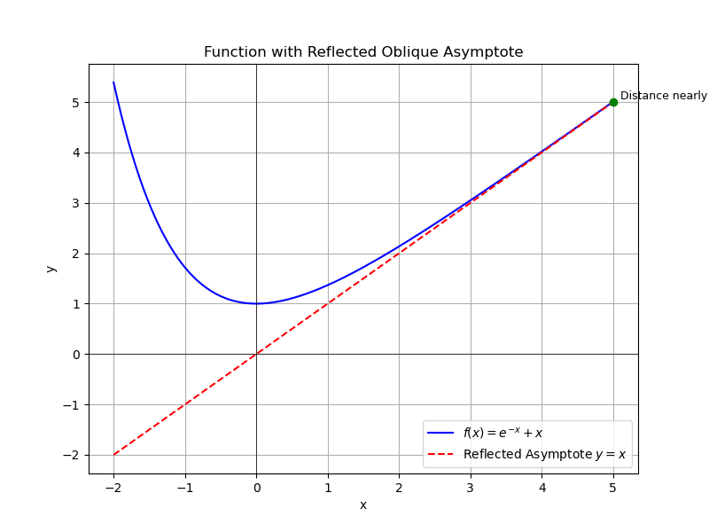

# 导数的应用

## 1 函数的单调性

- 设 $f(x)$ 在 $\left[a, b\right]$ 上连续，在 $(a, b)$ 内可导

	1. 若在 $(a, b)$ 内 $f'(x) > 0$，则 $f(x)$ 在 $\left[a, b\right]$ 上单调增
	2. 若在 $(a, b)$ 内 $f'(x) < 0$，则 $f(x)$ 在 $\left[a, b\right]$ 上单调减

## 2 数的极值

### 2.1 极值的定义

- 设 $y = f(x)$ 在点 $x_0$ 的某邻域内有定义。如果对于该邻域内任何 $x$，恒有 $f(x) \leq f(x_0)$ 或 ($f(x) \geq f(x_0)$)，则称 $x_0$ 为 $f(x)$ 的一个**极大值点**（或**极小值点**），称 $f(x_0)$ 为 $f(x)$ 的**极大值**（或**极小值**）。
- 极大（小）值统称为**极值**
- 极大（小）值点统称为**极值点**
- 导数为零的点称为函数的**驻点**

### 2.2 极值的必要条件

- 设 $y = f(x)$ 在点 $x_0$ 可导，如果 $x_0$ 为 $f(x)$ 的极值点，则 $f'(x_0) = 0$

### 2.3 极值的第一充分条件

- 设 $y = f(x)$ 在点 $x_0$ 的某去心邻域内可导，且 $f'(x_0) = 0$ (或 $f(x)$ 在 $x_0$ 处连续

	1. 若 $x < x_0$ 时，$f'(x) > 0$；$x > x_0$ 时，$f'(x) < 0$，则 $x_0$ 为 $f(x)$ 的极大值点
	2. 若 $x < x_0$ 时，$f'(x) < 0$；$x > x_0$ 时，$f'(x) > 0$，则 $x_0$ 为 $f(x)$ 的极小值点
	3. 若 $f'(x)$ 在 $x_0$ 的两侧同号，则 $x_0$ 不为 $f(x)$ 的极值点

### 2.4 极值的第二充分条件

- 设 $y = f(x)$ 在点 $x_0$ 二阶可导，且 $f'(x_0) = 0$

	1.  若 $f''(x_0) < 0$，则 $x_0$ 为 $f(x)$ 的极大值点
	2. 若 $f''(x_0) > 0$，则 $x_0$ 为 $f(x)$ 的极小值点
	3. 若 $f''(x_0) = 0$，则此方法不能判定 $x_0$ 是否为极值点

## 3 函数的最大值与最小值

### 3.1 定义

- 设函数 $y = f(x)$ 在闭区间 $\left[a, b\right]$ 上有定义，$x_0 \in \left[a, b\right]$. 若对于任意 $x \in \left[a, b\right]$，恒有 $f(x) \leq f(x_0)$ (或 $f(x) \geq f(x_0)$)，则称 $f(x_0)$ 为函数 $f(x)$ 在闭区间 $\left[a, b\right]$ 上的最大值 (或最小值)，称 $x_0$ 为 $f(x)$ 在 $\left[a, b\right]$ 上的最大值点 (或最小值点).

### 3.2 常见问题

#### 3.2.1 连续函数 $f(x)$ 在闭区间 $\left[a, b\right]$ 上的最大最小值

1. 求出 $f(x)$ 在开区间 $(a, b)$ 内的驻点和不可导的点 $x_1, x_2, \cdots, x_n$；

2. 求出 $f(x)$ 在点 $x_1, x_2, \cdots, x_n$ 和区间端点 $a, b$ 处的函数值
$$f(x_1), f(x_2), \cdots, f(x_n), f(a), f(b);$$

3. 比较以上各点函数值，其中最大的即为 $f(x)$ 在 $\left[a, b\right]$ 上的最大值，最小的即为 $f(x)$ 在 $\left[a, b\right]$ 上的最小值.

##### 注意

- 当连续函数 $f(x)$ 在 $\left[a, b\right]$ 内仅有唯一极值点，若在该点 $f(x)$ 取极大值 (或极小值)，则它也是 $f(x)$ 在 $\left[a, b\right]$ 上的最大值 (或最小值).

#### 3.2.2 最大最小值的应用题

1. 建立目标函数
2. 确定其定义域
3. 按照以上三步求其最大值 (或最小值)

## 4 曲线的凹凸性

### 4.1 定义

1. 设函数 $f(x)$ 在区间 $I$ 上连续，如果对 $I$ 上任意两点 $x_1$, $x_2$ $$f\left(\frac{x_1 + x_2}{2}\right) < \frac{f(x_1) + f(x_2)}{2},$$则称 $f(x)$ 在 $I$ 上的图形是**凹**的

2. 如果恒有$$f\left(\frac{x_1 + x_2}{2}\right) > \frac{f(x_1) + f(x_2)}{2},$$则称 $f(x)$ 在 $I$ 上的图形是**凸**的。

### 4.2 定理

- 设函数 $y = f(x)$ 在 $\left[a, b\right]$ 上连续，在 $(a, b)$ 二阶可导，那么
	1. 若在 $(a, b)$ 内有 $f''(x) > 0$，则 $f(x)$ 在 $\left[a, b\right]$ 上的图形是凹的；
	2. 若在 $(a, b)$ 内有 $f''(x) < 0$，则 $f(x)$ 在 $\left[a, b\right]$ 上的图形是凸的。

##### 注意

- 一阶导数的正负用来判定单调性
- 二阶导数的正负用来判定凹凸性

### 4.3 拐点
- 连续曲线弧上的凹与凸的分界点称为曲线弧的拐点
- 拐点的必要条件、第一充分条件、第二充分条件都是极值的一必二充提高一阶

#### 4.3.1 拐点的必要条件
- 设 $y = f(x)$ 在点 $x_0$ 二阶可导，且点 $(x_0, f(x_0))$ 为曲线 $y = f(x)$ 的拐点，则$$f''(x_0) = 0$$

#### 4.3.2 拐点的第一充分条件

- 设 $y = f(x)$ 在点 $x_0$ 的某去心邻域内二阶可导，且 $f''(x_0) = 0$ （或 $f(x)$ 在 $x_0$ 处连续）
	1. 若 $f''(x)$ 在 $x_0$ 的左、右两侧异号，则点 $(x_0, f(x_0))$ 为曲线 $y = f(x)$ 的拐点；
	2. 若 $f''(x)$ 在 $x_0$ 的左、右两侧同号，则点 $(x_0, f(x_0))$ 不为曲线 $y = f(x)$ 的拐点。

#### 4.3.3 拐点的第二充分条件

- 设 $y = f(x)$ 在点 $x_0$ 处三阶可导，且 $f''(x_0) = 0$.
	1. 若 $f'''(x_0) \neq 0$，则点 $(x_0, f(x_0))$ 为曲线 $y = f(x)$ 的拐点；
	2. 若 $f'''(x_0) = 0$，则此方法不能判定 $(x_0, f(x_0))$ 是否为曲线 $y = f(x)$ 的拐点。

## 5 曲线的渐近线

### 5.1 定义

- 若点 M 曲线 $y=f(x)$ 无限远离原点时，它与某条定直线 L 之间的距离将趋近于零，则称直线 L 为曲线 $y=f(x)$ 的一条渐近线。
	1. 若直线 L 与 x 平行，则称 L 为曲线 $y=f(x)$ 的水平渐近线
	2. 若直线 L 与 x 轴垂直，则称 L 为曲线 $y=f(x)$ 的铅直渐近线
	3. 若直线 L 既不平行于 x 轴，也不垂直于 x 轴，则称直线 L 为曲线 $y=f(x)$ 的斜渐近线

### 5.2 水平渐近线  

- 若 $\lim_{x \to \infty} f(x) = A$ (或 $\lim_{x \to -\infty} f(x) = A$, 或 $\lim_{x \to +\infty} f(x) = A$), 那么 $y=A$ 是曲线 $y=f(x)$ 的水平渐近线
- 最多两条，x趋向于正负无穷

### 5.3 垂直渐近线  

- 若 $\lim_{x \to x_0} f(x) = \infty$ (或 $\lim_{x \to x_0^-} f(x) = \infty$, 或 $\lim_{x \to x_0^+} f(x) = \infty$), 么 $x=x_0$ 是曲线 $y=f(x)$ 的铅直渐近线。

### 5.4 斜渐近线  

- 若 $\lim_{x \to \infty} \frac{f(x)}{x} = a$ 且 $\lim_{x \to \infty} (f(x) - ax) = b$ (或 $x \to -\infty$, 或 $x \to +\infty$), 那么 $y=ax+b$ 是曲线 $y=f(x)$ 的斜渐近线
- 最多2条
- 判断方法：
	1. $\lim_{x \to \infty} \frac{f(x)}{x} = a$ ， $\lim_{x \to \infty} (f(x) - ax) = b$计算a和b，求出 $y=ax+b$ 
	2. 修改函数为 $y=f(x)= ax+b+\alpha (x)$ ，当前半部分$ax+b$是一个线性函数，后半部分$\alpha (x)$是一个趋向于0的函数时，可以快速判断这是一个斜渐近线，也可以用来计算

## 6 数的作图

利用函数的单调性、极值、曲线的凹凸性、拐点及渐近线可以做出函数曲线。

## 7 曲线的弧微分与曲率

### 7.1 弧微分

设 $y = f(x)$ 在 $(a, b)$ 内有连续导数，则有弧微分$$ds = \sqrt{1 + y'^2} dx.$$

### 7.2 曲率

设 $y = f(x)$ 有二阶导数，则有曲率$$K = \frac{|y''|}{(1 + y'^2)^{3/2}},$$称 $\rho = \frac{1}{K}$ 为曲率半径。

### 7.3 曲率圆

若曲线 $y = f(x)$ 在点 $M(x, y)$ 的曲率为 $K(K \neq 0)$。在点 $M$ 曲线的法线上，在曲线凹的一侧取一点 $D$，使 $|DM| = \frac{1}{K} = \rho$，以 $D$ 为圆心，$\rho$ 为半径的圆称为曲线在点 $M$ 的**曲率圆**，圆心 $D$ 为曲线在点 $M$ 处的**曲率中心**。
