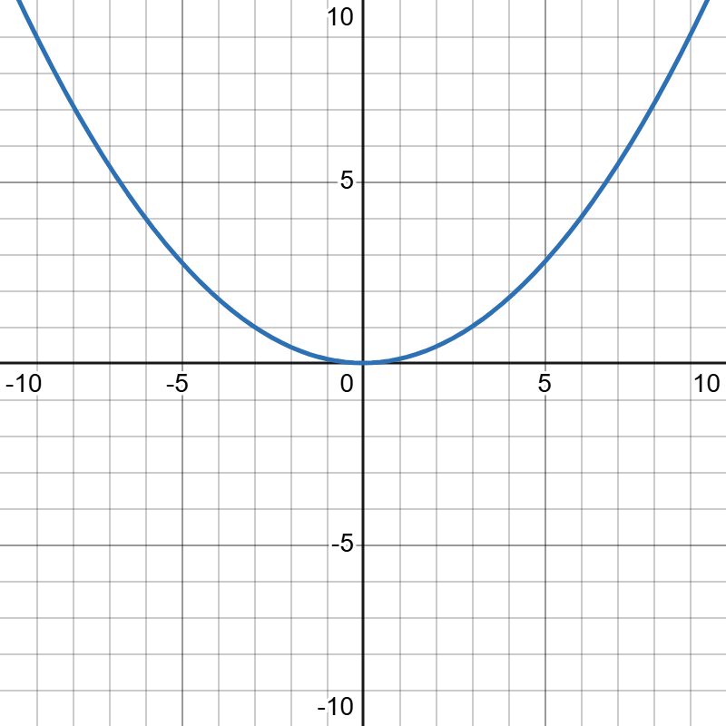
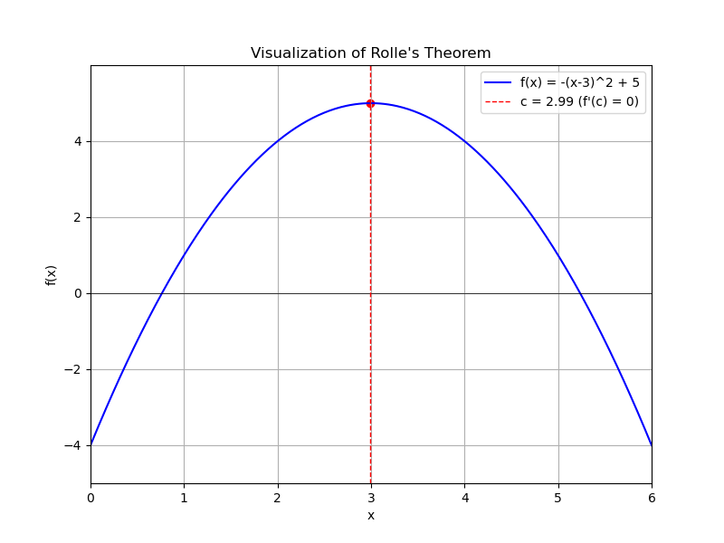
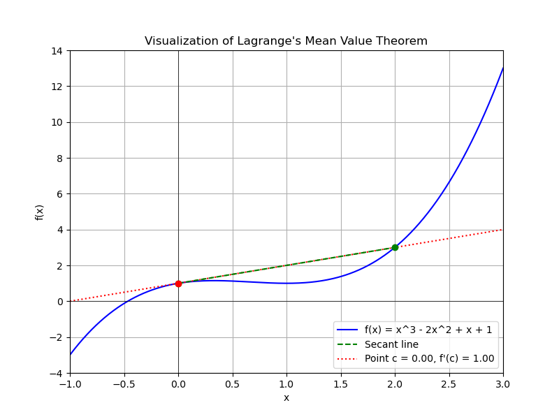
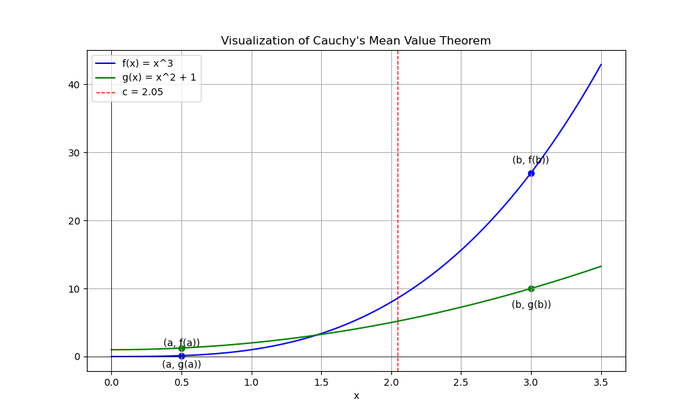

# 微分中值定理

## 1 费马引理

设函数 $f(x)$ 在点 $x_0$ 处可导，如果函数 $f(x)$ 在点 $x_0$ 处取得极值，那么 $f'(x_0) = 0$。

## 2 罗尔定理

定理（罗尔定理）如果 $f(x)$ 足以下条件：

1. 在闭区间 $[a, b]$ 上连续，
2. 在开区间 $(a, b)$ 内可导，
3. $f(a) = f(b)$，

则在 $(a, b)$ 内至少存在一点 $\xi$ 使得 $f'(\xi) = 0$。

## 3 拉格朗日中值定理

如果 $f(x)$ 满足以下条件：
1. 在闭区间 $[a, b]$ 上连续，
2. 在开区间 $(a, b)$内可导，
则在 $(a, b)$ 内至少存在一点 $\xi$，使得
$$f(b) - f(a) = f'(\xi)(b - a)$$

**推论**：如果在 $(a, b)$ 恒有 $f'(x) = 0$， 则在 $(a, b)$ 内$f(x)$ 为常数。

## 4 柯西中值定理
如果 $f(x)$，$F(x)$ 足以下条件： 
3. 在闭区间 $[a, b]$ 上连续
4. 在开区间 $(a, b)$ 内可导，且 $F'(x)$ 在 $(a, b)$ 内每一点处均不为零， 则在 $(a, b)$ 内至少存在一点 $\xi$，使得 $$ \frac{f(b) - f(a)}{F(b) - F(a)} = \frac{f'(\xi)}{F'(\xi)} $$

## 5 泰勒公式

### 5.1 皮亚诺型预想泰勒公式

如果 $f(x)$ 在点 $x_0$ 有直至 $n$ 的导数，则有

$$ f(x) = f(x_0) + f'(x_0)(x - x_0) + \frac{1}{2!} f''(x_0)(x - x_0)^2 + \cdots + \frac{1}{n!} f^{(n)}(x_0)(x - x_0)^n + o[(x - x_0)^n] $$

常称 $R_n(x) = o[(x - x_0)^n]$ 为皮亚诺型余项。若 $x_0 = 0$，则得麦克劳林公式：

$$ f(x) = f(0) + f'(0)x + \frac{1}{2!} f''(0)x^2 + \cdots + \frac{1}{n!} f^{(n)}(0)x^n + o(x^n) $$

### 5.2 拉格朗日型余项泰勒公式

设函数 $f(x)$ 在含有 $x_0$ 的开区间 $(a, b)$ 内有直到 $n+1$ 的导数，则当 $x \in (a, b)$ 时有

$$ f(x) = f(x_0) + f'(x_0)(x - x_0) + \frac{1}{2!} f''(x_0)(x - x_0)^2 + \cdots + \frac{1}{n!} f^{(n)}(x_0)(x - x_0)^n + R_n(x) $$

其中 $R_n(x) = \frac{f^{(n+1)}(\xi)}{(n+1)!}(x - x_0)^{n+1}$，这里 $\xi$ 介于 $x_0$ 与 $x$ 之间，称为拉格朗日型余项。

### 5.3 几个常用的泰勒公式（拉格朗日型余项）

5. $e^x = 1 + x + \frac{x^2}{2!} + \cdots + \frac{x^n}{n!} + \frac{e^{\theta x}}{(n+1)!}x^{n+1}$

6. $\sin x = x - \frac{x^3}{3!} + \cdots + (-1)^{n-1} \frac{x^{2n-1}}{(2n-1)!} + (-1)^n \frac{\cos(\theta x)}{(2n+1)!}x^{2n+1}$

7. $\cos x = 1 - \frac{x^2}{2!} + \cdots + (-1)^n \frac{x^{2n}}{(2n)!} + (-1)^{n+1} \frac{\cos(\theta x)}{(2n+2)!}x^{2n+2}$

8. $\ln(1 + x) = x - \frac{x^2}{2} + \cdots + (-1)^{n-1} \frac{x^n}{n} + (-1)^n \frac{x^{n+1}}{(n+1)(1 + \theta x)^{n+1}}$

9. $(1 + x)^a = 1 + ax + \frac{a(a-1)}{2!}x^2 + \cdots + \frac{a(a-1)\cdots(a-n+1)}{n!}x^n + \frac{a(a-1)\cdots(a-n+1)(a-n)}{(n+1)!}(1 + \theta x)^{a-n-1}x^{n+1}$
（以上 $\theta$ 满足 $\theta \in (0, 1)$）

